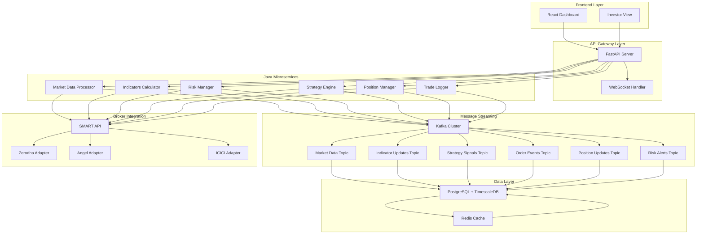

# Multi-User Algotrading System Architecture

## System Overview

This document outlines the architecture for a multi-user algotrading system specialized in NSE India intraday options and stock trading. The system is designed to be robust, scalable, and support multiple brokers and trading strategies with real-time tick-by-tick data processing.

## Technology Stack

- **Backend**: Java 21 with Spring Boot 3.x (High-Performance Components)
- **API Gateway**: Node.js/FastAPI (Existing)
- **Database**: PostgreSQL with TimescaleDB
- **Frontend**: React
- **Message Queue**: Apache Kafka
- **WebSocket**: For real-time data streaming
- **Authentication**: JWT tokens

## System Architecture

## Core Components

### 1. Java Market Data Processor

**Purpose**: High-performance processing of real-time market data from SMART API

**Key Features**:
- Real-time tick data processing
- Forming candle management
- Data normalization and validation
- Kafka producer for market data
- WebSocket client for SMART API

**Performance Optimizations**:
- Virtual threads for concurrent processing
- Circular buffers for efficient data storage
- Batch processing for database operations
- Connection pooling for broker APIs

### 2. Java Indicators Calculator

**Purpose**: Real-time calculation of technical indicators with forming candle optimization

**Key Features**:
- Real-time indicator calculation engine
- Historical data management system
- EMA, SMA, RSI, MACD indicators
- Indicator caching and optimization
- Batch processing for efficiency

**Performance Optimizations**:
- Sub-millisecond calculation times
- Incremental calculation algorithms
- Efficient data structures
- Parallel processing for multiple symbols

### 3. Java Risk Manager

**Purpose**: Comprehensive risk management with real-time monitoring

**Key Features**:
- Risk rule engine and validation
- Daily loss limit tracking
- Position sizing algorithms
- Drawdown calculation and monitoring
- Emergency exit mechanisms

**Performance Optimizations**:
- Real-time risk evaluation
- Efficient rule processing
- Parallel risk checks
- Optimized data structures

### 4. API Gateway

**Purpose**: Entry point for all client requests and routing to Java microservices

**Key Features**:
- REST API endpoints
- WebSocket connections
- Authentication and authorization
- Request validation and error handling
- Rate limiting and security

## Database Schema

### Core Tables

1. **Users**
   - user_id (PK)
   - username
   - email
   - password_hash
   - role (trader/investor/admin)
   - created_at
   - updated_at

2. **Brokers**
   - broker_id (PK)
   - name
   - api_type
   - api_credentials (encrypted)
   - user_id (FK)
   - is_active

3. **Strategies**
   - strategy_id (PK)
   - name
   - description
   - strategy_type
   - parameters
   - is_active
   - user_id (FK)

4. **Market Data**
   - data_id (PK)
   - symbol
   - timestamp
   - open, high, low, close
   - volume
   - tick_data (JSON)

5. **Trades**
   - trade_id (PK)
   - strategy_id (FK)
   - broker_id (FK)
   - symbol
   - type (buy/sell)
   - quantity
   - price
   - timestamp
   - status

6. **Positions**
   - position_id (PK)
   - trade_id (FK)
   - symbol
   - quantity
   - average_price
   - current_price
   - pnl
   - status

7. **Risk Settings**
   - risk_id (PK)
   - user_id (FK)
   - daily_loss_limit
   - max_position_size
   - max_drawdown_percent
   - max_risk_per_trade

## API Design

### REST Endpoints

#### Authentication
- POST /api/auth/login
- POST /api/auth/logout
- POST /api/auth/refresh

#### User Management
- GET /api/users/profile
- PUT /api/users/profile
- GET /api/users/risk-settings
- PUT /api/users/risk-settings

#### Broker Management
- GET /api/brokers
- POST /api/brokers
- PUT /api/brokers/{broker_id}
- DELETE /api/brokers/{broker_id}

#### Strategy Management
- GET /api/strategies
- POST /api/strategies
- GET /api/strategies/{strategy_id}
- PUT /api/strategies/{strategy_id}
- DELETE /api/strategies/{strategy_id}
- POST /api/strategies/{strategy_id}/start
- POST /api/strategies/{strategy_id}/stop

#### Trading
- GET /api/trades
- GET /api/trades/{trade_id}
- POST /api/orders
- PUT /api/orders/{order_id}
- DELETE /api/orders/{order_id}
- GET /api/positions
- GET /api/positions/{position_id}
- POST /api/positions/{position_id}/close

#### Analytics
- GET /api/analytics/performance
- GET /api/analytics/pnl
- GET /api/analytics/trades

### WebSocket Channels

#### Market Data
- /ws/market-data/{symbol}
- /ws/indicators/{symbol}:{indicator}
- /ws/positions
- /ws/orders
- /ws/strategy:{strategy_id}
- /ws/alerts

## Development Phases

### Phase 1: Foundation (Weeks 1-3)
1. Project setup and environment configuration
2. Database design and implementation
3. User authentication system
4. Basic API structure
5. Frontend foundation
6. Kafka cluster setup

### Phase 2: Core Trading Engine (Weeks 4-6)
1. Java market data processor
2. Java indicators calculator
3. Java risk manager
4. Broker adapter framework
5. Strategy framework
6. Kafka integration

### Phase 3: Risk & Position Management (Weeks 7-8)
1. Risk management system
2. Position monitoring
3. Trade logging
4. P&L tracking
5. Emergency exit mechanisms

### Phase 4: Frontend & Dashboard (Weeks 9-11)
1. Trading dashboard
2. Real-time charts
3. Order management
4. Analytics and reporting
5. Investor view
6. Live/dry mode switching

### Phase 5: Advanced Features (Weeks 12-14)
1. Additional broker integrations
2. Backtesting engine
3. Performance optimization
4. System monitoring
5. Multi-broker support

### Phase 6: Testing & Deployment (Weeks 15-16)
1. Comprehensive testing
2. Documentation
3. CI/CD pipeline
4. Production deployment

## Security Architecture

### Authentication & Authorization
- JWT-based authentication
- Role-based access control
- Token refresh mechanism
- Rate limiting

### Data Security
- Encrypted storage of broker credentials
- Secure API communication
- Input validation and sanitization
- Audit logging

### Network Security
- HTTPS/WSS for all communications
- CORS configuration
- Security headers
- DDoS protection

## Performance Considerations

### Real-time Data Processing
- Sub-millisecond tick processing
- High-throughput Kafka messaging
- Efficient data structures
- Parallel processing

### Database Optimization
- Proper indexing
- Query optimization
- Connection pooling
- TimescaleDB for time-series data

### Caching Strategy
- Redis for frequently accessed data
- Indicator value caching
- Session caching
- API response caching

## Monitoring & Observability

### Logging
- Structured logging with correlation IDs
- Log aggregation and analysis
- Performance metrics
- Error tracking

### Metrics
- System performance metrics
- Trading metrics
- User behavior metrics
- Resource utilization

### Health Checks
- Component health monitoring
- Database connectivity checks
- Kafka cluster monitoring
- Broker API health checks

This architecture provides a solid foundation for building a robust, scalable, and feature-rich algotrading system with Java microservices for optimal performance.