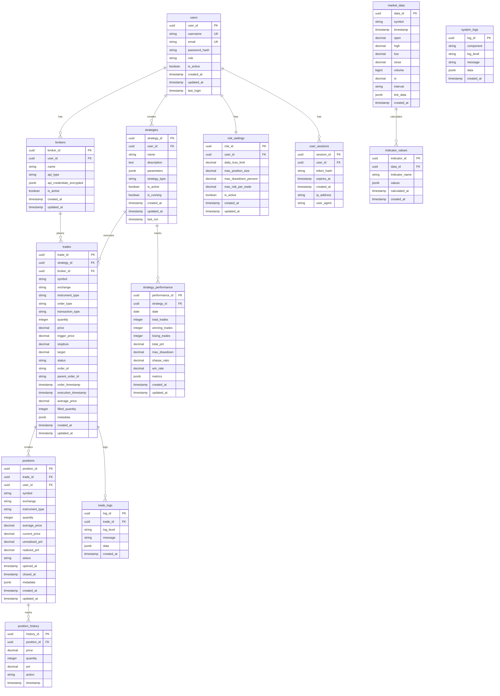

# Database Schema Design

This document outlines the complete database schema for the multi-user algotrading system, including tables, relationships, indexes, and constraints.

## Database Overview

- **Database**: PostgreSQL 14+
- **ORM**: SQLAlchemy 2.0
- **Migration Tool**: Alembic
- **Time Series Extension**: TimescaleDB for market data

## Schema Diagram



## Table Definitions

### 1. users

Stores user authentication and profile information.

```sql
CREATE TABLE users (
    user_id UUID PRIMARY KEY DEFAULT gen_random_uuid(),
    username VARCHAR(50) UNIQUE NOT NULL,
    email VARCHAR(255) UNIQUE NOT NULL,
    password_hash VARCHAR(255) NOT NULL,
    role VARCHAR(20) NOT NULL CHECK (role IN ('trader', 'investor', 'admin')),
    is_active BOOLEAN DEFAULT true,
    created_at TIMESTAMP WITH TIME ZONE DEFAULT CURRENT_TIMESTAMP,
    updated_at TIMESTAMP WITH TIME ZONE DEFAULT CURRENT_TIMESTAMP,
    last_login TIMESTAMP WITH TIME ZONE
);

-- Indexes
CREATE INDEX idx_users_username ON users(username);
CREATE INDEX idx_users_email ON users(email);
CREATE INDEX idx_users_role ON users(role);
CREATE INDEX idx_users_is_active ON users(is_active);
```

### 2. brokers

Stores broker configuration and API credentials.

```sql
CREATE TABLE brokers (
    broker_id UUID PRIMARY KEY DEFAULT gen_random_uuid(),
    user_id UUID NOT NULL REFERENCES users(user_id) ON DELETE CASCADE,
    name VARCHAR(100) NOT NULL,
    api_type VARCHAR(50) NOT NULL CHECK (api_type IN ('zerodha', 'angel', 'icici')),
    api_credentials_encrypted JSONB NOT NULL,
    is_active BOOLEAN DEFAULT true,
    created_at TIMESTAMP WITH TIME ZONE DEFAULT CURRENT_TIMESTAMP,
    updated_at TIMESTAMP WITH TIME ZONE DEFAULT CURRENT_TIMESTAMP
);

-- Indexes
CREATE INDEX idx_brokers_user_id ON brokers(user_id);
CREATE INDEX idx_brokers_api_type ON brokers(api_type);
CREATE INDEX idx_brokers_is_active ON brokers(is_active);
```

### 3. strategies

Stores trading strategy configurations.

```sql
CREATE TABLE strategies (
    strategy_id UUID PRIMARY KEY DEFAULT gen_random_uuid(),
    user_id UUID NOT NULL REFERENCES users(user_id) ON DELETE CASCADE,
    name VARCHAR(100) NOT NULL,
    description TEXT,
    parameters JSONB NOT NULL DEFAULT '{}',
    strategy_type VARCHAR(50) NOT NULL,
    is_active BOOLEAN DEFAULT true,
    is_running BOOLEAN DEFAULT false,
    created_at TIMESTAMP WITH TIME ZONE DEFAULT CURRENT_TIMESTAMP,
    updated_at TIMESTAMP WITH TIME ZONE DEFAULT CURRENT_TIMESTAMP,
    last_run TIMESTAMP WITH TIME ZONE
);

-- Indexes
CREATE INDEX idx_strategies_user_id ON strategies(user_id);
CREATE INDEX idx_strategies_type ON strategies(strategy_type);
CREATE INDEX idx_strategies_is_active ON strategies(is_active);
CREATE INDEX idx_strategies_is_running ON strategies(is_running);
```

### 4. risk_settings

Stores user-specific risk management settings.

```sql
CREATE TABLE risk_settings (
    risk_id UUID PRIMARY KEY DEFAULT gen_random_uuid(),
    user_id UUID UNIQUE NOT NULL REFERENCES users(user_id) ON DELETE CASCADE,
    daily_loss_limit DECIMAL(15,2) NOT NULL,
    max_position_size DECIMAL(15,2) NOT NULL,
    max_drawdown_percent DECIMAL(5,2) NOT NULL,
    max_risk_per_trade DECIMAL(5,2) NOT NULL,
    is_active BOOLEAN DEFAULT true,
    created_at TIMESTAMP WITH TIME ZONE DEFAULT CURRENT_TIMESTAMP,
    updated_at TIMESTAMP WITH TIME ZONE DEFAULT CURRENT_TIMESTAMP
);

-- Indexes
CREATE INDEX idx_risk_settings_user_id ON risk_settings(user_id);
```

### 5. user_sessions

Stores user authentication sessions.

```sql
CREATE TABLE user_sessions (
    session_id UUID PRIMARY KEY DEFAULT gen_random_uuid(),
    user_id UUID NOT NULL REFERENCES users(user_id) ON DELETE CASCADE,
    token_hash VARCHAR(255) NOT NULL,
    expires_at TIMESTAMP WITH TIME ZONE NOT NULL,
    created_at TIMESTAMP WITH TIME ZONE DEFAULT CURRENT_TIMESTAMP,
    ip_address INET,
    user_agent TEXT
);

-- Indexes
CREATE INDEX idx_user_sessions_user_id ON user_sessions(user_id);
CREATE INDEX idx_user_sessions_token_hash ON user_sessions(token_hash);
CREATE INDEX idx_user_sessions_expires_at ON user_sessions(expires_at);
```

### 6. market_data

Stores market data with time-series optimization.

```sql
CREATE TABLE market_data (
    data_id UUID PRIMARY KEY DEFAULT gen_random_uuid(),
    symbol VARCHAR(50) NOT NULL,
    timestamp TIMESTAMP WITH TIME ZONE NOT NULL,
    open DECIMAL(10,2) NOT NULL,
    high DECIMAL(10,2) NOT NULL,
    low DECIMAL(10,2) NOT NULL,
    close DECIMAL(10,2) NOT NULL,
    volume BIGINT NOT NULL,
    oi DECIMAL(15,2),
    interval VARCHAR(10) NOT NULL CHECK (interval IN ('tick', '1min', '5min', '15min', '30min', '1hour', '1day')),
    tick_data JSONB,
    created_at TIMESTAMP WITH TIME ZONE DEFAULT CURRENT_TIMESTAMP
);

-- Create as hypertable for time-series data
SELECT create_hypertable('market_data', 'timestamp');

-- Indexes
CREATE INDEX idx_market_data_symbol ON market_data(symbol);
CREATE INDEX idx_market_data_timestamp ON market_data(timestamp);
CREATE INDEX idx_market_data_symbol_timestamp ON market_data(symbol, timestamp);
CREATE INDEX idx_market_data_interval ON market_data(interval);
```

### 7. indicator_values

Stores calculated technical indicator values.

```sql
CREATE TABLE indicator_values (
    indicator_id UUID PRIMARY KEY DEFAULT gen_random_uuid(),
    data_id UUID NOT NULL REFERENCES market_data(data_id) ON DELETE CASCADE,
    indicator_name VARCHAR(50) NOT NULL,
    values JSONB NOT NULL,
    calculated_at TIMESTAMP WITH TIME ZONE NOT NULL,
    created_at TIMESTAMP WITH TIME ZONE DEFAULT CURRENT_TIMESTAMP
);

-- Indexes
CREATE INDEX idx_indicator_values_data_id ON indicator_values(data_id);
CREATE INDEX idx_indicator_values_name ON indicator_values(indicator_name);
CREATE INDEX idx_indicator_values_calculated_at ON indicator_values(calculated_at);
```

### 8. trades

Stores all trade orders and executions.

```sql
CREATE TABLE trades (
    trade_id UUID PRIMARY KEY DEFAULT gen_random_uuid(),
    strategy_id UUID NOT NULL REFERENCES strategies(strategy_id) ON DELETE CASCADE,
    broker_id UUID NOT NULL REFERENCES brokers(broker_id) ON DELETE RESTRICT,
    symbol VARCHAR(50) NOT NULL,
    exchange VARCHAR(20) NOT NULL,
    instrument_type VARCHAR(20) NOT NULL,
    order_type VARCHAR(20) NOT NULL CHECK (order_type IN ('MARKET', 'LIMIT', 'SL', 'SL-M')),
    transaction_type VARCHAR(10) NOT NULL CHECK (transaction_type IN ('BUY', 'SELL')),
    quantity INTEGER NOT NULL,
    price DECIMAL(10,2),
    trigger_price DECIMAL(10,2),
    stoploss DECIMAL(10,2),
    target DECIMAL(10,2),
    status VARCHAR(20) NOT NULL CHECK (status IN ('PENDING', 'OPEN', 'PARTIALLY_FILLED', 'FILLED', 'CANCELLED', 'REJECTED')),
    order_id VARCHAR(100),
    parent_order_id VARCHAR(100),
    order_timestamp TIMESTAMP WITH TIME ZONE,
    execution_timestamp TIMESTAMP WITH TIME ZONE,
    average_price DECIMAL(10,2),
    filled_quantity INTEGER DEFAULT 0,
    metadata JSONB,
    created_at TIMESTAMP WITH TIME ZONE DEFAULT CURRENT_TIMESTAMP,
    updated_at TIMESTAMP WITH TIME ZONE DEFAULT CURRENT_TIMESTAMP
);

-- Indexes
CREATE INDEX idx_trades_strategy_id ON trades(strategy_id);
CREATE INDEX idx_trades_broker_id ON trades(broker_id);
CREATE INDEX idx_trades_symbol ON trades(symbol);
CREATE INDEX idx_trades_status ON trades(status);
CREATE INDEX idx_trades_order_timestamp ON trades(order_timestamp);
CREATE INDEX idx_trades_execution_timestamp ON trades(execution_timestamp);
```

### 9. positions

Stores current and historical positions.

```sql
CREATE TABLE positions (
    position_id UUID PRIMARY KEY DEFAULT gen_random_uuid(),
    trade_id UUID NOT NULL REFERENCES trades(trade_id) ON DELETE CASCADE,
    user_id UUID NOT NULL REFERENCES users(user_id) ON DELETE CASCADE,
    symbol VARCHAR(50) NOT NULL,
    exchange VARCHAR(20) NOT NULL,
    instrument_type VARCHAR(20) NOT NULL,
    quantity INTEGER NOT NULL,
    average_price DECIMAL(10,2) NOT NULL,
    current_price DECIMAL(10,2),
    unrealized_pnl DECIMAL(15,2) DEFAULT 0,
    realized_pnl DECIMAL(15,2) DEFAULT 0,
    status VARCHAR(20) NOT NULL CHECK (status IN ('OPEN', 'CLOSED', 'PARTIALLY_CLOSED')),
    opened_at TIMESTAMP WITH TIME ZONE NOT NULL,
    closed_at TIMESTAMP WITH TIME ZONE,
    metadata JSONB,
    created_at TIMESTAMP WITH TIME ZONE DEFAULT CURRENT_TIMESTAMP,
    updated_at TIMESTAMP WITH TIME ZONE DEFAULT CURRENT_TIMESTAMP
);

-- Indexes
CREATE INDEX idx_positions_trade_id ON positions(trade_id);
CREATE INDEX idx_positions_user_id ON positions(user_id);
CREATE INDEX idx_positions_symbol ON positions(symbol);
CREATE INDEX idx_positions_status ON positions(status);
CREATE INDEX idx_positions_opened_at ON positions(opened_at);
```

### 10. position_history

Stores historical position changes.

```sql
CREATE TABLE position_history (
    history_id UUID PRIMARY KEY DEFAULT gen_random_uuid(),
    position_id UUID NOT NULL REFERENCES positions(position_id) ON DELETE CASCADE,
    price DECIMAL(10,2) NOT NULL,
    quantity INTEGER NOT NULL,
    pnl DECIMAL(15,2) NOT NULL,
    action VARCHAR(20) NOT NULL CHECK (action IN ('OPEN', 'CLOSE', 'INCREASE', 'DECREASE')),
    timestamp TIMESTAMP WITH TIME ZONE NOT NULL
);

-- Indexes
CREATE INDEX idx_position_history_position_id ON position_history(position_id);
CREATE INDEX idx_position_history_timestamp ON position_history(timestamp);
```

### 11. trade_logs

Stores detailed logs for each trade.

```sql
CREATE TABLE trade_logs (
    log_id UUID PRIMARY KEY DEFAULT gen_random_uuid(),
    trade_id UUID NOT NULL REFERENCES trades(trade_id) ON DELETE CASCADE,
    log_level VARCHAR(10) NOT NULL CHECK (log_level IN ('DEBUG', 'INFO', 'WARNING', 'ERROR', 'CRITICAL')),
    message TEXT NOT NULL,
    data JSONB,
    created_at TIMESTAMP WITH TIME ZONE DEFAULT CURRENT_TIMESTAMP
);

-- Indexes
CREATE INDEX idx_trade_logs_trade_id ON trade_logs(trade_id);
CREATE INDEX idx_trade_logs_level ON trade_logs(log_level);
CREATE INDEX idx_trade_logs_created_at ON trade_logs(created_at);
```

### 12. strategy_performance

Stores strategy performance metrics.

```sql
CREATE TABLE strategy_performance (
    performance_id UUID PRIMARY KEY DEFAULT gen_random_uuid(),
    strategy_id UUID NOT NULL REFERENCES strategies(strategy_id) ON DELETE CASCADE,
    date DATE NOT NULL,
    total_trades INTEGER DEFAULT 0,
    winning_trades INTEGER DEFAULT 0,
    losing_trades INTEGER DEFAULT 0,
    total_pnl DECIMAL(15,2) DEFAULT 0,
    max_drawdown DECIMAL(15,2) DEFAULT 0,
    sharpe_ratio DECIMAL(10,4),
    win_rate DECIMAL(5,2),
    metrics JSONB,
    created_at TIMESTAMP WITH TIME ZONE DEFAULT CURRENT_TIMESTAMP,
    updated_at TIMESTAMP WITH TIME ZONE DEFAULT CURRENT_TIMESTAMP,
    UNIQUE(strategy_id, date)
);

-- Indexes
CREATE INDEX idx_strategy_performance_strategy_id ON strategy_performance(strategy_id);
CREATE INDEX idx_strategy_performance_date ON strategy_performance(date);
```

### 13. system_logs

Stores system-wide logs for monitoring and debugging.

```sql
CREATE TABLE system_logs (
    log_id UUID PRIMARY KEY DEFAULT gen_random_uuid(),
    component VARCHAR(50) NOT NULL,
    log_level VARCHAR(10) NOT NULL CHECK (log_level IN ('DEBUG', 'INFO', 'WARNING', 'ERROR', 'CRITICAL')),
    message TEXT NOT NULL,
    data JSONB,
    created_at TIMESTAMP WITH TIME ZONE DEFAULT CURRENT_TIMESTAMP
);

-- Indexes
CREATE INDEX idx_system_logs_component ON system_logs(component);
CREATE INDEX idx_system_logs_level ON system_logs(log_level);
CREATE INDEX idx_system_logs_created_at ON system_logs(created_at);
```

## Database Functions and Triggers

### 1. Update Timestamp Trigger

```sql
CREATE OR REPLACE FUNCTION update_updated_at_column()
RETURNS TRIGGER AS $$
BEGIN
    NEW.updated_at = CURRENT_TIMESTAMP;
    RETURN NEW;
END;
$$ language 'plpgsql';

-- Apply to relevant tables
CREATE TRIGGER update_users_updated_at BEFORE UPDATE ON users
    FOR EACH ROW EXECUTE FUNCTION update_updated_at_column();

CREATE TRIGGER update_brokers_updated_at BEFORE UPDATE ON brokers
    FOR EACH ROW EXECUTE FUNCTION update_updated_at_column();

CREATE TRIGGER update_strategies_updated_at BEFORE UPDATE ON strategies
    FOR EACH ROW EXECUTE FUNCTION update_updated_at_column();

CREATE TRIGGER update_risk_settings_updated_at BEFORE UPDATE ON risk_settings
    FOR EACH ROW EXECUTE FUNCTION update_updated_at_column();

CREATE TRIGGER update_trades_updated_at BEFORE UPDATE ON trades
    FOR EACH ROW EXECUTE FUNCTION update_updated_at_column();

CREATE TRIGGER update_positions_updated_at BEFORE UPDATE ON positions
    FOR EACH ROW EXECUTE FUNCTION update_updated_at_column();

CREATE TRIGGER update_strategy_performance_updated_at BEFORE UPDATE ON strategy_performance
    FOR EACH ROW EXECUTE FUNCTION update_updated_at_column();
```

### 2. Position P&L Calculation Function

```sql
CREATE OR REPLACE FUNCTION calculate_position_pnl()
RETURNS TRIGGER AS $$
BEGIN
    -- Update unrealized P&L when current price changes
    IF NEW.current_price IS DISTINCT FROM OLD.current_price THEN
        NEW.unrealized_pnl = (NEW.current_price - NEW.average_price) * NEW.quantity;
    END IF;
    
    RETURN NEW;
END;
$$ language 'plpgsql';

CREATE TRIGGER calculate_position_pnl_trigger BEFORE UPDATE ON positions
    FOR EACH ROW EXECUTE FUNCTION calculate_position_pnl();
```

## Data Retention Policies

### 1. Market Data Retention

```sql
-- Create a policy to delete tick data older than 30 days
SELECT add_retention_policy('market_data', INTERVAL '30 days');

-- Create a policy to aggregate 1-minute data to 5-minute after 90 days
-- This would be implemented as a scheduled job
```

### 2. Log Retention

```sql
-- Delete system logs older than 90 days
DELETE FROM system_logs WHERE created_at < CURRENT_TIMESTAMP - INTERVAL '90 days';

-- Delete trade logs older than 1 year
DELETE FROM trade_logs WHERE created_at < CURRENT_TIMESTAMP - INTERVAL '1 year';
```

## Performance Optimization

### 1. Partitioning

```sql
-- Partition market_data by symbol for better query performance
-- This would be implemented based on the most frequently traded symbols
```

### 2. Materialized Views

```sql
-- Create materialized view for daily performance summary
CREATE MATERIALIZED VIEW daily_performance_summary AS
SELECT 
    u.user_id,
    u.username,
    DATE(t.execution_timestamp) as trade_date,
    COUNT(*) as total_trades,
    SUM(CASE WHEN t.transaction_type = 'SELL' THEN t.filled_quantity * t.average_price ELSE 0 END) as total_sales,
    SUM(CASE WHEN t.transaction_type = 'BUY' THEN t.filled_quantity * t.average_price ELSE 0 END) as total_purchases,
    SUM(p.realized_pnl) as total_realized_pnl
FROM users u
JOIN strategies s ON u.user_id = s.user_id
JOIN trades t ON s.strategy_id = t.strategy_id
LEFT JOIN positions p ON t.trade_id = p.trade_id
WHERE t.status = 'FILLED'
GROUP BY u.user_id, u.username, DATE(t.execution_timestamp);

-- Create unique index for refresh
CREATE UNIQUE INDEX idx_daily_performance_summary_unique ON daily_performance_summary(user_id, trade_date);

-- Refresh schedule (would be implemented as a scheduled job)
-- REFRESH MATERIALIZED VIEW CONCURRENTLY daily_performance_summary;
```

## Security Considerations

1. **Row Level Security**: Implement RLS for sensitive tables
2. **Encryption**: Encrypt sensitive data like API credentials
3. **Audit Trail**: Maintain audit logs for all critical operations
4. **Access Control**: Implement proper database user permissions

This database schema provides a comprehensive foundation for the algotrading system, supporting all the requirements specified in the PBR document while ensuring performance, scalability, and data integrity.