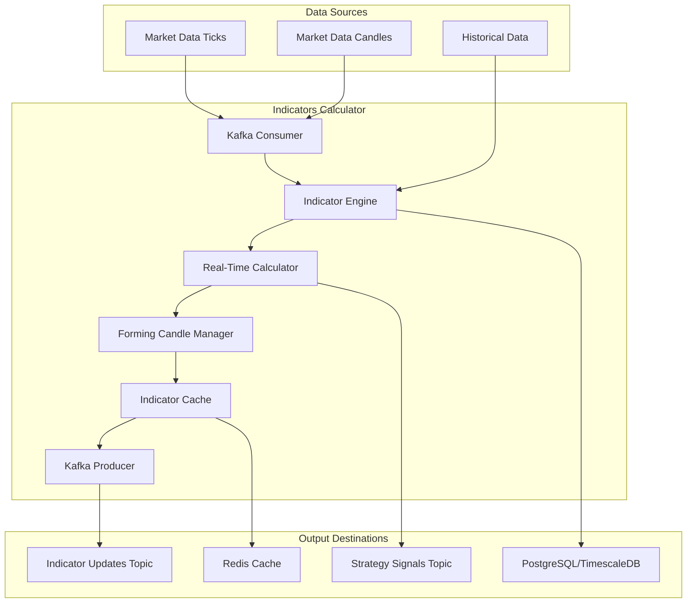

# Java Technical Indicators Calculation Microservice

## Overview

The Technical Indicators Calculation microservice is a high-performance Java application designed for real-time calculation of technical indicators using the forming candle approach. This service leverages Java 21's virtual threads, optimized mathematical libraries, and efficient data structures to provide sub-millisecond indicator updates for trading strategies.

## Service Architecture



## Core Components

### 1. Application Entry Point

```java
@SpringBootApplication
@EnableKafka
@EnableCaching
public class IndicatorsCalculatorApplication {
    
    public static void main(String[] args) {
        // Optimize for mathematical computations
        System.setProperty("java.util.concurrent.ForkJoinPool.common.parallelism", "200");
        SpringApplication.run(IndicatorsCalculatorApplication.class, args);
    }
    
    @Bean
    public TaskExecutor indicatorTaskExecutor() {
        ThreadPoolTaskExecutor executor = new ThreadPoolTaskExecutor();
        executor.setCorePoolSize(100);
        executor.setMaxPoolSize(500);
        executor.setThreadNamePrefix("Indicator-");
        executor.setRejectedExecutionHandler(new ThreadPoolExecutor.CallerRunsPolicy());
        executor.initialize();
        return executor;
    }
    
    @Bean
    public IndicatorCache indicatorCache() {
        return new CaffeineIndicatorCache();
    }
}
```

### 2. Real-Time Indicator Engine

```java
@Component
@Slf4j
public class RealTimeIndicatorEngine {
    
    private final Map<String, SymbolIndicatorData> symbolData = new ConcurrentHashMap<>();
    private final IndicatorCalculator calculator;
    private final IndicatorCache cache;
    private final HistoricalDataService historicalDataService;
    private final KafkaTemplate<String, Object> kafkaTemplate;
    private final MeterRegistry meterRegistry;
    
    // Performance metrics
    private final Timer calculationTimer;
    private final Counter updateCounter;
    
    public RealTimeIndicatorEngine(IndicatorCalculator calculator,
                                  IndicatorCache cache,
                                  HistoricalDataService historicalDataService,
                                  KafkaTemplate<String, Object> kafkaTemplate,
                                  MeterRegistry meterRegistry) {
        this.calculator = calculator;
        this.cache = cache;
        this.historicalDataService = historicalDataService;
        this.kafkaTemplate = kafkaTemplate;
        this.meterRegistry = meterRegistry;
        
        this.calculationTimer = Timer.builder("indicator.calculation.time")
            .description("Time taken to calculate indicators")
            .register(meterRegistry);
        this.updateCounter = Counter.builder("indicator.updates")
            .description("Number of indicator updates")
            .register(meterRegistry);
    }
    
    @KafkaListener(topics = KafkaTopics.MARKET_DATA_TICKS, 
                   containerFactory = "tickKafkaListenerContainerFactory")
    public void processTick(TickData tick) {
        Timer.Sample sample = Timer.start(meterRegistry);
        
        try {
            SymbolIndicatorData data = getOrCreateSymbolData(tick.getSymbol());
            
            // Update forming candle with tick
            data.updateFormingCandle(tick);
            
            // Calculate indicators for all timeframes
            calculateIndicatorsForSymbol(data);
            
            updateCounter.increment();
            
        } catch (Exception e) {
            log.error("Error processing tick for indicator calculation: {}", tick, e);
        } finally {
            sample.stop(calculationTimer);
        }
    }
    
    @KafkaListener(topics = KafkaTopics.MARKET_DATA_CANDLES,
                   containerFactory = "candleKafkaListenerContainerFactory")
    public void processCandle(CandleData candle) {
        SymbolIndicatorData data = getOrCreateSymbolData(candle.getSymbol());
        
        // Add completed candle to historical data
        data.addCompletedCandle(candle);
        
        // Recalculate indicators
        calculateIndicatorsForSymbol(data);
    }
    
    private SymbolIndicatorData getOrCreateSymbolData(String symbol) {
        return symbolData.computeIfAbsent(symbol, s -> {
            // Initialize with historical data
            List<CandleData> historicalCandles = historicalDataService.getHistoricalCandles(s, "5min", 500);
            return new SymbolIndicatorData(s, historicalCandles);
        });
    }
    
    private void calculateIndicatorsForSymbol(SymbolIndicatorData data) {
        // Process all configured timeframes in parallel
        List<String> timeframes = List.of("1min", "5min", "15min", "30min", "1hour");
        
        timeframes.parallelStream().forEach(timeframe -> {
            try {
                calculateIndicatorsForTimeframe(data, timeframe);
            } catch (Exception e) {
                log.error("Error calculating indicators for timeframe: {}", timeframe, e);
            }
        });
    }
    
    private void calculateIndicatorsForTimeframe(SymbolIndicatorData data, String timeframe) {
        String symbol = data.getSymbol();
        
        // Get all candles (historical + forming)
        List<CandleData> allCandles = data.getAllCandles(timeframe);
        
        if (allCandles.isEmpty()) return;
        
        // Calculate indicators
        Map<String, IndicatorValue> indicators = calculator.calculateIndicators(symbol, allCandles);
        
        // Cache results
        indicators.forEach((name, value) -> 
            cache.put(symbol, timeframe, name, value));
        
        // Send updates to Kafka
        sendIndicatorUpdates(symbol, timeframe, indicators);
    }
    
    private void sendIndicatorUpdates(String symbol, String timeframe, 
                                   Map<String, IndicatorValue> indicators) {
        IndicatorUpdate update = IndicatorUpdate.builder()
            .symbol(symbol)
            .timeframe(timeframe)
            .timestamp(Instant.now())
            .indicators(indicators)
            .build();
        
        kafkaTemplate.send(KafkaTopics.INDICATOR_UPDATES, 
                         symbol + "-" + timeframe, update);
    }
}
```

### 3. High-Performance Indicator Calculator

```java
@Component
public class IndicatorCalculator {
    
    private final Map<String, IndicatorAlgorithm> algorithms;
    private final MeterRegistry meterRegistry;
    
    public IndicatorCalculator(MeterRegistry meterRegistry) {
        this.meterRegistry = meterRegistry;
        this.algorithms = initializeAlgorithms();
    }
    
    private Map<String, IndicatorAlgorithm> initializeAlgorithms() {
        Map<String, IndicatorAlgorithm> map = new HashMap<>();
        
        // Moving Averages
        map.put("SMA", new SimpleMovingAverage());
        map.put("EMA", new ExponentialMovingAverage());
        map.put("WMA", new WeightedMovingAverage());
        map.put("DEMA", new DoubleExponentialMovingAverage());
        map.put("TEMA", new TripleExponentialMovingAverage());
        
        // Oscillators
        map.put("RSI", new RelativeStrengthIndex());
        map.put("MACD", new MovingAverageConvergenceDivergence());
        map.put("STOCH", new StochasticOscillator());
        map.put("CCI", new CommodityChannelIndex());
        map.put("WilliamsR", new WilliamsR());
        
        // Volatility
        map.put("BB", new BollingerBands());
        map.put("ATR", new AverageTrueRange());
        map.put("KC", new KeltnerChannels());
        
        // Volume
        map.put("OBV", new OnBalanceVolume());
        map.put("VWAP", new VolumeWeightedAveragePrice());
        map.put("AD", new AccumulationDistribution());
        
        // Momentum
        map.put("MOM", new Momentum());
        map.put("ROC", new RateOfChange());
        map.put("TSI", new TrueStrengthIndex());
        
        return map;
    }
    
    public Map<String, IndicatorValue> calculateIndicators(String symbol, List<CandleData> candles) {
        Map<String, IndicatorValue> results = new ConcurrentHashMap<>();
        
        // Calculate all indicators in parallel
        algorithms.entrySet().parallelStream().forEach(entry -> {
            try {
                String name = entry.getKey();
                IndicatorAlgorithm algorithm = entry.getValue();
                
                Timer.Sample sample = Timer.start(meterRegistry);
                
                IndicatorValue value = algorithm.calculate(candles);
                
                sample.stop(Timer.builder("indicator.calculation.time")
                    .tag("indicator", name)
                    .register(meterRegistry));
                
                if (value != null) {
                    results.put(name, value);
                }
                
            } catch (Exception e) {
                log.error("Error calculating indicator: {}", entry.getKey(), e);
            }
        });
        
        return results;
    }
}
```

### 4. Optimized Indicator Algorithms

```java
public interface IndicatorAlgorithm {
    IndicatorValue calculate(List<CandleData> candles);
    String getName();
    List<Integer> getRequiredPeriods();
}

// High-Performance EMA Implementation
public class ExponentialMovingAverage implements IndicatorAlgorithm {
    
    private final Map<Integer, Double> multipliers = new ConcurrentHashMap<>();
    
    @Override
    public IndicatorValue calculate(List<CandleData> candles) {
        if (candles.isEmpty()) return null;
        
        // Calculate EMAs for common periods
        Map<Integer, Double> emaValues = new HashMap<>();
        List<Integer> periods = List.of(5, 10, 20, 50, 100, 200);
        
        for (int period : periods) {
            if (candles.size() >= period) {
                double ema = calculateEMA(candles, period);
                emaValues.put(period, ema);
            }
        }
        
        return IndicatorValue.builder()
            .name("EMA")
            .timestamp(candles.get(candles.size() - 1).getTimestamp())
            .values(emaValues)
            .build();
    }
    
    private double calculateEMA(List<CandleData> candles, int period) {
        double[] closes = candles.stream()
            .mapToDouble(CandleData::getClose)
            .toArray();
        
        return calculateEMAArray(closes, period)[closes.length - 1];
    }
    
    // Optimized array-based EMA calculation
    private double[] calculateEMAArray(double[] prices, int period) {
        double[] ema = new double[prices.length];
        double multiplier = getMultiplier(period);
        
        // Calculate initial SMA
        double sum = 0;
        for (int i = 0; i < period; i++) {
            sum += prices[i];
        }
        ema[period - 1] = sum / period;
        
        // Calculate EMA for remaining values
        for (int i = period; i < prices.length; i++) {
            ema[i] = (prices[i] * multiplier) + (ema[i - 1] * (1 - multiplier));
        }
        
        return ema;
    }
    
    private double getMultiplier(int period) {
        return multipliers.computeIfAbsent(period, p -> 2.0 / (p + 1));
    }
    
    @Override
    public String getName() {
        return "EMA";
    }
    
    @Override
    public List<Integer> getRequiredPeriods() {
        return List.of(5, 10, 20, 50, 100, 200);
    }
}

// High-Performance RSI Implementation
public class RelativeStrengthIndex implements IndicatorAlgorithm {
    
    @Override
    public IndicatorValue calculate(List<CandleData> candles) {
        if (candles.size() < 15) return null;
        
        Map<Integer, Double> rsiValues = new HashMap<>();
        List<Integer> periods = List.of(14, 21, 30);
        
        for (int period : periods) {
            if (candles.size() >= period + 1) {
                double rsi = calculateRSI(candles, period);
                rsiValues.put(period, rsi);
            }
        }
        
        return IndicatorValue.builder()
            .name("RSI")
            .timestamp(candles.get(candles.size() - 1).getTimestamp())
            .values(rsiValues)
            .build();
    }
    
    private double calculateRSI(List<CandleData> candles, int period) {
        double[] closes = candles.stream()
            .mapToDouble(CandleData::getClose)
            .toArray();
        
        double[] gains = new double[closes.length - 1];
        double[] losses = new double[closes.length - 1];
        
        for (int i = 1; i < closes.length; i++) {
            double change = closes[i] - closes[i - 1];
            gains[i - 1] = Math.max(0, change);
            losses[i - 1] = Math.max(0, -change);
        }
        
        double avgGain = calculateSMA(gains, period);
        double avgLoss = calculateSMA(losses, period);
        
        if (avgLoss == 0) return 100.0;
        
        double rs = avgGain / avgLoss;
        return 100.0 - (100.0 / (1.0 + rs));
    }
    
    private double calculateSMA(double[] values, int period) {
        double sum = 0;
        for (int i = values.length - period; i < values.length; i++) {
            sum += values[i];
        }
        return sum / period;
    }
    
    @Override
    public String getName() {
        return "RSI";
    }
    
    @Override
    public List<Integer> getRequiredPeriods() {
        return List.of(14, 21, 30);
    }
}

// High-Performance MACD Implementation
public class MovingAverageConvergenceDivergence implements IndicatorAlgorithm {
    
    @Override
    public IndicatorValue calculate(List<CandleData> candles) {
        if (candles.size() < 26) return null;
        
        double[] closes = candles.stream()
            .mapToDouble(CandleData::getClose)
            .toArray();
        
        // Calculate EMAs
        double[] ema12 = calculateEMAArray(closes, 12);
        double[] ema26 = calculateEMAArray(closes, 26);
        
        // Calculate MACD line
        double[] macdLine = new double[closes.length];
        for (int i = 0; i < macdLine.length; i++) {
            macdLine[i] = ema12[i] - ema26[i];
        }
        
        // Calculate signal line (9-period EMA of MACD)
        double[] signalLine = calculateEMAArray(macdLine, 9);
        
        // Calculate histogram
        double[] histogram = new double[closes.length];
        for (int i = 0; i < histogram.length; i++) {
            histogram[i] = macdLine[i] - signalLine[i];
        }
        
        int lastIndex = candles.size() - 1;
        
        Map<String, Double> values = new HashMap<>();
        values.put("macd", macdLine[lastIndex]);
        values.put("signal", signalLine[lastIndex]);
        values.put("histogram", histogram[lastIndex]);
        
        return IndicatorValue.builder()
            .name("MACD")
            .timestamp(candles.get(lastIndex).getTimestamp())
            .values(values)
            .build();
    }
    
    private double[] calculateEMAArray(double[] prices, int period) {
        double[] ema = new double[prices.length];
        double multiplier = 2.0 / (period + 1);
        
        // Calculate initial SMA
        double sum = 0;
        for (int i = 0; i < period; i++) {
            sum += prices[i];
        }
        ema[period - 1] = sum / period;
        
        // Calculate EMA for remaining values
        for (int i = period; i < prices.length; i++) {
            ema[i] = (prices[i] * multiplier) + (ema[i - 1] * (1 - multiplier));
        }
        
        return ema;
    }
    
    @Override
    public String getName() {
        return "MACD";
    }
    
    @Override
    public List<Integer> getRequiredPeriods() {
        return List.of(12, 26, 9);
    }
}
```

### 5. Symbol Data Management

```java
public class SymbolIndicatorData {
    
    private final String symbol;
    private final Map<String, List<CandleData>> historicalCandles;
    private final Map<String, FormingCandle> formingCandles;
    private final Map<String, Instant> lastCandleTimes;
    
    public SymbolIndicatorData(String symbol, List<CandleData> initialCandles) {
        this.symbol = symbol;
        this.historicalCandles = new ConcurrentHashMap<>();
        this.formingCandles = new ConcurrentHashMap<>();
        this.lastCandleTimes = new ConcurrentHashMap<>();
        
        // Initialize with historical data for different timeframes
        initializeHistoricalData(initialCandles);
    }
    
    private void initializeHistoricalData(List<CandleData> candles) {
        Map<String, List<CandleData>> groupedCandles = candles.stream()
            .collect(Collectors.groupingBy(CandleData::getInterval));
        
        groupedCandles.forEach((timeframe, timeframeCandles) -> {
            // Sort by timestamp
            timeframeCandles.sort(Comparator.comparing(CandleData::getTimestamp));
            historicalCandles.put(timeframe, new ArrayList<>(timeframeCandles));
        });
    }
    
    public void updateFormingCandle(TickData tick) {
        List<String> timeframes = List.of("1min", "5min", "15min", "30min", "1hour");
        
        for (String timeframe : timeframes) {
            updateFormingCandleForTimeframe(tick, timeframe);
        }
    }
    
    private void updateFormingCandleForTimeframe(TickData tick, String timeframe) {
        Instant candleTime = getCandleTime(tick.getTimestamp(), timeframe);
        
        FormingCandle formingCandle = formingCandles.get(timeframe);
        
        if (formingCandle == null || !formingCandle.getTimestamp().equals(candleTime)) {
            // New candle period started
            if (formingCandle != null) {
                // Complete previous forming candle
                completeFormingCandle(timeframe, formingCandle);
            }
            
            // Create new forming candle
            formingCandle = new FormingCandle(candleTime, tick.getPrice());
            formingCandles.put(timeframe, formingCandle);
        }
        
        // Update forming candle with tick
        formingCandle.updateWithTick(tick);
    }
    
    private void completeFormingCandle(String timeframe, FormingCandle formingCandle) {
        CandleData completedCandle = formingCandle.toCandleData(symbol, timeframe);
        
        // Add to historical data
        historicalCandles.computeIfAbsent(timeframe, k -> new ArrayList<>()).add(completedCandle);
        
        // Keep only last 500 candles
        List<CandleData> candles = historicalCandles.get(timeframe);
        if (candles.size() > 500) {
            candles.remove(0);
        }
    }
    
    public void addCompletedCandle(CandleData candle) {
        String timeframe = candle.getInterval();
        
        // Remove forming candle for this timeframe if it exists
        formingCandles.remove(timeframe);
        
        // Add to historical data
        historicalCandles.computeIfAbsent(timeframe, k -> new ArrayList<>()).add(candle);
        
        // Keep only last 500 candles
        List<CandleData> candles = historicalCandles.get(timeframe);
        if (candles.size() > 500) {
            candles.remove(0);
        }
    }
    
    public List<CandleData> getAllCandles(String timeframe) {
        List<CandleData> allCandles = new ArrayList<>();
        
        // Add historical candles
        List<CandleData> historical = historicalCandles.get(timeframe);
        if (historical != null) {
            allCandles.addAll(historical);
        }
        
        // Add forming candle if exists
        FormingCandle forming = formingCandles.get(timeframe);
        if (forming != null) {
            allCandles.add(forming.toCandleData(symbol, timeframe));
        }
        
        return allCandles;
    }
    
    private Instant getCandleTime(Instant tickTime, String timeframe) {
        LocalDateTime dateTime = LocalDateTime.ofInstant(tickTime, ZoneId.systemDefault());
        
        return switch (timeframe) {
            case "1min" -> dateTime.truncatedTo(ChronoUnit.MINUTES).atZone(ZoneId.systemDefault()).toInstant();
            case "5min" -> dateTime.truncatedTo(ChronoUnit.MINUTES)
                                  .withMinute((dateTime.getMinute() / 5) * 5)
                                  .atZone(ZoneId.systemDefault()).toInstant();
            case "15min" -> dateTime.truncatedTo(ChronoUnit.MINUTES)
                                   .withMinute((dateTime.getMinute() / 15) * 15)
                                   .atZone(ZoneId.systemDefault()).toInstant();
            case "30min" -> dateTime.truncatedTo(ChronoUnit.MINUTES)
                                   .withMinute((dateTime.getMinute() / 30) * 30)
                                   .atZone(ZoneId.systemDefault()).toInstant();
            case "1hour" -> dateTime.truncatedTo(ChronoUnit.HOURS).atZone(ZoneId.systemDefault()).toInstant();
            default -> throw new IllegalArgumentException("Unsupported timeframe: " + timeframe);
        };
    }
    
    // Getters
    public String getSymbol() { return symbol; }
}
```

### 6. High-Performance Caching

```java
@Component
public class CaffeineIndicatorCache implements IndicatorCache {
    
    private final Cache<String, IndicatorValue> cache;
    private final MeterRegistry meterRegistry;
    
    public CaffeineIndicatorCache(MeterRegistry meterRegistry) {
        this.meterRegistry = meterRegistry;
        
        this.cache = Caffeine.newBuilder()
            .maximumSize(100_000)
            .expireAfterWrite(Duration.ofMinutes(5))
            .recordStats()
            .build();
    }
    
    @Override
    public IndicatorValue get(String symbol, String timeframe, String indicatorName) {
        String key = buildKey(symbol, timeframe, indicatorName);
        return cache.getIfPresent(key);
    }
    
    @Override
    public void put(String symbol, String timeframe, String indicatorName, IndicatorValue value) {
        String key = buildKey(symbol, timeframe, indicatorName);
        cache.put(key, value);
        
        // Record cache metrics
        meterRegistry.counter("indicator.cache.puts").increment();
    }
    
    @Override
    public void invalidateSymbol(String symbol) {
        // Invalidate all entries for the symbol
        cache.asMap().keySet().removeIf(key -> key.startsWith(symbol + ":"));
    }
    
    @Override
    public void invalidateTimeframe(String timeframe) {
        // Invalidate all entries for the timeframe
        cache.asMap().keySet().removeIf(key -> key.contains(":" + timeframe + ":"));
    }
    
    @Override
    public CacheStats getStats() {
        return cache.stats();
    }
    
    private String buildKey(String symbol, String timeframe, String indicatorName) {
        return String.format("%s:%s:%s", symbol, timeframe, indicatorName);
    }
}
```

### 7. Data Models

```java
@Builder
@Data
@JsonInclude(JsonInclude.Include.NON_NULL)
public class IndicatorValue {
    
    private String name;
    private Instant timestamp;
    private Map<String, Double> values;
    private Map<String, Object> metadata;
    
    public Double getValue(String key) {
        return values != null ? values.get(key) : null;
    }
    
    public Double getValue(String key, Double defaultValue) {
        return values != null ? values.getOrDefault(key, defaultValue) : defaultValue;
    }
}

@Builder
@Data
public class IndicatorUpdate {
    
    private String symbol;
    private String timeframe;
    private Instant timestamp;
    private Map<String, IndicatorValue> indicators;
    private boolean isFormingCandle;
}

public class FormingCandle {
    
    private final Instant timestamp;
    private double open;
    private double high;
    private double low;
    private double close;
    private long volume;
    private int tickCount;
    
    public FormingCandle(Instant timestamp, double price) {
        this.timestamp = timestamp;
        this.open = price;
        this.high = price;
        this.low = price;
        this.close = price;
        this.volume = 0;
        this.tickCount = 1;
    }
    
    public void updateWithTick(TickData tick) {
        this.close = tick.getPrice();
        this.high = Math.max(this.high, tick.getPrice());
        this.low = Math.min(this.low, tick.getPrice());
        this.volume += tick.getVolume();
        this.tickCount++;
    }
    
    public CandleData toCandleData(String symbol, String timeframe) {
        return CandleData.builder()
            .symbol(symbol)
            .interval(timeframe)
            .timestamp(timestamp)
            .open(open)
            .high(high)
            .low(low)
            .close(close)
            .volume(volume)
            .tickCount(tickCount)
            .build();
    }
    
    // Getters
}
```

### 8. Kafka Configuration

```java
@Configuration
@EnableKafka
public class IndicatorKafkaConfig {
    
    @Value("${spring.kafka.bootstrap-servers}")
    private String bootstrapServers;
    
    @Bean
    public ConsumerFactory<String, Object> tickConsumerFactory() {
        Map<String, Object> props = new HashMap<>();
        props.put(ConsumerConfig.BOOTSTRAP_SERVERS_CONFIG, bootstrapServers);
        props.put(ConsumerConfig.GROUP_ID_CONFIG, "indicators-calculator-tick");
        props.put(ConsumerConfig.KEY_DESERIALIZER_CLASS_CONFIG, StringDeserializer.class);
        props.put(ConsumerConfig.VALUE_DESERIALIZER_CLASS_CONFIG, JsonDeserializer.class);
        props.put(ConsumerConfig.AUTO_OFFSET_RESET_CONFIG, "latest");
        props.put(ConsumerConfig.ENABLE_AUTO_COMMIT_CONFIG, false);
        props.put(ConsumerConfig.MAX_POLL_RECORDS_CONFIG, 1000);
        props.put(ConsumerConfig.FETCH_MIN_BYTES_CONFIG, 1024 * 1024); // 1MB
        props.put(ConsumerConfig.FETCH_MAX_WAIT_MS_CONFIG, 100);
        
        return new DefaultKafkaConsumerFactory<>(props, new StringDeserializer(), 
            new JsonDeserializer<>(TickData.class));
    }
    
    @Bean
    public ConcurrentKafkaListenerContainerFactory<String, Object> tickKafkaListenerContainerFactory() {
        ConcurrentKafkaListenerContainerFactory<String, Object> factory = 
            new ConcurrentKafkaListenerContainerFactory<>();
        factory.setConsumerFactory(tickConsumerFactory());
        factory.setConcurrency(12); // 12 concurrent consumers
        factory.getContainerProperties().setAckMode(AckMode.BATCH);
        return factory;
    }
    
    @Bean
    public ConsumerFactory<String, Object> candleConsumerFactory() {
        Map<String, Object> props = new HashMap<>();
        props.put(ConsumerConfig.BOOTSTRAP_SERVERS_CONFIG, bootstrapServers);
        props.put(ConsumerConfig.GROUP_ID_CONFIG, "indicators-calculator-candle");
        props.put(ConsumerConfig.KEY_DESERIALIZER_CLASS_CONFIG, StringDeserializer.class);
        props.put(ConsumerConfig.VALUE_DESERIALIZER_CLASS_CONFIG, JsonDeserializer.class);
        props.put(ConsumerConfig.AUTO_OFFSET_RESET_CONFIG, "latest");
        props.put(ConsumerConfig.ENABLE_AUTO_COMMIT_CONFIG, false);
        
        return new DefaultKafkaConsumerFactory<>(props, new StringDeserializer(), 
            new JsonDeserializer<>(CandleData.class));
    }
    
    @Bean
    public ConcurrentKafkaListenerContainerFactory<String, Object> candleKafkaListenerContainerFactory() {
        ConcurrentKafkaListenerContainerFactory<String, Object> factory = 
            new ConcurrentKafkaListenerContainerFactory<>();
        factory.setConsumerFactory(candleConsumerFactory());
        factory.setConcurrency(6); // 6 concurrent consumers
        factory.getContainerProperties().setAckMode(AckMode.BATCH);
        return factory;
    }
    
    @Bean
    public ProducerFactory<String, Object> producerFactory() {
        Map<String, Object> configProps = new HashMap<>();
        configProps.put(ProducerConfig.BOOTSTRAP_SERVERS_CONFIG, bootstrapServers);
        configProps.put(ProducerConfig.KEY_SERIALIZER_CLASS_CONFIG, StringSerializer.class);
        configProps.put(ProducerConfig.VALUE_SERIALIZER_CLASS_CONFIG, JsonSerializer.class);
        configProps.put(ProducerConfig.ACKS_CONFIG, "1");
        configProps.put(ProducerConfig.RETRIES_CONFIG, 3);
        configProps.put(ProducerConfig.BATCH_SIZE_CONFIG, 16384);
        configProps.put(ProducerConfig.LINGER_MS_CONFIG, 1);
        configProps.put(ProducerConfig.COMPRESSION_TYPE_CONFIG, "lz4");
        
        return new DefaultKafkaProducerFactory<>(configProps);
    }
    
    @Bean
    public KafkaTemplate<String, Object> kafkaTemplate() {
        return new KafkaTemplate<>(producerFactory());
    }
}
```

### 9. Performance Monitoring

```java
@Component
public class IndicatorMetrics {
    
    private final MeterRegistry meterRegistry;
    private final Timer calculationTimer;
    private final Counter cacheHitCounter;
    private final Counter cacheMissCounter;
    private final Gauge cacheSizeGauge;
    
    public IndicatorMetrics(MeterRegistry meterRegistry, IndicatorCache cache) {
        this.meterRegistry = meterRegistry;
        
        this.calculationTimer = Timer.builder("indicator.calculation.time")
            .description("Time taken to calculate indicators")
            .register(meterRegistry);
            
        this.cacheHitCounter = Counter.builder("indicator.cache.hits")
            .description("Number of cache hits")
            .register(meterRegistry);
            
        this.cacheMissCounter = Counter.builder("indicator.cache.misses")
            .description("Number of cache misses")
            .register(meterRegistry);
            
        this.cacheSizeGauge = Gauge.builder("indicator.cache.size")
            .description("Current cache size")
            .register(meterRegistry, cache, c -> c.getStats().requestCount());
    }
    
    public void recordCalculationTime(Duration duration, String indicatorName) {
        Timer.Sample sample = Timer.start(meterRegistry);
        sample.stop(Timer.builder("indicator.calculation.time")
            .tag("indicator", indicatorName)
            .register(meterRegistry));
    }
    
    public void recordCacheHit() {
        cacheHitCounter.increment();
    }
    
    public void recordCacheMiss() {
        cacheMissCounter.increment();
    }
}
```

## Configuration

```yaml
# application.yml
server:
  port: 8082

spring:
  application:
    name: indicators-calculator
  
  kafka:
    bootstrap-servers: kafka:9092
    consumer:
      group-id: indicators-calculator
      auto-offset-reset: latest
      enable-auto-commit: false
      max-poll-records: 1000
      fetch-min-size: 1048576  # 1MB
      fetch-max-wait: 100
    producer:
      key-serializer: org.apache.kafka.common.serialization.StringSerializer
      value-serializer: org.springframework.kafka.support.serializer.JsonSerializer
      acks: 1
      retries: 3
      batch-size: 16384
      linger-ms: 1
      compression-type: lz4
  
  cache:
    type: caffeine
    caffeine:
      spec: maximumSize=100000,expireAfterWrite=5m,recordStats

management:
  endpoints:
    web:
      exposure:
        include: health,metrics,prometheus
  endpoint:
    health:
      show-details: always
  metrics:
    export:
      prometheus:
        enabled: true

logging:
  level:
    com.velox.indicators: DEBUG
    org.apache.kafka: WARN

# Custom configuration
indicators:
  cache:
    max-size: 100000
    ttl: 5m
  calculation:
    thread-pool-size: 100
    max-thread-pool-size: 500
  timeframes: 1min,5min,15min,30min,1hour
  max-historical-candles: 500
```

## Performance Optimizations

### 1. Native Mathematical Libraries

```java
@Component
public class NativeMathLibrary {
    
    static {
        // Load native library for optimized calculations
        System.loadLibrary("indicatormath");
    }
    
    // Native method declarations
    public native double[] calculateEMA(double[] prices, int period);
    public native double[] calculateRSI(double[] prices, int period);
    public native double[] calculateMACD(double[] prices, int fastPeriod, int slowPeriod, int signalPeriod);
    public native double[] calculateSMA(double[] prices, int period);
    
    // Fallback to Java implementation if native library fails
    public double[] calculateEMAFallback(double[] prices, int period) {
        // Java implementation as fallback
        return calculateEMAJava(prices, period);
    }
}
```

### 2. Circular Buffers for Efficient Data Storage

```java
public class CircularBuffer<T> {
    
    private final Object[] buffer;
    private final int capacity;
    private int head = 0;
    private int tail = 0;
    private int size = 0;
    
    public CircularBuffer(int capacity) {
        this.capacity = capacity;
        this.buffer = new Object[capacity];
    }
    
    public void add(T item) {
        buffer[head] = item;
        head = (head + 1) % capacity;
        
        if (size < capacity) {
            size++;
        } else {
            tail = (tail + 1) % capacity;
        }
    }
    
    @SuppressWarnings("unchecked")
    public T get(int index) {
        if (index >= size) {
            throw new IndexOutOfBoundsException("Index: " + index + ", Size: " + size);
        }
        
        int actualIndex = (tail + index) % capacity;
        return (T) buffer[actualIndex];
    }
    
    public List<T> getAll() {
        List<T> result = new ArrayList<>(size);
        for (int i = 0; i < size; i++) {
            result.add(get(i));
        }
        return result;
    }
    
    public int size() {
        return size;
    }
    
    public boolean isFull() {
        return size == capacity;
    }
}
```

### 3. Parallel Stream Processing

```java
@Component
public class ParallelIndicatorProcessor {
    
    private final ForkJoinPool customThreadPool;
    
    public ParallelIndicatorProcessor() {
        this.customThreadPool = new ForkJoinPool(50);
    }
    
    public Map<String, IndicatorValue> calculateIndicatorsParallel(
            List<CandleData> candles, 
            Map<String, IndicatorAlgorithm> algorithms) {
        
        return customThreadPool.submit(() -> 
            algorithms.entrySet().parallelStream()
                .collect(Collectors.toConcurrentMap(
                    Map.Entry::getKey,
                    entry -> entry.getValue().calculate(candles),
                    (existing, replacement) -> existing
                ))
        ).join();
    }
}
```

## Deployment Configuration

```dockerfile
# Dockerfile
FROM eclipse-temurin:21-jre-alpine

WORKDIR /app

COPY target/indicators-calculator-*.jar app.jar

# JVM optimizations for mathematical computations
ENV JAVA_OPTS="-XX:+UseVirtualThreads -XX:+UseZGC -XX:+UnlockExperimentalVMOptions -XX:+UseTransparentHugePages -Xms1g -Xmx4g -XX:MaxDirectMemorySize=2g"

EXPOSE 8082

ENTRYPOINT ["sh", "-c", "java $JAVA_OPTS -jar app.jar"]
```

```yaml
# kubernetes/deployment.yaml
apiVersion: apps/v1
kind: Deployment
metadata:
  name: indicators-calculator
spec:
  replicas: 3
  selector:
    matchLabels:
      app: indicators-calculator
  template:
    metadata:
      labels:
        app: indicators-calculator
    spec:
      containers:
      - name: indicators-calculator
        image: velox/indicators-calculator:latest
        ports:
        - containerPort: 8082
        env:
        - name: SPRING_PROFILES_ACTIVE
          value: "production"
        - name: KAFKA_BOOTSTRAP_SERVERS
          value: "kafka:9092"
        resources:
          requests:
            memory: "2Gi"
            cpu: "1500m"
          limits:
            memory: "6Gi"
            cpu: "3000m"
        livenessProbe:
          httpGet:
            path: /actuator/health
            port: 8082
          initialDelaySeconds: 60
          periodSeconds: 10
        readinessProbe:
          httpGet:
            path: /actuator/health/readiness
            port: 8082
          initialDelaySeconds: 30
          periodSeconds: 5
```

This Java Technical Indicators Calculation microservice provides a robust, high-performance foundation for real-time technical analysis in the Velox algotrading system, with optimized algorithms, efficient caching, and sub-millisecond calculation times.