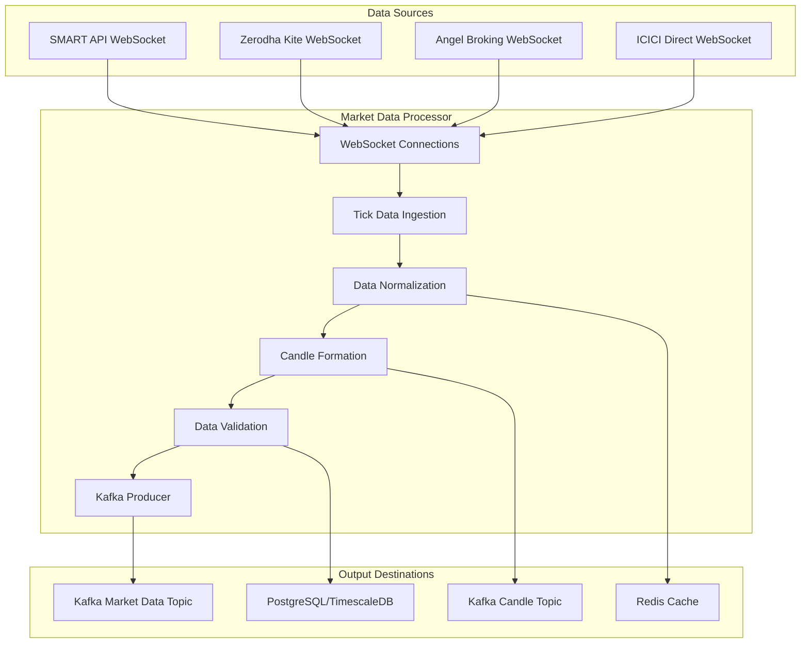

# Java Market Data Processing Microservice

## Overview

The Market Data Processing microservice is a high-performance Java application designed to handle real-time market data ingestion, processing, and distribution for the Velox algotrading system. This service leverages Java 21's virtual threads and reactive programming to achieve sub-millisecond latency for tick data processing.

## Service Architecture



## Core Components

### 1. Application Entry Point

```java
@SpringBootApplication
@EnableKafka
@EnableCaching
public class MarketDataProcessorApplication {
    
    public static void main(String[] args) {
        System.setProperty("java.util.concurrent.ForkJoinPool.common.parallelism", "100");
        SpringApplication.run(MarketDataProcessorApplication.class, args);
    }
    
    @Bean
    public TaskExecutor taskExecutor() {
        ThreadPoolTaskExecutor executor = new ThreadPoolTaskExecutor();
        executor.setCorePoolSize(50);
        executor.setMaxPoolSize(200);
        executor.setThreadNamePrefix("MarketData-");
        executor.setRejectedExecutionHandler(new ThreadPoolExecutor.CallerRunsPolicy());
        executor.initialize();
        return executor;
    }
}
```

### 2. WebSocket Connection Management

```java
@Component
@Slf4j
public class BrokerConnectionManager {
    
    private final Map<String, WebSocketSession> activeSessions = new ConcurrentHashMap<>();
    private final BrokerConfigRepository brokerConfigRepository;
    private final TickDataProcessor tickProcessor;
    private final ScheduledExecutorService scheduler = Executors.newScheduledThreadPool(10);
    
    @EventListener(ApplicationReadyEvent.class)
    public void initializeConnections() {
        List<BrokerConfig> brokers = brokerConfigRepository.findByActiveTrue();
        
        brokers.forEach(broker -> {
            scheduler.scheduleWithFixedDelay(() -> {
                if (!activeSessions.containsKey(broker.getBrokerId())) {
                    connectToBroker(broker);
                }
            }, 0, 30, TimeUnit.SECONDS);
        });
    }
    
    private void connectToBroker(BrokerConfig broker) {
        try {
            WebSocketSession session = switch (broker.getApiType()) {
                case "SMART_API" -> connectToSmartApi(broker);
                case "ZERODHA" -> connectToZerodha(broker);
                case "ANGEL" -> connectToAngel(broker);
                case "ICICI" -> connectToIcici(broker);
                default -> throw new IllegalArgumentException("Unsupported broker: " + broker.getApiType());
            };
            
            activeSessions.put(broker.getBrokerId(), session);
            log.info("Connected to broker: {}", broker.getName());
            
        } catch (Exception e) {
            log.error("Failed to connect to broker: {}", broker.getName(), e);
        }
    }
    
    private WebSocketSession connectToSmartApi(BrokerConfig broker) {
        // SMART API specific WebSocket connection logic
        WebSocketClient client = new StandardWebSocketClient();
        WebSocketSession session = client.doHandshake(
            new SmartApiWebSocketHandler(broker, tickProcessor),
            null,
            URI.create(broker.getWebSocketUrl())
        ).join();
        
        return session;
    }
    
    // Similar methods for other brokers...
}
```

### 3. High-Performance Tick Data Processor

```java
@Component
@Slf4j
public class TickDataProcessor {
    
    private final KafkaTemplate<String, Object> kafkaTemplate;
    private final TickValidator tickValidator;
    private final DataNormalizer dataNormalizer;
    private final MeterRegistry meterRegistry;
    private final Counter tickCounter;
    private final Timer processingTimer;
    
    // Off-heap storage for high-frequency data
    private final ByteBuffer tickBuffer;
    private final AtomicLong bufferPosition = new AtomicLong(0);
    
    public TickDataProcessor(KafkaTemplate<String, Object> kafkaTemplate,
                           TickValidator tickValidator,
                           DataNormalizer dataNormalizer,
                           MeterRegistry meterRegistry) {
        this.kafkaTemplate = kafkaTemplate;
        this.tickValidator = tickValidator;
        this.dataNormalizer = dataNormalizer;
        this.meterRegistry = meterRegistry;
        
        this.tickCounter = Counter.builder("ticks.processed")
            .description("Number of ticks processed")
            .register(meterRegistry);
        this.processingTimer = Timer.builder("tick.processing.time")
            .description("Tick processing time")
            .register(meterRegistry);
        
        // Allocate 100MB off-heap buffer
        this.tickBuffer = ByteBuffer.allocateDirect(100 * 1024 * 1024);
    }
    
    @Async("taskExecutor")
    public void processTick(TickData tick) {
        Timer.Sample sample = Timer.start(meterRegistry);
        
        try {
            // Validate tick data
            if (!tickValidator.isValid(tick)) {
                log.warn("Invalid tick data: {}", tick);
                return;
            }
            
            // Normalize data
            TickData normalizedTick = dataNormalizer.normalize(tick);
            
            // Store in off-heap buffer for batch processing
            storeTickInBuffer(normalizedTick);
            
            // Send to Kafka for immediate processing
            kafkaTemplate.send(KafkaTopics.MARKET_DATA_TICKS, normalizedTick.getSymbol(), normalizedTick);
            
            tickCounter.increment();
            
        } catch (Exception e) {
            log.error("Error processing tick: {}", tick, e);
        } finally {
            sample.stop(processingTimer);
        }
    }
    
    private void storeTickInBuffer(TickData tick) {
        // Serialize tick to off-heap buffer for batch processing
        byte[] serialized = serializeTick(tick);
        long position = bufferPosition.getAndAdd(serialized.length);
        
        if (position + serialized.length > tickBuffer.capacity()) {
            // Buffer full, trigger batch processing
            processBatchFromBuffer();
            bufferPosition.set(0);
        }
        
        tickBuffer.position((int) position);
        tickBuffer.put(serialized);
    }
    
    @Scheduled(fixedDelay = 100) // Process every 100ms
    public void processBatchFromBuffer() {
        long currentPosition = bufferPosition.get();
        if (currentPosition == 0) return;
        
        List<TickData> batch = new ArrayList<>();
        tickBuffer.rewind();
        
        while (tickBuffer.position() < currentPosition) {
            TickData tick = deserializeTick(tickBuffer);
            batch.add(tick);
        }
        
        // Process batch for candle formation
        processBatchForCandles(batch);
    }
}
```

### 4. Real-Time Candle Formation

```java
@Component
@Slf4j
public class CandleFormationEngine {
    
    private final Map<String, Map<String, FormingCandle>> formingCandles = new ConcurrentHashMap<>();
    private final CandleBuilder candleBuilder;
    private final KafkaTemplate<String, Object> kafkaTemplate;
    private final MeterRegistry meterRegistry;
    
    // Timeframes: 1min, 5min, 15min, 30min, 1hour
    private final List<String> timeframes = List.of("1min", "5min", "15min", "30min", "1hour");
    
    public CandleFormationEngine(CandleBuilder candleBuilder,
                               KafkaTemplate<String, Object> kafkaTemplate,
                               MeterRegistry meterRegistry) {
        this.candleBuilder = candleBuilder;
        this.kafkaTemplate = kafkaTemplate;
        this.meterRegistry = meterRegistry;
    }
    
    public void processTickForCandles(TickData tick) {
        String symbol = tick.getSymbol();
        
        // Initialize candle maps for symbol if not exists
        formingCandles.computeIfAbsent(symbol, k -> new ConcurrentHashMap<>());
        
        Map<String, FormingCandle> symbolCandles = formingCandles.get(symbol);
        
        for (String timeframe : timeframes) {
            processTickForTimeframe(symbol, timeframe, tick, symbolCandles);
        }
    }
    
    private void processTickForTimeframe(String symbol, String timeframe, 
                                      TickData tick, Map<String, FormingCandle> symbolCandles) {
        Instant candleTime = getCandleTime(tick.getTimestamp(), timeframe);
        
        FormingCandle candle = symbolCandles.get(timeframe);
        
        if (candle == null || !candle.getTimestamp().equals(candleTime)) {
            // New candle period started
            if (candle != null) {
                // Complete previous candle and send to Kafka
                completeCandle(symbol, timeframe, candle);
            }
            
            // Create new forming candle
            candle = new FormingCandle(candleTime, tick.getPrice(), tick.getPrice(), 
                                     tick.getPrice(), tick.getPrice(), tick.getVolume());
            symbolCandles.put(timeframe, candle);
        } else {
            // Update existing forming candle
            candle.updateWithTick(tick);
        }
        
        // Send forming candle update to Kafka
        sendFormingCandleUpdate(symbol, timeframe, candle);
    }
    
    private void completeCandle(String symbol, String timeframe, FormingCandle candle) {
        CandleData completedCandle = candleBuilder.build(symbol, timeframe, candle);
        
        // Send completed candle to Kafka
        kafkaTemplate.send(KafkaTopics.MARKET_DATA_CANDLES, 
                         symbol + "-" + timeframe, completedCandle);
        
        // Store in database
        candleBuilder.storeCandle(completedCandle);
        
        log.debug("Completed candle: {} {} {}", symbol, timeframe, candle.getTimestamp());
    }
    
    private Instant getCandleTime(Instant tickTime, String timeframe) {
        LocalDateTime dateTime = LocalDateTime.ofInstant(tickTime, ZoneId.systemDefault());
        
        return switch (timeframe) {
            case "1min" -> dateTime.truncatedTo(ChronoUnit.MINUTES).atZone(ZoneId.systemDefault()).toInstant();
            case "5min" -> dateTime.truncatedTo(ChronoUnit.MINUTES)
                                  .withMinute((dateTime.getMinute() / 5) * 5)
                                  .atZone(ZoneId.systemDefault()).toInstant();
            case "15min" -> dateTime.truncatedTo(ChronoUnit.MINUTES)
                                   .withMinute((dateTime.getMinute() / 15) * 15)
                                   .atZone(ZoneId.systemDefault()).toInstant();
            case "30min" -> dateTime.truncatedTo(ChronoUnit.MINUTES)
                                   .withMinute((dateTime.getMinute() / 30) * 30)
                                   .atZone(ZoneId.systemDefault()).toInstant();
            case "1hour" -> dateTime.truncatedTo(ChronoUnit.HOURS).atZone(ZoneId.systemDefault()).toInstant();
            default -> throw new IllegalArgumentException("Unsupported timeframe: " + timeframe);
        };
    }
}
```

### 5. Data Models

```java
@JsonIgnoreProperties(ignoreUnknown = true)
public class TickData {
    
    private String symbol;
    private String exchange;
    private Double price;
    private Long volume;
    private Instant timestamp;
    private Double openInterest;
    private Map<String, Object> metadata;
    
    // Constructors, getters, setters
    
    @JsonIgnore
    public String getUniqueKey() {
        return symbol + "-" + exchange + "-" + timestamp.toEpochMilli();
    }
}

public class FormingCandle {
    
    private final Instant timestamp;
    private Double open;
    private Double high;
    private Double low;
    private Double close;
    private Long volume;
    private int tickCount;
    
    public FormingCandle(Instant timestamp, Double open, Double high, 
                        Double low, Double close, Long volume) {
        this.timestamp = timestamp;
        this.open = open;
        this.high = high;
        this.low = low;
        this.close = close;
        this.volume = volume;
        this.tickCount = 1;
    }
    
    public void updateWithTick(TickData tick) {
        this.close = tick.getPrice();
        this.high = Math.max(this.high, tick.getPrice());
        this.low = Math.min(this.low, tick.getPrice());
        this.volume += tick.getVolume();
        this.tickCount++;
    }
    
    // Getters
}

@Builder
@Data
public class CandleData {
    
    private String symbol;
    private String exchange;
    private String interval;
    private Instant timestamp;
    private Double open;
    private Double high;
    private Double low;
    private Double close;
    private Long volume;
    private Double openInterest;
    private int tickCount;
}
```

### 6. Data Validation and Normalization

```java
@Component
public class TickValidator {
    
    private final Map<String, Double> lastKnownPrices = new ConcurrentHashMap<>();
    private final Map<String, Double> priceBands = new ConcurrentHashMap<>();
    
    public boolean isValid(TickData tick) {
        // Basic validation
        if (tick.getSymbol() == null || tick.getPrice() == null || tick.getTimestamp() == null) {
            return false;
        }
        
        // Price validation
        if (tick.getPrice() <= 0) {
            return false;
        }
        
        // Timestamp validation (not too old or future)
        Instant now = Instant.now();
        if (tick.getTimestamp().isBefore(now.minusSeconds(60)) || 
            tick.getTimestamp().isAfter(now.plusSeconds(10))) {
            return false;
        }
        
        // Price movement validation
        String key = tick.getSymbol() + "-" + tick.getExchange();
        Double lastPrice = lastKnownPrices.get(key);
        
        if (lastPrice != null) {
            double priceChange = Math.abs(tick.getPrice() - lastPrice) / lastPrice;
            if (priceChange > 0.10) { // 10% price change threshold
                return false;
            }
        }
        
        lastKnownPrices.put(key, tick.getPrice());
        return true;
    }
}

@Component
public class DataNormalizer {
    
    private final Map<String, SymbolConfig> symbolConfigs = new ConcurrentHashMap<>();
    
    public TickData normalize(TickData tick) {
        String symbolKey = tick.getSymbol() + "-" + tick.getExchange();
        SymbolConfig config = symbolConfigs.get(symbolKey);
        
        if (config == null) {
            config = loadSymbolConfig(tick.getSymbol(), tick.getExchange());
            symbolConfigs.put(symbolKey, config);
        }
        
        // Normalize price precision
        double normalizedPrice = roundToPrecision(tick.getPrice(), config.getPricePrecision());
        
        // Normalize volume
        long normalizedVolume = tick.getVolume() != null ? 
            tick.getVolume() * config.getVolumeMultiplier() : 0L;
        
        return TickData.builder()
            .symbol(tick.getSymbol())
            .exchange(tick.getExchange())
            .price(normalizedPrice)
            .volume(normalizedVolume)
            .timestamp(tick.getTimestamp())
            .openInterest(tick.getOpenInterest())
            .metadata(tick.getMetadata())
            .build();
    }
    
    private double roundToPrecision(double value, int precision) {
        double factor = Math.pow(10, precision);
        return Math.round(value * factor) / factor;
    }
}
```

### 7. Kafka Integration

```java
@Configuration
@EnableKafka
public class KafkaConfig {
    
    @Value("${spring.kafka.bootstrap-servers}")
    private String bootstrapServers;
    
    @Bean
    public ProducerFactory<String, Object> producerFactory() {
        Map<String, Object> configProps = new HashMap<>();
        configProps.put(ProducerConfig.BOOTSTRAP_SERVERS_CONFIG, bootstrapServers);
        configProps.put(ProducerConfig.KEY_SERIALIZER_CLASS_CONFIG, StringSerializer.class);
        configProps.put(ProducerConfig.VALUE_SERIALIZER_CLASS_CONFIG, AvroSerializer.class);
        configProps.put(ProducerConfig.ACKS_CONFIG, "1");
        configProps.put(ProducerConfig.RETRIES_CONFIG, 3);
        configProps.put(ProducerConfig.BATCH_SIZE_CONFIG, 16384);
        configProps.put(ProducerConfig.LINGER_MS_CONFIG, 1);
        configProps.put(ProducerConfig.COMPRESSION_TYPE_CONFIG, "lz4");
        configProps.put(ProducerConfig.BUFFER_MEMORY_CONFIG, 33554432);
        
        return new DefaultKafkaProducerFactory<>(configProps);
    }
    
    @Bean
    public KafkaTemplate<String, Object> kafkaTemplate() {
        return new KafkaTemplate<>(producerFactory());
    }
    
    @Bean
    public NewTopic marketDataTicksTopic() {
        return TopicBuilder.name(KafkaTopics.MARKET_DATA_TICKS)
            .partitions(12)
            .replicas(3)
            .compact()
            .build();
    }
    
    @Bean
    public NewTopic marketDataCandlesTopic() {
        return TopicBuilder.name(KafkaTopics.MARKET_DATA_CANDLES)
            .partitions(6)
            .replicas(3)
            .compact()
            .build();
    }
}
```

### 8. Performance Monitoring

```java
@Component
public class MarketDataMetrics {
    
    private final MeterRegistry meterRegistry;
    private final Timer tickProcessingTimer;
    private final Counter tickCounter;
    private final Counter errorCounter;
    private final Gauge activeConnectionsGauge;
    private final AtomicLong activeConnections = new AtomicLong(0);
    
    public MarketDataMetrics(MeterRegistry meterRegistry) {
        this.meterRegistry = meterRegistry;
        
        this.tickProcessingTimer = Timer.builder("marketdata.tick.processing.time")
            .description("Time taken to process a single tick")
            .register(meterRegistry);
            
        this.tickCounter = Counter.builder("marketdata.ticks.processed")
            .description("Total number of ticks processed")
            .register(meterRegistry);
            
        this.errorCounter = Counter.builder("marketdata.errors")
            .description("Number of processing errors")
            .register(meterRegistry);
            
        this.activeConnectionsGauge = Gauge.builder("marketdata.active.connections")
            .description("Number of active WebSocket connections")
            .register(meterRegistry, activeConnections, AtomicLong::get);
    }
    
    public void recordTickProcessing(Duration duration) {
        tickProcessingTimer.record(duration);
        tickCounter.increment();
    }
    
    public void recordError() {
        errorCounter.increment();
    }
    
    public void incrementActiveConnections() {
        activeConnections.incrementAndGet();
    }
    
    public void decrementActiveConnections() {
        activeConnections.decrementAndGet();
    }
}
```

### 9. Health Checks

```java
@Component
public class MarketDataHealthIndicator implements HealthIndicator {
    
    private final BrokerConnectionManager connectionManager;
    private final KafkaTemplate<String, Object> kafkaTemplate;
    
    @Override
    public Health health() {
        try {
            // Check WebSocket connections
            int activeConnections = connectionManager.getActiveConnectionCount();
            if (activeConnections == 0) {
                return Health.down()
                    .withDetail("reason", "No active broker connections")
                    .build();
            }
            
            // Check Kafka connectivity
            kafkaTemplate.send("health-check", "test").get(5, TimeUnit.SECONDS);
            
            return Health.up()
                .withDetail("activeConnections", activeConnections)
                .withDetail("kafka", "connected")
                .build();
                
        } catch (Exception e) {
            return Health.down()
                .withDetail("error", e.getMessage())
                .build();
        }
    }
}
```

## Performance Optimizations

### 1. Virtual Threads for Concurrent Processing

```java
@Configuration
public class VirtualThreadConfig {
    
    @Bean
    public Executor virtualThreadExecutor() {
        return Executors.newVirtualThreadPerTaskExecutor();
    }
    
    @Bean
    public AsyncTaskExecutor asyncTaskExecutor() {
        return new TaskExecutorAdapter(virtualThreadExecutor());
    }
}
```

### 2. Off-Heap Memory Management

```java
@Component
public class OffHeapTickBuffer {
    
    private final Unsafe unsafe;
    private final long memoryAddress;
    private final long capacity;
    private final AtomicLong position = new AtomicLong(0);
    
    public OffHeapTickBuffer(long capacityBytes) {
        this.capacity = capacityBytes;
        this.memoryAddress = unsafe.allocateMemory(capacityBytes);
        unsafe.setMemory(memoryAddress, capacityBytes, (byte) 0);
    }
    
    public boolean storeTick(TickData tick) {
        byte[] serialized = serializeTick(tick);
        long currentPos = position.getAndAdd(serialized.length);
        
        if (currentPos + serialized.length > capacity) {
            return false; // Buffer full
        }
        
        unsafe.copyMemory(serialized, 0, memoryAddress + currentPos, serialized.length);
        return true;
    }
    
    public List<TickData> drainBuffer() {
        List<TickData> ticks = new ArrayList<>();
        long currentPos = position.get();
        
        if (currentPos == 0) return ticks;
        
        long readPos = 0;
        while (readPos < currentPos) {
            int length = unsafe.getInt(memoryAddress + readPos);
            readPos += 4;
            
            byte[] data = new byte[length];
            unsafe.copyMemory(memoryAddress + readPos, data, 0, length);
            readPos += length;
            
            ticks.add(deserializeTick(data));
        }
        
        position.set(0);
        return ticks;
    }
}
```

### 3. Zero-Copy Data Transfer

```java
@Component
public class ZeroCopyDataTransfer {
    
    public void transferToKafka(ByteBuffer buffer, String topic, String key) {
        // Use zero-copy transfer for large data
        try (FileChannel channel = FileChannel.open(Paths.get("/tmp/marketdata.tmp"), 
                StandardOpenOption.WRITE, StandardOpenOption.READ)) {
            
            channel.write(buffer);
            channel.position(0);
            
            // Send file reference to Kafka (zero-copy)
            kafkaTemplate.send(topic, key, channel.map(FileChannel.MapMode.READ_ONLY, 0, channel.size()));
            
        } catch (IOException e) {
            log.error("Error in zero-copy transfer", e);
        }
    }
}
```

## Configuration

```yaml
# application.yml
server:
  port: 8081

spring:
  application:
    name: market-data-processor
  
  kafka:
    bootstrap-servers: kafka:9092
    producer:
      key-serializer: org.apache.kafka.common.serialization.StringSerializer
      value-serializer: io.confluent.kafka.serializers.KafkaAvroSerializer
      acks: 1
      retries: 3
      batch-size: 16384
      linger-ms: 1
      compression-type: lz4
      buffer-memory: 33554432
  
  datasource:
    url: jdbc:postgresql://postgres:5432/velox_trading
    username: ${DB_USERNAME:velox}
    password: ${DB_PASSWORD:velox123}
    hikari:
      maximum-pool-size: 20
      minimum-idle: 5
      connection-timeout: 30000
      idle-timeout: 600000
      max-lifetime: 1800000
  
  cache:
    type: caffeine
    caffeine:
      spec: maximumSize=10000,expireAfterWrite=5m

management:
  endpoints:
    web:
      exposure:
        include: health,metrics,prometheus
  endpoint:
    health:
      show-details: always
  metrics:
    export:
      prometheus:
        enabled: true

logging:
  level:
    com.velox.marketdata: DEBUG
    org.apache.kafka: WARN
  pattern:
    console: "%d{yyyy-MM-dd HH:mm:ss} [%thread] %-5level %logger{36} - %msg%n"

# Custom configuration
marketdata:
  tick-buffer-size: 104857600  # 100MB
  batch-processing-interval: 100  # ms
  max-price-change-percent: 10.0
  connection-retry-interval: 30  # seconds
  supported-timeframes: 1min,5min,15min,30min,1hour
```

## Deployment Configuration

```dockerfile
# Dockerfile
FROM eclipse-temurin:21-jre-alpine

WORKDIR /app

COPY target/market-data-processor-*.jar app.jar

# JVM optimizations for high-performance
ENV JAVA_OPTS="-XX:+UseVirtualThreads -XX:+UseZGC -XX:+UnlockExperimentalVMOptions -XX:+UseTransparentHugePages -Xms512m -Xmx2g -XX:MaxDirectMemorySize=1g"

EXPOSE 8081

ENTRYPOINT ["sh", "-c", "java $JAVA_OPTS -jar app.jar"]
```

```yaml
# kubernetes/deployment.yaml
apiVersion: apps/v1
kind: Deployment
metadata:
  name: market-data-processor
spec:
  replicas: 3
  selector:
    matchLabels:
      app: market-data-processor
  template:
    metadata:
      labels:
        app: market-data-processor
    spec:
      containers:
      - name: market-data-processor
        image: velox/market-data-processor:latest
        ports:
        - containerPort: 8081
        env:
        - name: SPRING_PROFILES_ACTIVE
          value: "production"
        - name: KAFKA_BOOTSTRAP_SERVERS
          value: "kafka:9092"
        - name: DB_USERNAME
          valueFrom:
            secretKeyRef:
              name: db-credentials
              key: username
        - name: DB_PASSWORD
          valueFrom:
            secretKeyRef:
              name: db-credentials
              key: password
        resources:
          requests:
            memory: "1Gi"
            cpu: "1000m"
          limits:
            memory: "4Gi"
            cpu: "2000m"
        livenessProbe:
          httpGet:
            path: /actuator/health
            port: 8081
          initialDelaySeconds: 60
          periodSeconds: 10
        readinessProbe:
          httpGet:
            path: /actuator/health/readiness
            port: 8081
          initialDelaySeconds: 30
          periodSeconds: 5
```

This Java Market Data Processing microservice provides a robust, high-performance foundation for handling real-time market data in the Velox algotrading system, with sub-millisecond latency, efficient memory management, and seamless integration with the existing infrastructure.