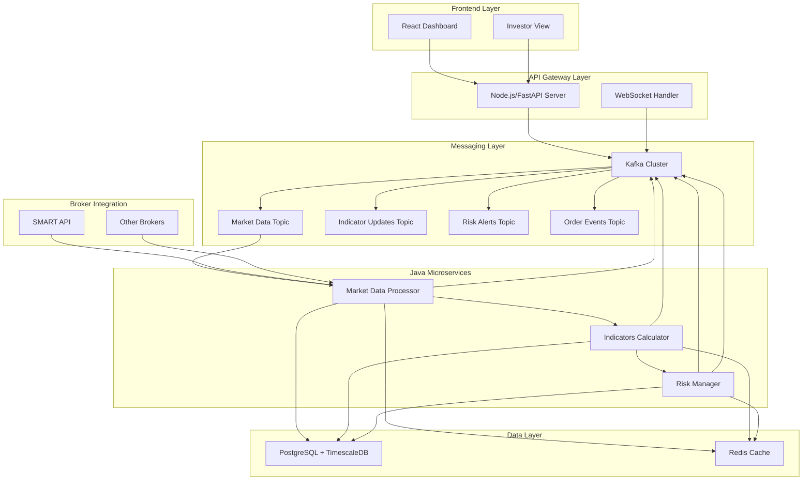

# Java Microservices Architecture for High-Performance Components

## Overview

This document outlines the architecture for implementing Java microservices to handle high-performance components in the Velox algotrading system. The Java microservices will focus on three critical areas: market data processing, technical indicators calculation, and risk management.

## Architecture Goals

1. **High Performance**: Leverage Java's performance advantages for computationally intensive tasks
2. **Low Latency**: Minimize processing latency for real-time trading decisions
3. **Scalability**: Design for horizontal scaling to handle increased load
4. **Reliability**: Ensure robust error handling and fault tolerance
5. **Integration**: Seamless integration with existing Node.js/Python components

## System Architecture



## Technology Stack

### Core Framework
- **Runtime**: Java 21 LTS (latest long-term support)
- **Framework**: Spring Boot 3.x with Spring Boot 3.2
- **Build Tool**: Maven 3.9+
- **JDK Distribution**: Eclipse Temurin or OpenJDK

### Performance & Concurrency
- **Reactive Programming**: Project Reactor (Spring WebFlux)
- **Concurrency**: Virtual Threads (Java 21)
- **High-Performance Computing**: Apache Commons Math, JMH for benchmarking
- **Memory Management**: Caffeine Cache, Off-heap storage options

### Messaging & Integration
- **Apache Kafka**: Kafka Streams for real-time processing
- **Kafka Client**: Spring for Apache Kafka
- **Serialization**: Apache Avro for efficient message serialization
- **Schema Registry**: Confluent Schema Registry

### Database & Persistence
- **PostgreSQL**: PostgreSQL JDBC Driver
- **TimescaleDB**: For time-series data optimization
- **Redis**: Spring Data Redis with Lettuce client
- **Connection Pooling**: HikariCP

### Monitoring & Observability
- **Metrics**: Micrometer with Prometheus
- **Tracing**: Spring Boot with OpenTelemetry
- **Logging**: Logback with structured logging (JSON)
- **Health Checks**: Spring Boot Actuator

### Testing
- **Unit Testing**: JUnit 5, Mockito
- **Integration Testing**: Testcontainers
- **Performance Testing**: JMH, Gatling
- **Contract Testing**: Pact

## Microservice Design

### 1. Market Data Processor Service

**Purpose**: High-performance processing of real-time market data from broker APIs

**Key Features**:
- Real-time tick data processing with sub-millisecond latency
- Data normalization and validation
- Candle formation with multiple timeframes
- High-throughput data ingestion (10,000+ ticks/second)
- Fault-tolerant broker connection management

**Core Components**:
```java
// Main service structure
com.velox.marketdata/
├── MarketDataProcessorApplication.java
├── config/
│   ├── KafkaConfig.java
│   ├── BrokerConfig.java
│   └── CacheConfig.java
├── service/
│   ├── TickProcessor.java
│   ├── CandleBuilder.java
│   ├── DataNormalizer.java
│   └── BrokerConnectionManager.java
├── model/
│   ├── TickData.java
│   ├── CandleData.java
│   └── MarketDataEvent.java
├── processor/
│   ├── TickDataProcessor.java
│   └── CandleFormationProcessor.java
└── controller/
    └── HealthController.java
```

**Performance Optimizations**:
- Virtual threads for concurrent tick processing
- Off-heap storage for high-frequency data
- Batch processing for database writes
- Zero-copy techniques for data transfer

### 2. Technical Indicators Calculator Service

**Purpose**: Real-time calculation of technical indicators with optimized algorithms

**Key Features**:
- Real-time indicator calculation with forming candle approach
- Support for 50+ technical indicators
- Custom indicator framework
- High-performance mathematical computations
- Indicator caching and optimization

**Core Components**:
```java
// Indicators service structure
com.velox.indicators/
├── IndicatorsCalculatorApplication.java
├── config/
│   ├── KafkaConfig.java
│   └── IndicatorConfig.java
├── service/
│   ├── IndicatorEngine.java
│   ├── RealTimeCalculator.java
│   └── IndicatorCache.java
├── indicators/
│   ├── movingaverages/
│   │   ├── EMA.java
│   │   ├── SMA.java
│   │   └── WMA.java
│   ├── oscillators/
│   │   ├── RSI.java
│   │   ├── MACD.java
│   │   └── Stochastic.java
│   └── volatility/
│       ├── BollingerBands.java
│       └── ATR.java
├── model/
│   ├── IndicatorValue.java
│   ├── IndicatorRequest.java
│   └── IndicatorResponse.java
└── processor/
    ├── IndicatorProcessor.java
    └── FormingCandleProcessor.java
```

**Performance Optimizations**:
- Native mathematical libraries (JNI for critical calculations)
- Circular buffers for efficient data storage
- Parallel computation for multi-symbol processing
- Incremental calculation algorithms

### 3. Risk Management Service

**Purpose**: Real-time risk monitoring and management for trading operations

**Key Features**:
- Real-time position and P&L monitoring
- Dynamic risk limit enforcement
- Emergency exit mechanisms
- Portfolio risk analytics
- Regulatory compliance checks

**Core Components**:
```java
// Risk management service structure
com.velox.risk/
├── RiskManagementApplication.java
├── config/
│   ├── KafkaConfig.java
│   └── RiskConfig.java
├── service/
│   ├── RiskEngine.java
│   ├── PositionMonitor.java
│   ├── RiskLimitChecker.java
│   └── EmergencyExit.java
├── model/
│   ├── RiskPosition.java
│   ├── RiskLimit.java
│   ├── RiskAlert.java
│   └── RiskMetrics.java
├── rules/
│   ├── PositionSizeRule.java
│   ├── LossLimitRule.java
│   ├── DrawdownRule.java
│   └── ConcentrationRule.java
└── processor/
    ├── RiskProcessor.java
    └── AlertProcessor.java
```

**Performance Optimizations**:
- In-memory risk calculations
- Event-driven risk evaluation
- Parallel risk rule processing
- Efficient position aggregation

## Inter-Service Communication

### Kafka Integration

**Topic Design**:
```java
// Kafka topic configuration
public class KafkaTopics {
    public static final String MARKET_DATA_TICKS = "market-data-ticks";
    public static final String MARKET_DATA_CANDLES = "market-data-candles";
    public static final String INDICATOR_UPDATES = "indicator-updates";
    public static final String RISK_ALERTS = "risk-alerts";
    public static final String POSITION_UPDATES = "position-updates";
    public static final String ORDER_EVENTS = "order-events";
}
```

**Message Schema** (Avro):
```avro
{
  "type": "record",
  "name": "MarketDataTick",
  "fields": [
    {"name": "symbol", "type": "string"},
    {"name": "timestamp", "type": "long"},
    {"name": "price", "type": "double"},
    {"name": "volume", "type": "long"},
    {"name": "exchange", "type": "string"}
  ]
}
```

### Service Discovery & Configuration

**Spring Cloud Config**:
- Centralized configuration management
- Environment-specific configurations
- Dynamic configuration updates

**Service Registration**:
- Eureka or Consul for service discovery
- Health check endpoints
- Load balancing configuration

## Database Integration Strategy

### Connection Management

**HikariCP Configuration**:
```java
@Configuration
public class DatabaseConfig {
    
    @Bean
    @Primary
    public DataSource dataSource() {
        HikariConfig config = new HikariConfig();
        config.setJdbcUrl("jdbc:postgresql://localhost:5432/velox_trading");
        config.setUsername("${db.username}");
        config.setPassword("${db.password}");
        config.setMaximumPoolSize(20);
        config.setMinimumIdle(5);
        config.setConnectionTimeout(30000);
        config.setIdleTimeout(600000);
        config.setMaxLifetime(1800000);
        return new HikariDataSource(config);
    }
}
```

### Time-Series Data Optimization

**TimescaleDB Integration**:
```java
@Repository
public class MarketDataRepository {
    
    @Autowired
    private JdbcTemplate jdbcTemplate;
    
    public void batchInsertCandles(List<CandleData> candles) {
        String sql = """
            INSERT INTO market_data (symbol, timestamp, open, high, low, close, volume, interval)
            VALUES (?, ?, ?, ?, ?, ?, ?, ?)
            """;
        
        jdbcTemplate.batchUpdate(sql, candles, candles.size(), (ps, candle) -> {
            ps.setString(1, candle.getSymbol());
            ps.setTimestamp(2, Timestamp.from(candle.getTimestamp()));
            ps.setDouble(3, candle.getOpen());
            ps.setDouble(4, candle.getHigh());
            ps.setDouble(5, candle.getLow());
            ps.setDouble(6, candle.getClose());
            ps.setLong(7, candle.getVolume());
            ps.setString(8, candle.getInterval());
        });
    }
}
```

## Performance Monitoring & Observability

### Metrics Collection

**Micrometer Configuration**:
```java
@Configuration
public class MetricsConfig {
    
    @Bean
    public TimedAspect timedAspect(MeterRegistry registry) {
        return new TimedAspect(registry);
    }
    
    @Bean
    public CountedAspect countedAspect(MeterRegistry registry) {
        return new CountedAspect(registry);
    }
}
```

**Custom Metrics**:
```java
@Component
public class PerformanceMetrics {
    
    private final MeterRegistry meterRegistry;
    private final Counter tickCounter;
    private final Timer processingTimer;
    
    public PerformanceMetrics(MeterRegistry meterRegistry) {
        this.meterRegistry = meterRegistry;
        this.tickCounter = Counter.builder("ticks.processed")
            .description("Number of ticks processed")
            .register(meterRegistry);
        this.processingTimer = Timer.builder("tick.processing.time")
            .description("Tick processing time")
            .register(meterRegistry);
    }
    
    public void recordTick() {
        tickCounter.increment();
    }
    
    public void recordProcessingTime(Duration duration) {
        processingTimer.record(duration);
    }
}
```

### Distributed Tracing

**OpenTelemetry Configuration**:
```java
@Configuration
public class TracingConfig {
    
    @Bean
    public OpenTelemetry openTelemetry() {
        return OpenTelemetrySdk.builder()
            .setTracerProvider(
                SdkTracerProvider.builder()
                    .addSpanProcessor(BatchSpanProcessor.builder(
                        OtlpGrpcSpanExporter.builder()
                            .setEndpoint("http://jaeger:14250")
                            .build())
                        .build())
                    .build())
            .setMeterProvider(
                SdkMeterProvider.builder()
                    .registerMetricReader(
                        PeriodicMetricReader.builder(
                            OtlpGrpcMetricExporter.builder()
                                .setEndpoint("http://prometheus:9090")
                                .build())
                        .setInterval(Duration.ofSeconds(30))
                        .build())
                    .build())
            .build();
    }
}
```

## Deployment Strategy

### Containerization

**Dockerfile**:
```dockerfile
FROM eclipse-temurin:21-jre-alpine

WORKDIR /app

COPY target/*.jar app.jar

EXPOSE 8080

ENTRYPOINT ["java", "-XX:+UseVirtualThreads", "-XX:+UseZGC", "-jar", "app.jar"]
```

### Kubernetes Deployment

**Deployment YAML**:
```yaml
apiVersion: apps/v1
kind: Deployment
metadata:
  name: market-data-processor
spec:
  replicas: 3
  selector:
    matchLabels:
      app: market-data-processor
  template:
    metadata:
      labels:
        app: market-data-processor
    spec:
      containers:
      - name: market-data-processor
        image: velox/market-data-processor:latest
        ports:
        - containerPort: 8080
        env:
        - name: SPRING_PROFILES_ACTIVE
          value: "production"
        - name: KAFKA_BOOTSTRAP_SERVERS
          value: "kafka:9092"
        - name: DB_URL
          value: "jdbc:postgresql://postgres:5432/velox_trading"
        resources:
          requests:
            memory: "512Mi"
            cpu: "500m"
          limits:
            memory: "1Gi"
            cpu: "1000m"
        livenessProbe:
          httpGet:
            path: /actuator/health
            port: 8080
          initialDelaySeconds: 60
          periodSeconds: 10
        readinessProbe:
          httpGet:
            path: /actuator/health/readiness
            port: 8080
          initialDelaySeconds: 30
          periodSeconds: 5
```

## Security Considerations

### Authentication & Authorization

**Spring Security Configuration**:
```java
@Configuration
@EnableWebSecurity
public class SecurityConfig {
    
    @Bean
    public SecurityFilterChain filterChain(HttpSecurity http) throws Exception {
        http
            .authorizeHttpRequests(authz -> authz
                .requestMatchers("/actuator/health").permitAll()
                .anyRequest().authenticated()
            )
            .oauth2ResourceServer(oauth2 -> oauth2
                .jwt(jwt -> jwt.jwtDecoder(jwtDecoder()))
            );
        return http.build();
    }
    
    @Bean
    public JwtDecoder jwtDecoder() {
        return NimbusJwtDecoder.withJwkSetUri("https://auth.velox.com/.well-known/jwks.json")
            .build();
    }
}
```

### Data Encryption

**Sensitive Data Protection**:
```java
@Component
public class EncryptionService {
    
    private final AESUtil aesUtil;
    
    public EncryptionService() {
        this.aesUtil = new AESUtil(System.getenv("ENCRYPTION_KEY"));
    }
    
    public String encrypt(String data) {
        return aesUtil.encrypt(data);
    }
    
    public String decrypt(String encryptedData) {
        return aesUtil.decrypt(encryptedData);
    }
}
```

## Testing Strategy

### Unit Testing

**JUnit 5 Configuration**:
```java
@ExtendWith(MockitoExtension.class)
class TickProcessorTest {
    
    @Mock
    private KafkaTemplate<String, Object> kafkaTemplate;
    
    @InjectMocks
    private TickProcessor tickProcessor;
    
    @Test
    void shouldProcessTickSuccessfully() {
        // Given
        TickData tick = new TickData("NIFTY", 18500.0, 1000, Instant.now());
        
        // When
        tickProcessor.processTick(tick);
        
        // Then
        verify(kafkaTemplate).send(eq("market-data-ticks"), any(TickData.class));
    }
}
```

### Integration Testing

**Testcontainers Configuration**:
```java
@SpringBootTest
@Testcontainers
class MarketDataIntegrationTest {
    
    @Container
    static KafkaContainer kafka = new KafkaContainer(DockerImageName.parse("confluentinc/cp-kafka:latest"));
    
    @Container
    static PostgreSQLContainer<?> postgres = new PostgreSQLContainer<>("postgres:15")
            .withDatabaseName("testdb")
            .withUsername("test")
            .withPassword("test");
    
    @DynamicPropertySource
    static void configureProperties(DynamicPropertyRegistry registry) {
        registry.add("spring.kafka.bootstrap-servers", kafka::getBootstrapServers);
        registry.add("spring.datasource.url", postgres::getJdbcUrl);
        registry.add("spring.datasource.username", postgres::getUsername);
        registry.add("spring.datasource.password", postgres::getPassword);
    }
}
```

### Performance Testing

**JMH Benchmark**:
```java
@BenchmarkMode(Mode.AverageTime)
@OutputTimeUnit(TimeUnit.MICROSECONDS)
@State(Scope.Benchmark)
public class IndicatorBenchmark {
    
    private List<CandleData> candles;
    private EMA ema;
    
    @Setup
    public void setup() {
        candles = generateCandles(1000);
        ema = new EMA(20);
    }
    
    @Benchmark
    public double calculateEMA() {
        return ema.calculate(candles);
    }
}
```

## Implementation Roadmap

### Phase 1: Foundation (Weeks 1-2)
- Set up Java development environment
- Create basic Spring Boot microservice templates
- Implement Kafka integration
- Set up database connectivity

### Phase 2: Market Data Processor (Weeks 3-4)
- Implement tick data processing
- Create candle formation logic
- Add broker integration
- Performance optimization

### Phase 3: Indicators Calculator (Weeks 5-6)
- Implement core technical indicators
- Add real-time calculation engine
- Create forming candle integration
- Performance benchmarking

### Phase 4: Risk Management (Weeks 7-8)
- Implement risk engine
- Add position monitoring
- Create risk rule framework
- Emergency exit mechanisms

### Phase 5: Integration & Testing (Weeks 9-10)
- Integrate with existing Node.js/Python components
- Comprehensive testing
- Performance optimization
- Documentation

### Phase 6: Deployment & Monitoring (Weeks 11-12)
- Containerization and Kubernetes deployment
- Monitoring and observability setup
- Production readiness
- Performance tuning

This Java microservices architecture provides a robust, high-performance foundation for the critical components of the Velox algotrading system, ensuring low latency, scalability, and reliability while maintaining seamless integration with the existing system.