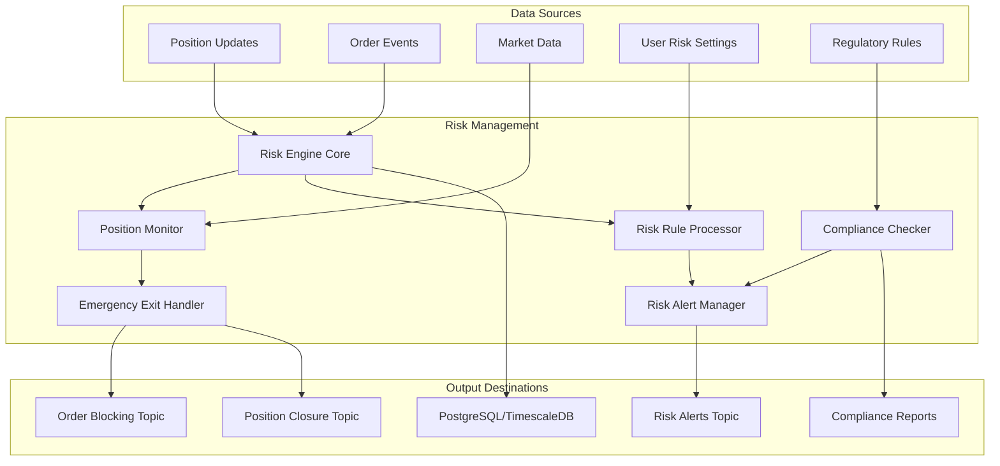

# Java Risk Management Microservice

## Overview

The Risk Management microservice is a critical Java application designed to provide real-time risk monitoring, position management, and regulatory compliance for the Velox algotrading system. This service leverages Java 21's virtual threads, event-driven architecture, and high-performance computing to ensure sub-millisecond risk evaluation and enforcement.

## Service Architecture



## Core Components

### 1. Application Entry Point

```java
@SpringBootApplication
@EnableKafka
@EnableScheduling
public class RiskManagementApplication {
    
    public static void main(String[] args) {
        // Optimize for real-time risk processing
        System.setProperty("java.util.concurrent.ForkJoinPool.common.parallelism", "100");
        SpringApplication.run(RiskManagementApplication.class, args);
    }
    
    @Bean
    public TaskExecutor riskTaskExecutor() {
        ThreadPoolTaskExecutor executor = new ThreadPoolTaskExecutor();
        executor.setCorePoolSize(50);
        executor.setMaxPoolSize(200);
        executor.setThreadNamePrefix("Risk-");
        executor.setRejectedExecutionHandler(new ThreadPoolExecutor.CallerRunsPolicy());
        executor.initialize();
        return executor;
    }
    
    @Bean
    public RiskMetrics riskMetrics(MeterRegistry meterRegistry) {
        return new RiskMetrics(meterRegistry);
    }
}
```

### 2. Real-Time Risk Engine

```java
@Component
@Slf4j
public class RealTimeRiskEngine {
    
    private final RiskRuleProcessor ruleProcessor;
    private final PositionMonitor positionMonitor;
    private final EmergencyExitHandler emergencyExitHandler;
    private final RiskAlertManager alertManager;
    private final ComplianceChecker complianceChecker;
    private final RiskMetrics metrics;
    private final KafkaTemplate<String, Object> kafkaTemplate;
    
    // In-memory risk state for ultra-fast access
    private final Map<String, UserRiskState> userRiskStates = new ConcurrentHashMap<>();
    private final Map<String, PositionRiskData> positionRisks = new ConcurrentHashMap<>();
    
    public RealTimeRiskEngine(RiskRuleProcessor ruleProcessor,
                              PositionMonitor positionMonitor,
                              EmergencyExitHandler emergencyExitHandler,
                              RiskAlertManager alertManager,
                              ComplianceChecker complianceChecker,
                              RiskMetrics metrics,
                              KafkaTemplate<String, Object> kafkaTemplate) {
        this.ruleProcessor = ruleProcessor;
        this.positionMonitor = positionMonitor;
        this.emergencyExitHandler = emergencyExitHandler;
        this.alertManager = alertManager;
        this.complianceChecker = complianceChecker;
        this.metrics = metrics;
        this.kafkaTemplate = kafkaTemplate;
    }
    
    @KafkaListener(topics = KafkaTopics.POSITION_UPDATES,
                   containerFactory = "positionKafkaListenerContainerFactory")
    public void processPositionUpdate(PositionUpdate update) {
        Timer.Sample sample = Timer.start(metrics.getMeterRegistry());
        
        try {
            String userId = update.getUserId();
            String symbol = update.getSymbol();
            
            // Update position risk data
            updatePositionRisk(update);
            
            // Get user risk state
            UserRiskState riskState = getOrCreateUserRiskState(userId);
            
            // Evaluate all risk rules
            RiskEvaluationResult result = evaluateRiskRules(update, riskState);
            
            // Process risk evaluation result
            processRiskResult(result, update);
            
            metrics.recordPositionUpdate();
            
        } catch (Exception e) {
            log.error("Error processing position update: {}", update, e);
            metrics.recordError();
        } finally {
            sample.stop(Timer.builder("risk.position.evaluation.time")
                .register(metrics.getMeterRegistry()));
        }
    }
    
    @KafkaListener(topics = KafkaTopics.ORDER_EVENTS,
                   containerFactory = "orderKafkaListenerContainerFactory")
    public OrderValidationResult validateOrder(OrderEvent orderEvent) {
        Timer.Sample sample = Timer.start(metrics.getMeterRegistry());
        
        try {
            String userId = orderEvent.getUserId();
            String symbol = orderEvent.getSymbol();
            
            // Get user risk state
            UserRiskState riskState = getOrCreateUserRiskState(userId);
            
            // Pre-trade risk validation
            OrderValidationResult validation = validateOrderRisk(orderEvent, riskState);
            
            // Check compliance
            ComplianceResult compliance = complianceChecker.checkOrderCompliance(orderEvent);
            
            // Combine results
            OrderValidationResult finalResult = combineValidationResults(validation, compliance);
            
            metrics.recordOrderValidation();
            
            return finalResult;
            
        } catch (Exception e) {
            log.error("Error validating order: {}", orderEvent, e);
            metrics.recordError();
            return OrderValidationResult.rejected("Internal risk validation error");
        } finally {
            sample.stop(Timer.builder("risk.order.validation.time")
                .register(metrics.getMeterRegistry()));
        }
    }
    
    private void updatePositionRisk(PositionUpdate update) {
        String positionKey = update.getUserId() + ":" + update.getSymbol();
        
        PositionRiskData riskData = positionRisks.compute(positionKey, (key, existing) -> {
            if (existing == null) {
                return new PositionRiskData(update);
            } else {
                existing.updateWithPositionUpdate(update);
                return existing;
            }
        });
        
        // Update user-level risk aggregation
        UserRiskState userState = userRiskStates.get(update.getUserId());
        if (userState != null) {
            userState.updatePositionRisk(riskData);
        }
    }
    
    private RiskEvaluationResult evaluateRiskRules(PositionUpdate update, UserRiskState riskState) {
        // Evaluate all risk rules in parallel
        List<RiskRule> rules = ruleProcessor.getApplicableRules(update.getUserId());
        
        List<RiskViolation> violations = rules.parallelStream()
            .map(rule -> rule.evaluate(update, riskState))
            .filter(Objects::nonNull)
            .collect(Collectors.toList());
        
        return RiskEvaluationResult.builder()
            .userId(update.getUserId())
            .symbol(update.getSymbol())
            .violations(violations)
            .riskScore(calculateRiskScore(violations))
            .timestamp(Instant.now())
            .build();
    }
    
    private void processRiskResult(RiskEvaluationResult result, PositionUpdate update) {
        if (result.hasViolations()) {
            // Handle risk violations
            for (RiskViolation violation : result.getViolations()) {
                handleRiskViolation(violation, update);
            }
            
            // Send risk alert
            alertManager.sendRiskAlert(result);
        }
        
        // Check for emergency exit conditions
        if (result.requiresEmergencyExit()) {
            emergencyExitHandler.triggerEmergencyExit(update.getUserId(), update.getSymbol());
        }
    }
    
    private void handleRiskViolation(RiskViolation violation, PositionUpdate update) {
        switch (violation.getSeverity()) {
            case CRITICAL:
                // Immediate action required
                emergencyExitHandler.handleCriticalViolation(violation, update);
                break;
            case HIGH:
                // Alert and potential position reduction
                alertManager.sendHighPriorityAlert(violation);
                positionMonitor.suggestPositionReduction(violation, update);
                break;
            case MEDIUM:
                // Alert and monitoring
                alertManager.sendMediumPriorityAlert(violation);
                break;
            case LOW:
                // Log for monitoring
                log.warn("Low severity risk violation: {}", violation);
                break;
        }
    }
    
    private UserRiskState getOrCreateUserRiskState(String userId) {
        return userRiskStates.computeIfAbsent(userId, id -> {
            // Load user risk settings from database
            UserRiskSettings settings = loadUserRiskSettings(id);
            return new UserRiskState(id, settings);
        });
    }
}
```

### 3. Risk Rule Processor

```java
@Component
public class RiskRuleProcessor {
    
    private final Map<String, RiskRule> rules = new ConcurrentHashMap<>();
    private final RiskRuleRepository ruleRepository;
    private final MeterRegistry meterRegistry;
    
    public RiskRuleProcessor(RiskRuleRepository ruleRepository, MeterRegistry meterRegistry) {
        this.ruleRepository = ruleRepository;
        this.meterRegistry = meterRegistry;
        initializeRules();
    }
    
    private void initializeRules() {
        // Position size rules
        rules.put("MAX_POSITION_SIZE", new MaxPositionSizeRule());
        rules.put("MAX_EXPOSURE", new MaxExposureRule());
        rules.put("CONCENTRATION_LIMIT", new ConcentrationLimitRule());
        
        // Loss limit rules
        rules.put("DAILY_LOSS_LIMIT", new DailyLossLimitRule());
        rules.put("MAX_DRAWDOWN", new MaxDrawdownRule());
        rules.put("STOP_LOSS_LIMIT", new StopLossLimitRule());
        
        // Portfolio rules
        rules.put("PORTFOLIO_VAR", new PortfolioVaRRule());
        rules.put("CORRELATION_LIMIT", new CorrelationLimitRule());
        rules.put("LEVERAGE_LIMIT", new LeverageLimitRule());
        
        // Regulatory rules
        rules.put("PATTERN_DAY_TRADER", new PatternDayTraderRule());
        rules.put("MARGIN_REQUIREMENT", new MarginRequirementRule());
        rules.put("POSITION_HOLDING_PERIOD", new PositionHoldingPeriodRule());
    }
    
    public List<RiskRule> getApplicableRules(String userId) {
        // Load user-specific rule configurations
        List<UserRiskRule> userRules = ruleRepository.findByUserId(userId);
        
        return userRules.stream()
            .map(userRule -> {
                RiskRule rule = rules.get(userRule.getRuleType());
                if (rule != null) {
                    return rule.withConfiguration(userRule.getConfiguration());
                }
                return null;
            })
            .filter(Objects::nonNull)
            .collect(Collectors.toList());
    }
}

// Example Risk Rule Implementation
public class DailyLossLimitRule implements RiskRule {
    
    @Override
    public RiskViolation evaluate(PositionUpdate update, UserRiskState riskState) {
        DailyLossConfig config = riskState.getDailyLossConfig();
        
        // Calculate current daily loss
        double currentDailyLoss = calculateDailyLoss(update.getUserId(), update.getTimestamp());
        
        if (currentDailyLoss >= config.getDailyLossLimit()) {
            return RiskViolation.builder()
                .ruleType("DAILY_LOSS_LIMIT")
                .severity(RiskSeverity.CRITICAL)
                .description(String.format("Daily loss limit exceeded: %.2f >= %.2f", 
                    currentDailyLoss, config.getDailyLossLimit()))
                .currentValue(currentDailyLoss)
                .limitValue(config.getDailyLossLimit())
                .recommendedAction("STOP_ALL_TRADING")
                .timestamp(Instant.now())
                .build();
        }
        
        // Check warning threshold
        double warningThreshold = config.getDailyLossLimit() * config.getWarningThreshold();
        if (currentDailyLoss >= warningThreshold) {
            return RiskViolation.builder()
                .ruleType("DAILY_LOSS_LIMIT")
                .severity(RiskSeverity.HIGH)
                .description(String.format("Approaching daily loss limit: %.2f >= %.2f", 
                    currentDailyLoss, warningThreshold))
                .currentValue(currentDailyLoss)
                .limitValue(config.getDailyLossLimit())
                .recommendedAction("REDUCE_POSITIONS")
                .timestamp(Instant.now())
                .build();
        }
        
        return null;
    }
    
    private double calculateDailyLoss(String userId, Instant currentTime) {
        // Calculate total loss for the current day
        LocalDate today = currentTime.atZone(ZoneId.systemDefault()).toLocalDate();
        Instant startOfDay = today.atStartOfDay(ZoneId.systemDefault()).toInstant();
        
        // Query database for today's trades and calculate loss
        return calculateLossFromTrades(userId, startOfDay, currentTime);
    }
    
    @Override
    public String getName() {
        return "Daily Loss Limit Rule";
    }
}

public class MaxDrawdownRule implements RiskRule {
    
    @Override
    public RiskViolation evaluate(PositionUpdate update, UserRiskState riskState) {
        MaxDrawdownConfig config = riskState.getMaxDrawdownConfig();
        
        // Calculate current drawdown
        double currentDrawdown = calculateCurrentDrawdown(update.getUserId());
        double peakValue = calculatePeakPortfolioValue(update.getUserId());
        
        if (peakValue > 0) {
            double drawdownPercent = (currentDrawdown / peakValue) * 100;
            
            if (drawdownPercent >= config.getMaxDrawdownPercent()) {
                return RiskViolation.builder()
                    .ruleType("MAX_DRAWDOWN")
                    .severity(RiskSeverity.CRITICAL)
                    .description(String.format("Maximum drawdown exceeded: %.2f%% >= %.2f%%", 
                        drawdownPercent, config.getMaxDrawdownPercent()))
                    .currentValue(drawdownPercent)
                    .limitValue(config.getMaxDrawdownPercent())
                    .recommendedAction("EMERGENCY_EXIT")
                    .timestamp(Instant.now())
                    .build();
            }
        }
        
        return null;
    }
    
    private double calculateCurrentDrawdown(String userId) {
        // Calculate current portfolio drawdown from peak
        double currentValue = getCurrentPortfolioValue(userId);
        double peakValue = calculatePeakPortfolioValue(userId);
        
        return Math.max(0, peakValue - currentValue);
    }
    
    @Override
    public String getName() {
        return "Maximum Drawdown Rule";
    }
}
```

### 4. Position Monitor

```java
@Component
@Slf4j
public class PositionMonitor {
    
    private final PositionRepository positionRepository;
    private final MarketDataService marketDataService;
    private final RiskMetrics metrics;
    private final KafkaTemplate<String, Object> kafkaTemplate;
    
    // Real-time position tracking
    private final Map<String, RealTimePosition> realTimePositions = new ConcurrentHashMap<>();
    
    public PositionMonitor(PositionRepository positionRepository,
                         MarketDataService marketDataService,
                         RiskMetrics metrics,
                         KafkaTemplate<String, Object> kafkaTemplate) {
        this.positionRepository = positionRepository;
        this.marketDataService = marketDataService;
        this.metrics = metrics;
        this.kafkaTemplate = kafkaTemplate;
        
        // Initialize with existing positions
        loadExistingPositions();
    }
    
    @Scheduled(fixedDelay = 1000) // Update every second
    public void updatePositionValues() {
        Timer.Sample sample = Timer.start(metrics.getMeterRegistry());
        
        try {
            realTimePositions.values().parallelStream().forEach(position -> {
                updatePositionValue(position);
                checkPositionRisk(position);
            });
            
            metrics.recordPositionUpdate();
            
        } catch (Exception e) {
            log.error("Error updating position values", e);
            metrics.recordError();
        } finally {
            sample.stop(Timer.builder("risk.position.update.time")
                .register(metrics.getMeterRegistry()));
        }
    }
    
    private void updatePositionValue(RealTimePosition position) {
        try {
            // Get current market price
            double currentPrice = marketDataService.getCurrentPrice(position.getSymbol());
            
            // Calculate P&L
            double unrealizedPnL = calculateUnrealizedPnL(position, currentPrice);
            double unrealizedPnLPercent = calculateUnrealizedPnLPercent(position, currentPrice);
            
            // Update position
            position.setCurrentPrice(currentPrice);
            position.setUnrealizedPnL(unrealizedPnL);
            position.setUnrealizedPnLPercent(unrealizedPnLPercent);
            position.setLastUpdated(Instant.now());
            
            // Send position update to Kafka
            sendPositionUpdate(position);
            
        } catch (Exception e) {
            log.error("Error updating position value for: {}", position.getSymbol(), e);
        }
    }
    
    private void checkPositionRisk(RealTimePosition position) {
        // Check stop loss
        if (position.getStopLoss() > 0 && position.getCurrentPrice() <= position.getStopLoss()) {
            triggerStopLoss(position);
        }
        
        // Check target
        if (position.getTarget() > 0 && position.getCurrentPrice() >= position.getTarget()) {
            triggerTarget(position);
        }
        
        // Check trailing stop loss
        if (position.getTrailingStopLoss() > 0) {
            updateTrailingStopLoss(position);
        }
    }
    
    private void triggerStopLoss(RealTimePosition position) {
        log.warn("Stop loss triggered for position: {} at price: {}", 
            position.getSymbol(), position.getCurrentPrice());
        
        // Send emergency exit signal
        EmergencyExitSignal signal = EmergencyExitSignal.builder()
            .userId(position.getUserId())
            .symbol(position.getSymbol())
            .reason("STOP_LOSS_TRIGGERED")
            .currentPrice(position.getCurrentPrice())
            .quantity(position.getQuantity())
            .timestamp(Instant.now())
            .build();
        
        kafkaTemplate.send(KafkaTopics.EMERGENCY_EXIT, signal);
    }
    
    private void updateTrailingStopLoss(RealTimePosition position) {
        double newStopLoss = calculateTrailingStopLoss(position);
        
        if (newStopLoss > position.getStopLoss()) {
            position.setStopLoss(newStopLoss);
            
            // Send position update
            sendPositionUpdate(position);
        }
    }
    
    private double calculateUnrealizedPnL(RealTimePosition position, double currentPrice) {
        if (position.getQuantity() == 0) return 0;
        
        double priceDiff = currentPrice - position.getAveragePrice();
        return priceDiff * position.getQuantity() * position.getMultiplier();
    }
    
    private double calculateUnrealizedPnLPercent(RealTimePosition position, double currentPrice) {
        if (position.getAveragePrice() == 0) return 0;
        
        return ((currentPrice - position.getAveragePrice()) / position.getAveragePrice()) * 100;
    }
    
    private void loadExistingPositions() {
        List<Position> positions = positionRepository.findAllOpenPositions();
        
        positions.forEach(position -> {
            RealTimePosition realTimePosition = RealTimePosition.fromPosition(position);
            realTimePositions.put(position.getPositionId(), realTimePosition);
        });
        
        log.info("Loaded {} existing positions for monitoring", positions.size());
    }
}
```

### 5. Emergency Exit Handler

```java
@Component
@Slf4j
public class EmergencyExitHandler {
    
    private final OrderService orderService;
    private final PositionRepository positionRepository;
    private final RiskAlertManager alertManager;
    private final RiskMetrics metrics;
    private final KafkaTemplate<String, Object> kafkaTemplate;
    
    public EmergencyExitHandler(OrderService orderService,
                              PositionRepository positionRepository,
                              RiskAlertManager alertManager,
                              RiskMetrics metrics,
                              KafkaTemplate<String, Object> kafkaTemplate) {
        this.orderService = orderService;
        this.positionRepository = positionRepository;
        this.alertManager = alertManager;
        this.metrics = metrics;
        this.kafkaTemplate = kafkaTemplate;
    }
    
    public void triggerEmergencyExit(String userId, String symbol) {
        log.warn("Triggering emergency exit for user: {}, symbol: {}", userId, symbol);
        
        Timer.Sample sample = Timer.start(metrics.getMeterRegistry());
        
        try {
            // Get all open positions for user and symbol
            List<Position> positions = positionRepository.findOpenPositions(userId, symbol);
            
            // Close all positions
            positions.parallelStream().forEach(position -> {
                closePosition(position, "EMERGENCY_EXIT");
            });
            
            // Cancel all pending orders
            cancelAllPendingOrders(userId, symbol);
            
            // Send critical alert
            alertManager.sendCriticalAlert(userId, symbol, "Emergency exit triggered");
            
            metrics.recordEmergencyExit();
            
        } catch (Exception e) {
            log.error("Error during emergency exit for user: {}, symbol: {}", userId, symbol, e);
            metrics.recordError();
        } finally {
            sample.stop(Timer.builder("risk.emergency.exit.time")
                .register(metrics.getMeterRegistry()));
        }
    }
    
    public void handleCriticalViolation(RiskViolation violation, PositionUpdate update) {
        log.error("Critical risk violation detected: {}", violation);
        
        // Immediate emergency exit
        triggerEmergencyExit(update.getUserId(), update.getSymbol());
        
        // Send critical alert
        alertManager.sendCriticalAlert(
            update.getUserId(), 
            update.getSymbol(), 
            violation.getDescription()
        );
        
        // Block further trading
        blockUserTrading(update.getUserId(), "CRITICAL_RISK_VIOLATION");
    }
    
    private void closePosition(Position position, String reason) {
        try {
            // Create market order to close position
            OrderRequest closeOrder = OrderRequest.builder()
                .userId(position.getUserId())
                .symbol(position.getSymbol())
                .exchange(position.getExchange())
                .transactionType(position.getQuantity() > 0 ? "SELL" : "BUY")
                .orderType("MARKET")
                .quantity(Math.abs(position.getQuantity()))
                .reason(reason)
                .timestamp(Instant.now())
                .build();
            
            // Place order
            orderService.placeOrder(closeOrder);
            
            // Update position status
            position.setStatus("CLOSING");
            positionRepository.save(position);
            
            log.info("Emergency close order placed for position: {}", position.getPositionId());
            
        } catch (Exception e) {
            log.error("Error closing position: {}", position.getPositionId(), e);
        }
    }
    
    private void cancelAllPendingOrders(String userId, String symbol) {
        try {
            List<Order> pendingOrders = orderService.getPendingOrders(userId, symbol);
            
            pendingOrders.parallelStream().forEach(order -> {
                try {
                    orderService.cancelOrder(order.getOrderId());
                } catch (Exception e) {
                    log.error("Error cancelling order: {}", order.getOrderId(), e);
                }
            });
            
        } catch (Exception e) {
            log.error("Error cancelling pending orders for user: {}, symbol: {}", userId, symbol, e);
        }
    }
    
    private void blockUserTrading(String userId, String reason) {
        // Block user from placing new orders
        UserTradingBlock block = UserTradingBlock.builder()
            .userId(userId)
            .reason(reason)
            .blockedAt(Instant.now())
            .expiresAt(Instant.now().plus(Duration.ofHours(1))) // 1-hour block
            .build();
        
        // Send user block event
        kafkaTemplate.send(KafkaTopics.USER_TRADING_BLOCK, block);
        
        log.warn("User trading blocked: {} - Reason: {}", userId, reason);
    }
}
```

### 6. Compliance Checker

```java
@Component
public class ComplianceChecker {
    
    private final ComplianceRuleRepository complianceRuleRepository;
    private final RegulatoryDataService regulatoryDataService;
    private final RiskMetrics metrics;
    
    public ComplianceChecker(ComplianceRuleRepository complianceRuleRepository,
                           RegulatoryDataService regulatoryDataService,
                           RiskMetrics metrics) {
        this.complianceRuleRepository = complianceRuleRepository;
        this.regulatoryDataService = regulatoryDataService;
        this.metrics = metrics;
    }
    
    public ComplianceResult checkOrderCompliance(OrderEvent orderEvent) {
        Timer.Sample sample = Timer.start(metrics.getMeterRegistry());
        
        try {
            List<ComplianceViolation> violations = new ArrayList<>();
            
            // Pattern Day Trader rule
            violations.addAll(checkPatternDayTraderRule(orderEvent));
            
            // Margin requirement rule
            violations.addAll(checkMarginRequirement(orderEvent));
            
            // Position holding period rule
            violations.addAll(checkPositionHoldingPeriod(orderEvent));
            
            // Short selling restrictions
            violations.addAll(checkShortSellingRestrictions(orderEvent));
            
            // Insider trading restrictions
            violations.addAll(checkInsiderTradingRestrictions(orderEvent));
            
            ComplianceResult result = ComplianceResult.builder()
                .orderId(orderEvent.getOrderId())
                .violations(violations)
                .compliant(violations.isEmpty())
                .timestamp(Instant.now())
                .build();
            
            metrics.recordComplianceCheck();
            
            return result;
            
        } catch (Exception e) {
            log.error("Error checking order compliance: {}", orderEvent, e);
            metrics.recordError();
            return ComplianceResult.nonCompliant("Compliance check error");
        } finally {
            sample.stop(Timer.builder("risk.compliance.check.time")
                .register(metrics.getMeterRegistry()));
        }
    }
    
    private List<ComplianceViolation> checkPatternDayTraderRule(OrderEvent orderEvent) {
        List<ComplianceViolation> violations = new ArrayList<>();
        
        // Check if user is pattern day trader
        boolean isPatternDayTrader = checkIfPatternDayTrader(orderEvent.getUserId());
        
        if (isPatternDayTrader) {
            // Check account equity
            double accountEquity = getAccountEquity(orderEvent.getUserId());
            
            if (accountEquity < 25000) {
                violations.add(ComplianceViolation.builder()
                    .rule("PATTERN_DAY_TRADER")
                    .description("Pattern day trader with insufficient equity")
                    .severity(ComplianceSeverity.HIGH)
                    .requiredAction("BLOCK_ORDER")
                    .build());
            }
        }
        
        return violations;
    }
    
    private List<ComplianceViolation> checkMarginRequirement(OrderEvent orderEvent) {
        List<ComplianceViolation> violations = new ArrayList<>();
        
        // Calculate margin requirement
        double marginRequirement = calculateMarginRequirement(orderEvent);
        double availableMargin = getAvailableMargin(orderEvent.getUserId());
        
        if (marginRequirement > availableMargin) {
            violations.add(ComplianceViolation.builder()
                .rule("MARGIN_REQUIREMENT")
                .description(String.format("Insufficient margin: required=%.2f, available=%.2f", 
                    marginRequirement, availableMargin))
                .severity(ComplianceSeverity.HIGH)
                .requiredAction("BLOCK_ORDER")
                .build());
        }
        
        return violations;
    }
    
    private List<ComplianceViolation> checkShortSellingRestrictions(OrderEvent orderEvent) {
        List<ComplianceViolation> violations = new ArrayList<>();
        
        if ("SELL".equals(orderEvent.getTransactionType())) {
            // Check if short selling is allowed for this symbol
            boolean shortSellingAllowed = checkShortSellingAllowed(orderEvent.getSymbol());
            
            if (!shortSellingAllowed) {
                violations.add(ComplianceViolation.builder()
                    .rule("SHORT_SELLING_RESTRICTION")
                    .description("Short selling not allowed for this symbol")
                    .severity(ComplianceSeverity.HIGH)
                    .requiredAction("BLOCK_ORDER")
                    .build());
            }
        }
        
        return violations;
    }
    
    private boolean checkIfPatternDayTrader(String userId) {
        // Check if user has made 4+ day trades in 5 business days
        LocalDate fiveDaysAgo = LocalDate.now().minusDays(5);
        
        long dayTrades = countDayTrades(userId, fiveDaysAgo);
        
        return dayTrades >= 4;
    }
    
    private double calculateMarginRequirement(OrderEvent orderEvent) {
        // Calculate margin requirement based on order details
        double orderValue = orderEvent.getQuantity() * orderEvent.getPrice();
        double marginPercent = getMarginPercent(orderEvent.getSymbol());
        
        return orderValue * marginPercent;
    }
}
```

### 7. Data Models

```java
@Builder
@Data
public class RiskViolation {
    
    private String ruleType;
    private RiskSeverity severity;
    private String description;
    private double currentValue;
    private double limitValue;
    private String recommendedAction;
    private Instant timestamp;
    private Map<String, Object> metadata;
}

@Builder
@Data
public class RiskEvaluationResult {
    
    private String userId;
    private String symbol;
    private List<RiskViolation> violations;
    private double riskScore;
    private boolean requiresEmergencyExit;
    private Instant timestamp;
}

@Builder
@Data
public class ComplianceViolation {
    
    private String rule;
    private String description;
    private ComplianceSeverity severity;
    private String requiredAction;
    private Map<String, Object> metadata;
}

@Builder
@Data
public class ComplianceResult {
    
    private String orderId;
    private List<ComplianceViolation> violations;
    private boolean compliant;
    private String rejectionReason;
    private Instant timestamp;
}

@Builder
@Data
public class EmergencyExitSignal {
    
    private String userId;
    private String symbol;
    private String reason;
    private double currentPrice;
    private int quantity;
    private Instant timestamp;
}

public class RealTimePosition {
    
    private String positionId;
    private String userId;
    private String symbol;
    private String exchange;
    private int quantity;
    private double averagePrice;
    private double currentPrice;
    private double unrealizedPnL;
    private double unrealizedPnLPercent;
    private double stopLoss;
    private double target;
    private double trailingStopLoss;
    private double multiplier;
    private Instant lastUpdated;
    
    public static RealTimePosition fromPosition(Position position) {
        return RealTimePosition.builder()
            .positionId(position.getPositionId())
            .userId(position.getUserId())
            .symbol(position.getSymbol())
            .exchange(position.getExchange())
            .quantity(position.getQuantity())
            .averagePrice(position.getAveragePrice())
            .stopLoss(position.getStopLoss())
            .target(position.getTarget())
            .multiplier(getSymbolMultiplier(position.getSymbol()))
            .lastUpdated(Instant.now())
            .build();
    }
    
    // Getters and setters
}

public class UserRiskState {
    
    private final String userId;
    private final UserRiskSettings riskSettings;
    private final Map<String, Double> currentExposures;
    private final Map<String, Double> dailyLosses;
    private double totalExposure;
    private double currentDrawdown;
    private Instant lastUpdated;
    
    public UserRiskState(String userId, UserRiskSettings riskSettings) {
        this.userId = userId;
        this.riskSettings = riskSettings;
        this.currentExposures = new ConcurrentHashMap<>();
        this.dailyLosses = new ConcurrentHashMap<>();
        this.totalExposure = 0.0;
        this.currentDrawdown = 0.0;
        this.lastUpdated = Instant.now();
    }
    
    public void updatePositionRisk(PositionRiskData riskData) {
        // Update exposure for symbol
        currentExposures.put(riskData.getSymbol(), riskData.getExposure());
        
        // Recalculate total exposure
        totalExposure = currentExposures.values().stream()
            .mapToDouble(Double::doubleValue)
            .sum();
        
        lastUpdated = Instant.now();
    }
    
    // Getters
}
```

### 8. Kafka Configuration

```java
@Configuration
@EnableKafka
public class RiskKafkaConfig {
    
    @Value("${spring.kafka.bootstrap-servers}")
    private String bootstrapServers;
    
    @Bean
    public ConsumerFactory<String, Object> positionConsumerFactory() {
        Map<String, Object> props = new HashMap<>();
        props.put(ConsumerConfig.BOOTSTRAP_SERVERS_CONFIG, bootstrapServers);
        props.put(ConsumerConfig.GROUP_ID_CONFIG, "risk-management-position");
        props.put(ConsumerConfig.KEY_DESERIALIZER_CLASS_CONFIG, StringDeserializer.class);
        props.put(ConsumerConfig.VALUE_DESERIALIZER_CLASS_CONFIG, JsonDeserializer.class);
        props.put(ConsumerConfig.AUTO_OFFSET_RESET_CONFIG, "latest");
        props.put(ConsumerConfig.ENABLE_AUTO_COMMIT_CONFIG, false);
        
        return new DefaultKafkaConsumerFactory<>(props, new StringDeserializer(), 
            new JsonDeserializer<>(PositionUpdate.class));
    }
    
    @Bean
    public ConcurrentKafkaListenerContainerFactory<String, Object> positionKafkaListenerContainerFactory() {
        ConcurrentKafkaListenerContainerFactory<String, Object> factory = 
            new ConcurrentKafkaListenerContainerFactory<>();
        factory.setConsumerFactory(positionConsumerFactory());
        factory.setConcurrency(6);
        factory.getContainerProperties().setAckMode(AckMode.BATCH);
        return factory;
    }
    
    @Bean
    public ConsumerFactory<String, Object> orderConsumerFactory() {
        Map<String, Object> props = new HashMap<>();
        props.put(ConsumerConfig.BOOTSTRAP_SERVERS_CONFIG, bootstrapServers);
        props.put(ConsumerConfig.GROUP_ID_CONFIG, "risk-management-order");
        props.put(ConsumerConfig.KEY_DESERIALIZER_CLASS_CONFIG, StringDeserializer.class);
        props.put(ConsumerConfig.VALUE_DESERIALIZER_CLASS_CONFIG, JsonDeserializer.class);
        props.put(ConsumerConfig.AUTO_OFFSET_RESET_CONFIG, "latest");
        props.put(ConsumerConfig.ENABLE_AUTO_COMMIT_CONFIG, false);
        
        return new DefaultKafkaConsumerFactory<>(props, new StringDeserializer(), 
            new JsonDeserializer<>(OrderEvent.class));
    }
    
    @Bean
    public ConcurrentKafkaListenerContainerFactory<String, Object> orderKafkaListenerContainerFactory() {
        ConcurrentKafkaListenerContainerFactory<String, Object> factory = 
            new ConcurrentKafkaListenerContainerFactory<>();
        factory.setConsumerFactory(orderConsumerFactory());
        factory.setConcurrency(6);
        factory.getContainerProperties().setAckMode(AckMode.BATCH);
        return factory;
    }
    
    @Bean
    public ProducerFactory<String, Object> producerFactory() {
        Map<String, Object> configProps = new HashMap<>();
        configProps.put(ProducerConfig.BOOTSTRAP_SERVERS_CONFIG, bootstrapServers);
        configProps.put(ProducerConfig.KEY_SERIALIZER_CLASS_CONFIG, StringSerializer.class);
        configProps.put(ProducerConfig.VALUE_SERIALIZER_CLASS_CONFIG, JsonSerializer.class);
        configProps.put(ProducerConfig.ACKS_CONFIG, "1");
        configProps.put(ProducerConfig.RETRIES_CONFIG, 3);
        configProps.put(ProducerConfig.BATCH_SIZE_CONFIG, 16384);
        configProps.put(ProducerConfig.LINGER_MS_CONFIG, 1);
        configProps.put(ProducerConfig.COMPRESSION_TYPE_CONFIG, "lz4");
        
        return new DefaultKafkaProducerFactory<>(configProps);
    }
    
    @Bean
    public KafkaTemplate<String, Object> kafkaTemplate() {
        return new KafkaTemplate<>(producerFactory());
    }
}
```

## Configuration

```yaml
# application.yml
server:
  port: 8083

spring:
  application:
    name: risk-management
  
  kafka:
    bootstrap-servers: kafka:9092
    consumer:
      group-id: risk-management
      auto-offset-reset: latest
      enable-auto-commit: false
    producer:
      key-serializer: org.apache.kafka.common.serialization.StringSerializer
      value-serializer: org.springframework.kafka.support.serializer.JsonSerializer
      acks: 1
      retries: 3
      batch-size: 16384
      linger-ms: 1
      compression-type: lz4
  
  datasource:
    url: jdbc:postgresql://postgres:5432/velox_trading
    username: ${DB_USERNAME:velox}
    password: ${DB_PASSWORD:velox123}
    hikari:
      maximum-pool-size: 20
      minimum-idle: 5
      connection-timeout: 30000
      idle-timeout: 600000
      max-lifetime: 1800000

management:
  endpoints:
    web:
      exposure:
        include: health,metrics,prometheus
  endpoint:
    health:
      show-details: always
  metrics:
    export:
      prometheus:
        enabled: true

logging:
  level:
    com.velox.risk: DEBUG
    org.apache.kafka: WARN

# Custom configuration
risk:
  position-update-interval: 1000  # ms
  emergency-exit-timeout: 5000  # ms
  max-concurrent-risk-evaluations: 100
  compliance-check-timeout: 2000  # ms
  risk-cache-ttl: 300  # seconds
```

## Performance Optimizations

### 1. In-Memory Risk State Management

```java
@Component
public class InMemoryRiskStateStore {
    
    private final Map<String, UserRiskState> userStates = new ConcurrentHashMap<>();
    private final Map<String, PositionRiskData> positionRisks = new ConcurrentHashMap<>();
    private final ScheduledExecutorService cleanupExecutor = Executors.newScheduledThreadPool(1);
    
    public InMemoryRiskStateStore() {
        // Schedule periodic cleanup of stale data
        cleanupExecutor.scheduleWithFixedDelay(this::cleanupStaleData, 1, 1, TimeUnit.HOURS);
    }
    
    public UserRiskState getUserRiskState(String userId) {
        return userStates.get(userId);
    }
    
    public void updateUserRiskState(String userId, UserRiskState state) {
        userStates.put(userId, state);
    }
    
    public PositionRiskData getPositionRisk(String positionKey) {
        return positionRisks.get(positionKey);
    }
    
    public void updatePositionRisk(String positionKey, PositionRiskData risk) {
        positionRisks.put(positionKey, risk);
    }
    
    private void cleanupStaleData() {
        Instant cutoff = Instant.now().minus(Duration.ofHours(24));
        
        // Clean up stale user states
        userStates.entrySet().removeIf(entry -> 
            entry.getValue().getLastUpdated().isBefore(cutoff));
        
        // Clean up stale position risks
        positionRisks.entrySet().removeIf(entry -> 
            entry.getValue().getLastUpdated().isBefore(cutoff));
    }
}
```

### 2. Parallel Risk Rule Evaluation

```java
@Component
public class ParallelRiskRuleEvaluator {
    
    private final ForkJoinPool customThreadPool;
    
    public ParallelRiskRuleEvaluator() {
        this.customThreadPool = new ForkJoinPool(50);
    }
    
    public List<RiskViolation> evaluateRulesParallel(
            List<RiskRule> rules, 
            PositionUpdate update, 
            UserRiskState riskState) {
        
        return customThreadPool.submit(() -> 
            rules.parallelStream()
                .map(rule -> rule.evaluate(update, riskState))
                .filter(Objects::nonNull)
                .collect(Collectors.toList())
        ).join();
    }
}
```

## Deployment Configuration

```dockerfile
# Dockerfile
FROM eclipse-temurin:21-jre-alpine

WORKDIR /app

COPY target/risk-management-*.jar app.jar

# JVM optimizations for real-time risk processing
ENV JAVA_OPTS="-XX:+UseVirtualThreads -XX:+UseZGC -XX:+UnlockExperimentalVMOptions -XX:+UseTransparentHugePages -Xms1g -Xmx3g -XX:MaxDirectMemorySize=1g"

EXPOSE 8083

ENTRYPOINT ["sh", "-c", "java $JAVA_OPTS -jar app.jar"]
```

```yaml
# kubernetes/deployment.yaml
apiVersion: apps/v1
kind: Deployment
metadata:
  name: risk-management
spec:
  replicas: 3
  selector:
    matchLabels:
      app: risk-management
  template:
    metadata:
      labels:
        app: risk-management
    spec:
      containers:
      - name: risk-management
        image: velox/risk-management:latest
        ports:
        - containerPort: 8083
        env:
        - name: SPRING_PROFILES_ACTIVE
          value: "production"
        - name: KAFKA_BOOTSTRAP_SERVERS
          value: "kafka:9092"
        - name: DB_USERNAME
          valueFrom:
            secretKeyRef:
              name: db-credentials
              key: username
        - name: DB_PASSWORD
          valueFrom:
            secretKeyRef:
              name: db-credentials
              key: password
        resources:
          requests:
            memory: "1Gi"
            cpu: "1000m"
          limits:
            memory: "4Gi"
            cpu: "2000m"
        livenessProbe:
          httpGet:
            path: /actuator/health
            port: 8083
          initialDelaySeconds: 60
          periodSeconds: 10
        readinessProbe:
          httpGet:
            path: /actuator/health/readiness
            port: 8083
          initialDelaySeconds: 30
          periodSeconds: 5
```

This Java Risk Management microservice provides a robust, high-performance foundation for real-time risk monitoring and compliance in the Velox algotrading system, with sub-millisecond risk evaluation, comprehensive rule engine, and emergency exit capabilities.