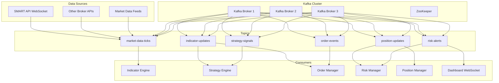

# Kafka Integration for Real-Time Trading System

This document outlines the integration of Apache Kafka for high-throughput, low-latency message streaming in the Velox algotrading system.

## Why Kafka for Algotrading?

### Benefits for Trading Systems
- **High Throughput**: Handle millions of messages per second (ticks, orders, indicators)
- **Low Latency**: Sub-millisecond message delivery for real-time trading
- **Durability**: Persistent message storage for replay and recovery
- **Scalability**: Horizontal scaling for multiple users and strategies
- **Fault Tolerance**: Replication and partitioning for reliability

### Use Cases in Trading
1. **Market Data Ingestion**: High-volume tick data from brokers
2. **Indicator Updates**: Real-time indicator calculations
3. **Strategy Signals**: Trading signals from multiple strategies
4. **Order Management**: Order placement and execution updates
5. **Position Updates**: Real-time position and P&L tracking
6. **Risk Management**: Risk alerts and position closures

## Kafka Architecture



## Kafka Topics Configuration

### 1. Market Data Ticks
```json
{
  "topic": "market-data-ticks",
  "partitions": 6,
  "replication_factor": 3,
  "retention_ms": 3600000,
  "cleanup_policy": "delete",
  "segment_ms": 1000,
  "compression_type": "lz4"
}
```

**Message Schema**:
```json
{
  "symbol": "NIFTY",
  "exchange": "NSE",
  "timestamp": 1704067200123,
  "price": 18500.50,
  "volume": 1000,
  "open": 18500.00,
  "high": 18550.00,
  "low": 18480.00,
  "close": 18520.00,
  "tick_type": "trade",
  "source": "smart_api"
}
```

### 2. Indicator Updates
```json
{
  "topic": "indicator-updates",
  "partitions": 4,
  "replication_factor": 3,
  "retention_ms": 7200000,
  "cleanup_policy": "delete",
  "segment_ms": 5000,
  "compression_type": "lz4"
}
```

**Message Schema**:
```json
{
  "symbol": "NIFTY",
  "timeframe": "5min",
  "timestamp": 1704067200123,
  "indicators": {
    "EMA_20": {
      "value": 18500.50,
      "is_realtime": true
    },
    "RSI_14": {
      "value": 55.75,
      "is_realtime": true
    }
  },
  "forming_candle": {
    "open": 18500.00,
    "high": 18550.00,
    "low": 18480.00,
    "close": 18520.00,
    "volume": 1000
  }
}
```

### 3. Strategy Signals
```json
{
  "topic": "strategy-signals",
  "partitions": 4,
  "replication_factor": 3,
  "retention_ms": 86400000,
  "cleanup_policy": "delete",
  "segment_ms": 10000,
  "compression_type": "lz4"
}
```

**Message Schema**:
```json
{
  "strategy_id": "uuid",
  "symbol": "NIFTY",
  "timestamp": 1704067200123,
  "signal": {
    "action": "BUY|SELL|HOLD",
    "confidence": 0.85,
    "price": 18500.50,
    "quantity": 50,
    "stoploss": 18450.00,
    "target": 18600.00
  },
  "indicators": {
    "EMA_20": 18500.50,
    "RSI_14": 55.75
  }
}
```

### 4. Order Events
```json
{
  "topic": "order-events",
  "partitions": 6,
  "replication_factor": 3,
  "retention_ms": 604800000,
  "cleanup_policy": "delete",
  "segment_ms": 15000,
  "compression_type": "lz4"
}
```

**Message Schema**:
```json
{
  "order_id": "uuid",
  "strategy_id": "uuid",
  "symbol": "NIFTY",
  "timestamp": 1704067200123,
  "event_type": "PLACED|FILLED|CANCELLED|REJECTED",
  "order": {
    "transaction_type": "BUY",
    "order_type": "LIMIT",
    "quantity": 50,
    "price": 18500.50,
    "status": "PENDING"
  },
  "execution": {
    "average_price": 18500.25,
    "filled_quantity": 50,
    "execution_time": 1704067200150
  }
}
```

### 5. Position Updates
```json
{
  "topic": "position-updates",
  "partitions": 4,
  "replication_factor": 3,
  "retention_ms": 604800000,
  "cleanup_policy": "delete",
  "segment_ms": 15000,
  "compression_type": "lz4"
}
```

**Message Schema**:
```json
{
  "position_id": "uuid",
  "user_id": "uuid",
  "symbol": "NIFTY",
  "timestamp": 1704067200123,
  "event_type": "OPENED|CLOSED|MODIFIED",
  "position": {
    "quantity": 50,
    "average_price": 18500.00,
    "current_price": 18520.00,
    "unrealized_pnl": 1000.00,
    "realized_pnl": 0.00,
    "status": "OPEN"
  }
}
```

### 6. Risk Alerts
```json
{
  "topic": "risk-alerts",
  "partitions": 3,
  "replication_factor": 3,
  "retention_ms": 2592000000,
  "cleanup_policy": "delete",
  "segment_ms": 30000,
  "compression_type": "lz4"
}
```

**Message Schema**:
```json
{
  "alert_id": "uuid",
  "user_id": "uuid",
  "timestamp": 1704067200123,
  "alert_type": "DAILY_LOSS|DRAWDOWN|POSITION_SIZE|MARGIN",
  "severity": "INFO|WARNING|ERROR|CRITICAL",
  "message": "Daily loss limit reached",
  "data": {
    "current_loss": 10000.00,
    "limit": 10000.00,
    "positions_to_close": ["NIFTY", "BANKNIFTY"]
  }
}
```

## Kafka Integration Implementation

### 1. Kafka Producer Configuration

```python
# app/core/kafka_producer.py
import asyncio
import json
from typing import Dict, Any
from aiokafka import AIOKafkaProducer
from app.core.config import settings

class KafkaProducerManager:
    def __init__(self):
        self.producer = None
        self.topics = {
            'market_data': 'market-data-ticks',
            'indicators': 'indicator-updates',
            'signals': 'strategy-signals',
            'orders': 'order-events',
            'positions': 'position-updates',
            'alerts': 'risk-alerts'
        }
    
    async def initialize(self):
        """Initialize Kafka producer"""
        self.producer = AIOKafkaProducer(
            bootstrap_servers=settings.KAFKA_BOOTSTRAP_SERVERS,
            value_serializer=lambda v: json.dumps(v).encode('utf-8'),
            key_serializer=lambda k: k.encode('utf-8') if k else None,
            compression_type='lz4',
            batch_size=16384,
            linger_ms=5,
            max_in_flight_requests_per_connection=5,
            acks='all',
            retries=3
        )
        await self.producer.start()
    
    async def publish_market_data(self, symbol: str, data: Dict[str, Any]):
        """Publish market data tick"""
        await self.producer.send(
            topic=self.topics['market_data'],
            key=symbol,
            value=data
        )
    
    async def publish_indicator_update(self, symbol: str, data: Dict[str, Any]):
        """Publish indicator update"""
        await self.producer.send(
            topic=self.topics['indicators'],
            key=symbol,
            value=data
        )
    
    async def publish_strategy_signal(self, strategy_id: str, data: Dict[str, Any]):
        """Publish strategy signal"""
        await self.producer.send(
            topic=self.topics['signals'],
            key=strategy_id,
            value=data
        )
    
    async def publish_order_event(self, order_id: str, data: Dict[str, Any]):
        """Publish order event"""
        await self.producer.send(
            topic=self.topics['orders'],
            key=order_id,
            value=data
        )
    
    async def publish_position_update(self, user_id: str, data: Dict[str, Any]):
        """Publish position update"""
        await self.producer.send(
            topic=self.topics['positions'],
            key=user_id,
            value=data
        )
    
    async def publish_risk_alert(self, user_id: str, data: Dict[str, Any]):
        """Publish risk alert"""
        await self.producer.send(
            topic=self.topics['alerts'],
            key=user_id,
            value=data
        )
    
    async def close(self):
        """Close producer connection"""
        if self.producer:
            await self.producer.stop()
```

### 2. Kafka Consumer Configuration

```python
# app/core/kafka_consumer.py
import asyncio
import json
from typing import Dict, Any, Callable
from aiokafka import AIOKafkaConsumer
from app.core.config import settings

class KafkaConsumerManager:
    def __init__(self):
        self.consumers = {}
        self.handlers = {}
    
    async def create_consumer(self, topic: str, group_id: str) -> AIOKafkaConsumer:
        """Create Kafka consumer for topic"""
        consumer = AIOKafkaConsumer(
            topic,
            bootstrap_servers=settings.KAFKA_BOOTSTRAP_SERVERS,
            group_id=group_id,
            value_deserializer=lambda v: json.loads(v.decode('utf-8')),
            key_deserializer=lambda k: k.decode('utf-8') if k else None,
            auto_offset_reset='latest',
            enable_auto_commit=False,
            session_timeout_ms=30000,
            heartbeat_interval_ms=3000,
            max_poll_records=1000,
            fetch_max_bytes=52428800,
            compression_type='lz4'
        )
        return consumer
    
    async def subscribe_to_market_data(self, handler: Callable):
        """Subscribe to market data ticks"""
        consumer = await self.create_consumer('market-data-ticks', 'market-data-group')
        self.consumers['market_data'] = consumer
        self.handlers['market_data'] = handler
        
        await consumer.start()
        asyncio.create_task(self._consume_messages('market_data', consumer))
    
    async def subscribe_to_indicators(self, handler: Callable):
        """Subscribe to indicator updates"""
        consumer = await self.create_consumer('indicator-updates', 'indicator-group')
        self.consumers['indicators'] = consumer
        self.handlers['indicators'] = handler
        
        await consumer.start()
        asyncio.create_task(self._consume_messages('indicators', consumer))
    
    async def subscribe_to_signals(self, handler: Callable):
        """Subscribe to strategy signals"""
        consumer = await self.create_consumer('strategy-signals', 'signal-group')
        self.consumers['signals'] = consumer
        self.handlers['signals'] = handler
        
        await consumer.start()
        asyncio.create_task(self._consume_messages('signals', consumer))
    
    async def _consume_messages(self, consumer_type: str, consumer: AIOKafkaConsumer):
        """Consume messages from Kafka topic"""
        try:
            async for message in consumer:
                await self.handlers[consumer_type](message.value, message.key)
                await consumer.commit()
        except Exception as e:
            logger.error(f"Error consuming messages from {consumer_type}: {e}")
    
    async def close_all(self):
        """Close all consumer connections"""
        for consumer in self.consumers.values():
            await consumer.stop()
```

### 3. Integration with Real-Time Indicator Engine

```python
# app/indicators/kafka_integration.py
import asyncio
from typing import Dict, Any
from app.core.kafka_producer import KafkaProducerManager
from app.core.kafka_consumer import KafkaConsumerManager
from app.indicators.realtime import RealTimeIndicatorEngine

class KafkaIndicatorEngine:
    def __init__(self):
        self.producer = KafkaProducerManager()
        self.consumer = KafkaConsumerManager()
        self.indicator_engine = RealTimeIndicatorEngine()
    
    async def initialize(self):
        """Initialize Kafka integration"""
        await self.producer.initialize()
        
        # Subscribe to market data
        await self.consumer.subscribe_to_market_data(self._handle_market_data)
        
        # Subscribe to strategy signals (for indicator requests)
        await self.consumer.subscribe_to_signals(self._handle_strategy_signal)
    
    async def _handle_market_data(self, data: Dict[str, Any], key: str):
        """Handle incoming market data"""
        symbol = data['symbol']
        
        # Process tick through indicator engine
        await self.indicator_engine.process_tick(symbol, data)
        
        # Get updated indicators
        indicators = await self.indicator_engine.get_indicators(symbol)
        
        # Publish indicator updates
        await self.producer.publish_indicator_update(symbol, {
            'symbol': symbol,
            'timestamp': data['timestamp'],
            'indicators': indicators,
            'forming_candle': self.indicator_engine.get_forming_candle(symbol)
        })
    
    async def _handle_strategy_signal(self, data: Dict[str, Any], key: str):
        """Handle strategy signal for indicator calculation"""
        strategy_id = key
        symbol = data['symbol']
        
        # Ensure indicators are calculated for this symbol
        if not self.indicator_engine.is_initialized(symbol):
            await self.indicator_engine.initialize_symbol(
                symbol, 
                data.get('timeframe', '5min'),
                data.get('periods', 200)
            )
```

## Performance Optimization

### 1. Producer Optimization
- **Batching**: Group messages for efficient sending
- **Compression**: LZ4 compression for reduced network usage
- **Partitioning**: Key-based partitioning for parallel processing
- **Acknowledgments**: Proper ack settings for reliability

### 2. Consumer Optimization
- **Parallel Processing**: Multiple consumer instances per topic
- **Batch Processing**: Process multiple messages together
- **Offset Management**: Manual offset commits for control
- **Connection Pooling**: Reuse connections for efficiency

### 3. Cluster Configuration
- **Replication**: 3-way replication for fault tolerance
- **Partitioning**: Optimal partition count for throughput
- **Retention**: Appropriate retention periods for different data types
- **Compression**: LZ4 compression for storage efficiency

## Monitoring and Management

### 1. Kafka Metrics
```python
# app/monitoring/kafka_metrics.py
from prometheus_client import Counter, Histogram, Gauge

# Producer metrics
MESSAGES_PRODUCED = Counter('kafka_messages_produced_total', 'Total messages produced', ['topic'])
PRODUCE_LATENCY = Histogram('kafka_produce_latency_seconds', 'Message production latency')
PRODUCER_ERRORS = Counter('kafka_producer_errors_total', 'Producer errors', ['topic', 'error_type'])

# Consumer metrics
MESSAGES_CONSUMED = Counter('kafka_messages_consumed_total', 'Total messages consumed', ['topic', 'group'])
CONSUME_LATENCY = Histogram('kafka_consume_latency_seconds', 'Message consumption latency')
CONSUMER_LAG = Gauge('kafka_consumer_lag', 'Consumer lag', ['topic', 'group', 'partition'])
```

### 2. Health Checks
```python
# app/monitoring/kafka_health.py
import asyncio
from aiokafka import AIOKafkaAdminClient

class KafkaHealthChecker:
    def __init__(self):
        self.admin_client = None
    
    async def initialize(self):
        """Initialize admin client"""
        self.admin_client = AIOKafkaAdminClient(
            bootstrap_servers=settings.KAFKA_BOOTSTRAP_SERVERS
        )
    
    async def check_cluster_health(self) -> Dict[str, Any]:
        """Check Kafka cluster health"""
        try:
            # Get cluster metadata
            metadata = await self.admin_client.describe_cluster()
            
            # Check topic health
            topics = await self.admin_client.list_topics()
            
            return {
                'status': 'healthy',
                'brokers': len(metadata['brokers']),
                'topics': len(topics),
                'timestamp': asyncio.get_event_loop().time()
            }
        except Exception as e:
            return {
                'status': 'unhealthy',
                'error': str(e),
                'timestamp': asyncio.get_event_loop().time()
            }
```

## Deployment Configuration

### 1. Docker Compose
```yaml
# docker-compose.kafka.yml
version: '3.8'
services:
  zookeeper:
    image: confluentinc/cp-zookeeper:7.3.0
    environment:
      ZOOKEEPER_CLIENT_PORT: 2181
      ZOOKEEPER_TICK_TIME: 2000
    ports:
      - "2181:2181"
  
  kafka:
    image: confluentinc/cp-kafka:7.3.0
    depends_on:
      - zookeeper
    ports:
      - "9092:9092"
      - "9101:9101"
    environment:
      KAFKA_BROKER_ID: 1
      KAFKA_ZOOKEEPER_CONNECT: zookeeper:2181
      KAFKA_ADVERTISED_LISTENERS: PLAINTEXT://localhost:9092
      KAFKA_OFFSETS_TOPIC_REPLICATION_FACTOR: 3
      KAFKA_TRANSACTION_STATE_LOG_REPLICATION_FACTOR: 3
      KAFKA_TRANSACTION_STATE_LOG_MIN_ISR: 2
      KAFKA_DEFAULT_REPLICATION_FACTOR: 3
      KAFKA_MIN_INSYNC_REPLICAS: 2
      KAFKA_JMX_PORT: 9101
      KAFKA_JMX_HOSTNAME: localhost
      KAFKA_AUTO_CREATE_TOPICS_ENABLE: 'true'
      KAFKA_DELETE_TOPIC_ENABLE: 'true'
      KAFKA_LOG_RETENTION_HOURS: 168
      KAFKA_LOG_SEGMENT_BYTES: 1073741824
      KAFKA_LOG_RETENTION_CHECK_INTERVAL_MS: 300000
      KAFKA_LOG_CLEANUP_POLICY: delete
  
  kafka-ui:
    image: provectuslabs/kafka-ui:latest
    ports:
      - "8080:8080"
    environment:
      KAFKA_CLUSTERS_0_NAME: local
      KAFKA_CLUSTERS_0_BOOTSTRAPSERVERS: kafka:9092
      KAFKA_CLUSTERS_0_ZOOKEEPER: zookeeper:2181
    depends_on:
      - kafka
```

### 2. Environment Configuration
```env
# Kafka Configuration
KAFKA_BOOTSTRAP_SERVERS=localhost:9092
KAFKA_GROUP_ID_PREFIX=velox-trading
KAFKA_AUTO_OFFSET_RESET=latest
KAFKA_ENABLE_AUTO_COMMIT=false
KAFKA_SESSION_TIMEOUT_MS=30000
KAFKA_HEARTBEAT_INTERVAL_MS=3000
KAFKA_MAX_POLL_RECORDS=1000
KAFKA_FETCH_MAX_BYTES=52428800
KAFKA_COMPRESSION_TYPE=lz4
```

This Kafka integration provides the high-throughput, low-latency messaging infrastructure required for real-time algotrading with multiple users, strategies, and data sources.