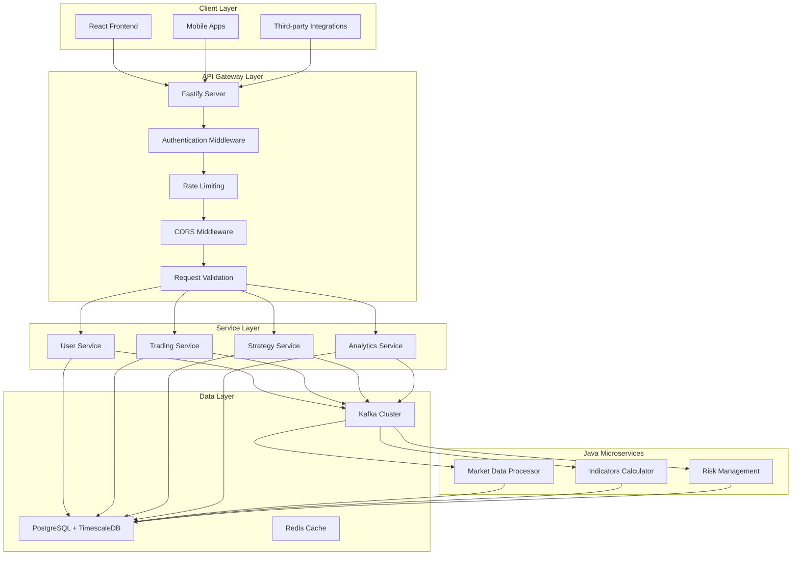

# Node.js API Gateway Architecture

## System Overview

This document outlines the complete Node.js architecture for the Velox algotrading system API gateway, which serves as the entry point for all client requests and routes them to appropriate Java microservices for high-performance processing.

## Technology Stack

### Core Framework
- **Runtime**: Node.js 18+ (LTS)
- **Framework**: Fastify 4.x (high-performance web framework)
- **Language**: TypeScript 5.x (type safety and better development experience)
- **Package Manager**: pnpm (efficient dependency management)

### Database & ORM
- **Database**: PostgreSQL 15+ with TimescaleDB extension
- **ORM**: Prisma 5.x (type-safe database access)
- **Connection Pooling**: pg-pool for optimized connections

### Messaging & Streaming
- **Message Queue**: Apache Kafka 3.x
- **Kafka Client**: kafkajs (native Node.js Kafka client)
- **Schema Registry**: Confluent Schema Registry
- **Serialization**: Avro for efficient message serialization

### Authentication & Security
- **Authentication**: JWT tokens with refresh mechanism
- **Password Hashing**: bcrypt
- **Rate Limiting**: fastify-rate-limit
- **CORS**: fastify-cors
- **Validation**: Joi for request validation

### Real-time Communication
- **WebSocket**: fastify-websocket
- **Socket.io**: Fallback for complex real-time scenarios
- **Server-Sent Events**: fastify-sse-v2 for one-way streaming

## System Architecture



## Core Components

### 1. Fastify Server Architecture

```typescript
// Main server structure
src/
├── server.ts                 // Fastify server entry point
├── plugins/                  // Fastify plugins
│   ├── auth.ts              // Authentication plugin
│   ├── cors.ts              // CORS configuration
│   ├── rateLimit.ts         // Rate limiting
│   ├── websocket.ts         // WebSocket plugin
│   └── kafka.ts             // Kafka integration plugin
├── routes/                   // API routes
│   ├── auth/                // Authentication routes
│   ├── users/               // User management routes
│   ├── brokers/             // Broker management routes
│   ├── strategies/          // Strategy management routes
│   ├── trading/             // Trading endpoints
│   ├── market-data/         // Market data endpoints
│   └── analytics/           // Analytics endpoints
├── middleware/              // Custom middleware
│   ├── validation.ts        // Request validation
│   ├── logging.ts           // Request logging
│   └── errorHandling.ts     // Error handling
└── utils/                   // Utility functions
    ├── logger.ts            // Pino logger configuration
    ├── metrics.ts           // Prometheus metrics
    └── config.ts            // Configuration management
```

### 2. Authentication System

```typescript
// JWT-based authentication
src/auth/
├── authService.ts           // Authentication service
├── tokenService.ts          // JWT token management
├── permissionService.ts     // Permission management
├── middleware/              // Authentication middleware
│   ├── authMiddleware.ts    // JWT validation
│   └── rbacMiddleware.ts   // Role-based access control
└── strategies/              // Auth strategies
    ├── localStrategy.ts     // Local authentication
    └── brokerStrategy.ts   // Broker authentication
```

### 3. API Routes Organization

```typescript
// Organized API routes
src/routes/
├── auth/                    // Authentication routes
│   ├── login.ts            // User login
│   ├── logout.ts           // User logout
│   ├── refresh.ts          // Token refresh
│   └── changePassword.ts    // Password change
├── users/                   // User management routes
│   ├── profile.ts          // User profile
│   ├── settings.ts         // User settings
│   └── riskSettings.ts     // Risk settings
├── brokers/                 // Broker management routes
│   ├── list.ts             // Get brokers
│   ├── create.ts           // Add broker
│   ├── update.ts           // Update broker
│   └── testConnection.ts   // Test broker connection
├── strategies/              // Strategy management routes
│   ├── list.ts             // Get strategies
│   ├── create.ts           // Create strategy
│   ├── update.ts           // Update strategy
│   ├── start.ts            // Start strategy
│   └── stop.ts             // Stop strategy
├── trading/                 // Trading endpoints
│   ├── orders.ts           // Order management
│   ├── positions.ts        // Position tracking
│   └── trades.ts           // Trade history
├── market-data/             // Market data endpoints
│   ├── symbols.ts          // Available symbols
│   ├── candles.ts          // Historical candles
│   └── indicators.ts       // Calculated indicators
└── analytics/               // Analytics endpoints
    ├── performance.ts      // Performance metrics
    ├── pnl.ts              // P&L analysis
    └── trades.ts           // Trade analytics
```

### 4. WebSocket Integration

```typescript
// Real-time WebSocket handling
src/websocket/
├── websocketHandler.ts       // Main WebSocket handler
├── connectionManager.ts      // Connection management
├── messageRouter.ts         // Message routing
├── channels/               // Channel handlers
│   ├── marketData.ts       // Market data channel
│   ├── indicators.ts       // Indicators channel
│   ├── positions.ts        // Positions channel
│   ├── orders.ts           // Orders channel
│   ├── strategies.ts       // Strategy channel
│   └── alerts.ts          // Alerts channel
└── serializers/            // Message serializers
    ├── marketData.ts       // Market data serialization
    ├── indicators.ts       // Indicators serialization
    └── positions.ts        // Positions serialization
```

### 5. Kafka Integration

```typescript
// Kafka producer/consumer management
src/kafka/
├── producerManager.ts       // Kafka producer manager
├── consumerManager.ts       // Kafka consumer manager
├── topics/                 // Topic definitions
│   ├── marketData.ts       // Market data topic
│   ├── indicators.ts       // Indicators topic
│   ├── signals.ts          // Strategy signals topic
│   ├── orders.ts           // Orders topic
│   ├── positions.ts        // Positions topic
│   └── alerts.ts          // Alerts topic
├── serializers/            // Message serializers
│   ├── avroSerializer.ts   // Avro serialization
│   └── jsonSerializer.ts   // JSON serialization
└── health/                 // Kafka health monitoring
    ├── producerHealth.ts    // Producer health
    ├── consumerHealth.ts    // Consumer health
    └── clusterHealth.ts    // Cluster health
```

## Performance Optimizations

### 1. Fastify Optimizations
- **Async/Await**: Leverage Node.js async capabilities
- **Connection Pooling**: Reuse database connections
- **Request Validation**: Fast schema validation with Joi
- **Response Compression**: Gzip/Brotli compression
- **Caching**: Redis caching for frequently accessed data

### 2. Kafka Optimizations
- **Batch Processing**: Batch messages for higher throughput
- **Compression**: Message compression for network efficiency
- **Partitioning**: Optimize topic partitioning for parallelism
- **Consumer Groups**: Efficient consumer group management
- **Acknowledgment**: Proper ack handling for reliability

### 3. Database Optimizations
- **Connection Pooling**: Optimize database connection usage
- **Query Optimization**: Efficient query patterns
- **Indexing**: Proper database indexing
- **Read Replicas**: Read scaling for analytics
- **TimescaleDB**: Time-series data optimization

## Security Architecture

### 1. Authentication & Authorization
```typescript
// JWT-based authentication
src/auth/
├── authService.ts           // Authentication service
├── tokenService.ts          // JWT token management
├── permissionService.ts     // Permission management
├── middleware/              // Authentication middleware
│   ├── authMiddleware.ts    // JWT validation
│   └── rbacMiddleware.ts   // Role-based access control
└── strategies/              // Auth strategies
    ├── localStrategy.ts     // Local authentication
    └── brokerStrategy.ts   // Broker authentication
```

### 2. Data Security
- **Encryption**: AES-256 for sensitive data
- **Hashing**: bcrypt for password hashing
- **API Keys**: Secure API key management
- **Data Masking**: Sensitive data masking in logs
- **Audit Trail**: Complete audit logging

### 3. Network Security
- **HTTPS/WSS**: Secure communication protocols
- **Rate Limiting**: Prevent abuse and attacks
- **Input Validation**: Comprehensive input validation
- **CORS**: Proper cross-origin resource sharing
- **Security Headers**: Security-focused HTTP headers

## Monitoring & Observability

### 1. Logging Strategy
```typescript
// Structured logging with Pino
src/logging/
├── logger.ts               // Pino logger configuration
├── formatters.ts            // Log formatters
├── transports.ts            // Log transports
└── middleware/              // Logging middleware
    ├── requestLogger.ts     // Request logging
    └── errorLogger.ts       // Error logging
```

### 2. Metrics Collection
```typescript
// Prometheus metrics
src/metrics/
├── collector.ts             // Metrics collector
├── counters.ts             // Counter metrics
├── histograms.ts           // Histogram metrics
├── gauges.ts              // Gauge metrics
└── middleware/            // Metrics middleware
    ├── requestMetrics.ts   // Request metrics
    └── tradingMetrics.ts   // Trading-specific metrics
```

### 3. Health Checks
```typescript
// Health check system
src/health/
├── healthChecker.ts        // Main health checker
├── checks/                 // Individual health checks
│   ├── databaseHealth.ts   // Database health
│   ├── kafkaHealth.ts      // Kafka health
│   └── brokerHealth.ts     // Broker connectivity
└── routes/                 // Health check routes
    └── healthRoutes.ts     // Health check endpoints
```

## Deployment Architecture

### 1. Container Strategy
```dockerfile
# Multi-stage Docker builds
FROM node:18-alpine AS builder
WORKDIR /app
COPY package*.json ./
RUN pnpm install --frozen-lockfile
COPY . .
RUN pnpm build

FROM node:18-alpine AS runtime
WORKDIR /app
COPY --from=builder /app/dist ./dist
COPY --from=builder /app/node_modules ./node_modules
EXPOSE 3000
CMD ["node", "dist/server.js"]
```

### 2. Orchestration
```yaml
# Docker Compose for development
version: '3.8'
services:
  api-gateway:
    build: .
    environment:
      - NODE_ENV=development
    ports:
      - "3000:3000"
    depends_on:
      - postgres
      - kafka
      - redis
```

### 3. Production Deployment
- **Kubernetes**: Container orchestration
- **Helm Charts**: Deployment templates
- **Auto-scaling**: Horizontal pod autoscaling
- **Load Balancing**: NGINX or Traefik
- **Service Mesh**: Istio for advanced networking

## Development Workflow

### 1. Local Development
```bash
# Development setup
pnpm install
pnpm dev
```

### 2. Testing Strategy
```typescript
// Comprehensive testing
tests/
├── unit/                   // Unit tests
├── integration/            // Integration tests
├── e2e/                   // End-to-end tests
├── performance/            // Performance tests
└── fixtures/               // Test fixtures
```

### 3. CI/CD Pipeline
```yaml
# GitHub Actions workflow
name: CI/CD Pipeline
on: [push, pull_request]
jobs:
  test:
    runs-on: ubuntu-latest
    steps:
      - uses: actions/checkout@v3
      - uses: actions/setup-node@v3
      - run: pnpm install
      - run: pnpm test
      - run: pnpm build
```

This Node.js architecture provides a high-performance, scalable, and maintainable API gateway that efficiently routes requests to Java microservices for optimal processing performance.