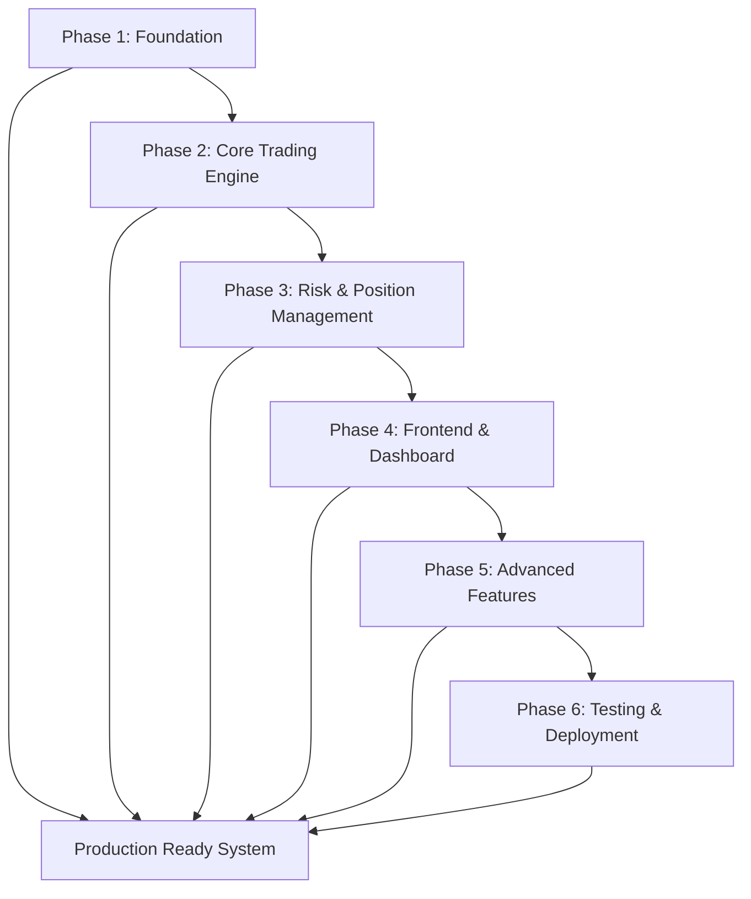

# Velox Algotrading System - Phases Index

## Project Overview

This document provides a comprehensive index of all phases for the Velox multi-user algotrading system implementation. Each phase is documented in detail with specific tasks, subtasks, deliverables, and acceptance criteria.

## Phase Structure

The project is divided into 6 phases over 16 weeks:

1. **Phase 1: Foundation** (Weeks 1-3) - Infrastructure setup
2. **Phase 2: Core Trading Engine** (Weeks 4-6) - Trading functionality
3. **Phase 3: Risk & Position Management** (Weeks 7-8) - Risk controls
4. **Phase 4: Frontend & Dashboard** (Weeks 9-11) - User interface
5. **Phase 5: Advanced Features** (Weeks 12-14) - Extended capabilities
6. **Phase 6: Testing & Deployment** (Weeks 15-16) - Production readiness

---

## Phase Documents

### 📋 [Phase 1: Foundation (Weeks 1-3)](phase_1_foundation.md)

**Focus**: Establish technical infrastructure and basic functionality

**Key Objectives**:
- Set up development environment and project structure
- Implement database with TimescaleDB
- Create user authentication and authorization
- Establish Kafka cluster for high-throughput messaging
- Build basic frontend foundation

**Major Tasks**:
- Project structure and environment setup
- Database implementation with migrations
- Kafka cluster configuration
- Authentication system development
- Basic API structure
- React frontend foundation

**Duration**: 3 weeks  
**Priority**: Critical foundation

---

### ⚙️ [Phase 2: Core Trading Engine (Weeks 4-6)](phase_2_core_trading_engine.md)

**Focus**: Implement core trading functionality with real-time processing

**Key Objectives**:
- Integrate SMART API for real-time trading
- Set up real-time market data processing with Kafka
- Create zero-latency technical indicators
- Develop strategy execution engine
- Establish position and order management

**Major Tasks**:
- SMART API integration with WebSocket
- Real-time market data handler
- Technical indicators with forming candle optimization
- Strategy framework and execution
- Kafka integration for trading data

**Duration**: 3 weeks  
**Priority**: Core trading functionality

---

### 🛡️ [Phase 3: Risk & Position Management (Weeks 7-8)](phase_3_risk_position_management.md)

**Focus**: Implement comprehensive risk management and position tracking

**Key Objectives**:
- Create robust risk management with daily loss limits
- Implement real-time position monitoring and P&L tracking
- Develop trade logging and audit trail
- Establish emergency exit mechanisms
- Set up Kafka-based risk alerts

**Major Tasks**:
- Risk management engine with limits
- Real-time position tracking
- Trade logging and audit trail
- Kafka risk alert system
- Position synchronization

**Duration**: 2 weeks  
**Priority**: Risk and position safety

---

### 📊 [Phase 4: Frontend & Dashboard (Weeks 9-11)](phase_4_frontend_dashboard.md)

**Focus**: Develop comprehensive user interface and analytics

**Key Objectives**:
- Create trading dashboard with real-time updates
- Implement analytics and reporting features
- Develop investor view with read-only access
- Set up live/dry run mode switching
- Establish WebSocket connections for real-time data

**Major Tasks**:
- Trading dashboard with real-time charts
- Order management interface
- Analytics and reporting system
- Investor view and role management
- Live/dry run mode switching

**Duration**: 3 weeks  
**Priority**: User experience and functionality

---

### 🚀 [Phase 5: Advanced Features (Weeks 12-14)](phase_5_advanced_features.md)

**Focus**: Implement advanced features and additional broker support

**Key Objectives**:
- Integrate additional brokers (Zerodha, Angel, ICICI)
- Create comprehensive backtesting engine
- Develop system monitoring and alerting
- Implement performance optimization
- Complete broker switching functionality

**Major Tasks**:
- Additional broker integrations
- Backtesting engine with optimization
- System monitoring and alerting
- Performance optimization
- Integration testing

**Duration**: 3 weeks  
**Priority**: Advanced capabilities

---

### 🧪 [Phase 6: Testing & Deployment (Weeks 15-16)](phase_6_testing_deployment.md)

**Focus**: Ensure production readiness through comprehensive testing

**Key Objectives**:
- Write comprehensive tests for all components
- Create complete documentation
- Set up CI/CD pipeline
- Validate production readiness
- Implement deployment procedures

**Major Tasks**:
- Comprehensive testing (unit, integration, performance)
- Strategy development documentation
- CI/CD pipeline setup
- Production deployment preparation
- System validation

**Duration**: 2 weeks  
**Priority**: Production readiness

---

## Supporting Documentation

### Core Architecture Documents
- [`architecture.md`](architecture.md) - Complete system architecture
- [`project_structure.md`](project_structure.md) - Project organization
- [`database_schema.md`](database_schema.md) - Database design
- [`api_specification.md`](api_specification.md) - API reference

### Technical Implementation Guides
- [`development_guide.md`](development_guide.md) - Development setup and best practices
- [`kafka_integration.md`](kafka_integration.md) - Kafka implementation guide
- [`realtime_indicators_optimization.md`](realtime_indicators_optimization.md) - Real-time indicators
- [`docker_configuration.md`](docker_configuration.md) - Docker setup and configuration

### Planning and Overview
- [`README.md`](README.md) - Project overview and quick start
- [`implementation_roadmap.md`](implementation_roadmap.md) - High-level roadmap
- [`PBR.md`](PBR.md) - Original requirements document

---

## Phase Dependencies

## Success Criteria by Phase

### Phase 1 Success
- ✅ Development environment operational
- ✅ Database with TimescaleDB running
- ✅ Kafka cluster configured
- ✅ Authentication system working
- ✅ Basic frontend structure

### Phase 2 Success
- ✅ SMART API integrated with real-time data
- ✅ Technical indicators with zero-latency
- ✅ Strategy framework functional
- ✅ Kafka messaging for trading data

### Phase 3 Success
- ✅ Risk management with daily limits
- ✅ Real-time position tracking
- ✅ Trade logging and audit trail
- ✅ Kafka-based risk alerts

### Phase 4 Success
- ✅ Trading dashboard with real-time updates
- ✅ Analytics and reporting system
- ✅ Investor view with role-based access
- ✅ Live/dry run mode switching

### Phase 5 Success
- ✅ Multiple broker integrations
- ✅ Backtesting engine with optimization
- ✅ System monitoring and alerting
- ✅ Performance optimization

### Phase 6 Success
- ✅ Comprehensive test coverage
- ✅ Complete documentation
- ✅ CI/CD pipeline
- ✅ Production deployment ready

## Timeline Summary

| Phase | Weeks | Duration | Start Date | End Date | Key Deliverable |
|--------|--------|------------|-----------|----------------|
| Phase 1 | 1-3 | 3 weeks | Foundation |
| Phase 2 | 4-6 | 3 weeks | Core Trading Engine |
| Phase 3 | 7-8 | 2 weeks | Risk & Position Management |
| Phase 4 | 9-11 | 3 weeks | Frontend & Dashboard |
| Phase 5 | 12-14 | 3 weeks | Advanced Features |
| Phase 6 | 15-16 | 2 weeks | Testing & Deployment |

**Total Duration**: 16 weeks

## Resource Requirements

### Development Team
- **Backend Developer**: Python/FastAPI specialist
- **Frontend Developer**: React/TypeScript specialist
- **Database Administrator**: PostgreSQL/TimescaleDB expert
- **DevOps Engineer**: Kafka and deployment specialist
- **QA Engineer**: Testing and quality assurance

### Infrastructure
- **Development Environment**: Local development setups
- **Testing Environment**: Staging environment for integration testing
- **Production Environment**: Cloud infrastructure for deployment
- **Monitoring**: System monitoring and alerting

### External Dependencies
- **Broker APIs**: SMART API, Zerodha, Angel, ICICI
- **Market Data**: Real-time data subscriptions
- **Cloud Services**: Hosting and deployment platforms
- **Monitoring Tools**: Application and infrastructure monitoring

## Quality Gates

Each phase must pass the following quality gates before proceeding:

### Functional Requirements
- All major tasks completed successfully
- Components integrate properly
- User acceptance criteria met
- Performance targets achieved

### Technical Requirements
- Code quality standards met
- Test coverage thresholds exceeded
- Security requirements satisfied
- Documentation complete and accurate

### Process Requirements
- Code reviews completed
- Stakeholder approval obtained
- Risk assessment performed
- Deployment readiness validated

This phased approach ensures systematic development, quality assurance, and successful delivery of a production-ready algotrading system.