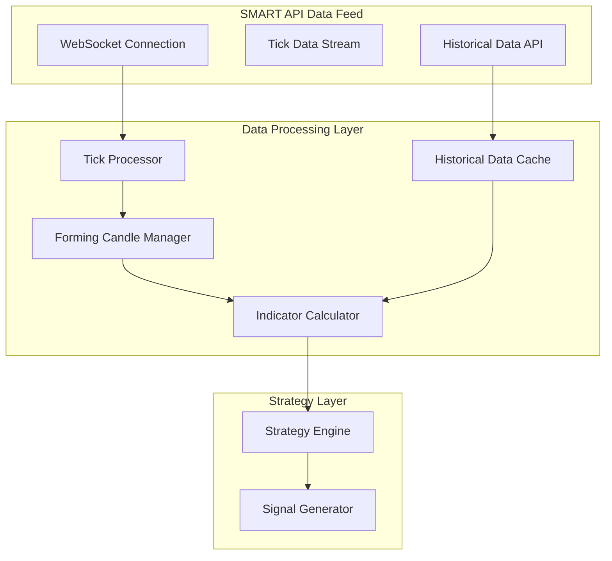

# Real-Time Indicators Optimization

## Overview

This document outlines the optimized approach for real-time indicator calculation using historical data combined with the current forming candle, updated tick-by-tick, and SMART API integration for data feed.

## Problem Statement

Traditional approaches that wait for candles to complete before calculating indicators introduce significant delays:
- **1-hour EMA with 200 periods**: Would require 200+ hours of data before first calculation
- **5-minute indicators**: Would wait 5 minutes between updates
- **Tick-by-tick trading**: Requires immediate indicator updates

## Solution: Hybrid Approach

### Core Concept

Combine historical completed candles with the current forming candle that updates in real-time with each tick.

```
Historical Data (Completed Candles) + Current Forming Candle (Tick-by-Tick Updates)
= Real-Time Indicator Values
```

## Architecture Implementation

### 1. Data Flow Architecture



### 2. Real-Time Indicator Calculation

#### Data Structure

The real-time indicator calculation uses a hybrid approach combining historical completed candles with a current forming candle that updates tick-by-tick.

**Key Components:**
- **Historical Candles**: Completed candle data for accurate indicator calculation
- **Forming Candle**: Current candle being built in real-time from tick data
- **Indicator Cache**: Cached values for performance optimization
- **Symbol Data**: Per-symbol data management with multiple timeframes

**Data Flow:**
1. Initialize with historical candle data
2. Process incoming ticks to update forming candle
3. Recalculate indicators with each tick update
4. Cache results for performance optimization

#### Indicator Calculation Engine

The indicator engine processes data in real-time using the following approach:

1. **Initialization**: Load historical data for each symbol and timeframe
2. **Tick Processing**: Update forming candle with each incoming tick
3. **Indicator Calculation**: Recalculate all indicators after each tick
4. **Caching**: Store calculated values for fast access

**Performance Optimizations:**
- Incremental calculation algorithms
- Circular buffers for efficient data storage
- Parallel processing for multiple symbols
- Batch processing for database operations

### 3. SMART API Integration

#### SMART API Adapter

The SMART API integration provides real-time market data and trading capabilities for the Velox algotrading system.

**Key Features:**
- **Real-time WebSocket Connection**: For tick-by-tick data streaming
- **Authentication**: Secure session-based authentication
- **Symbol Subscription**: Subscribe to multiple symbols simultaneously
- **Historical Data**: Fetch historical candle data for initialization
- **Error Handling**: Robust error handling and reconnection logic

**Integration Architecture:**
1. **Authentication**: Secure login with JWT token generation
2. **WebSocket Connection**: Persistent connection for real-time data
3. **Data Processing**: Process incoming tick data and forward to indicator engine
4. **Historical Data**: Fetch initial data for indicator calculation
5. **Error Recovery**: Automatic reconnection and error handling

**Performance Considerations:**
- Connection pooling for multiple symbols
- Batch processing for historical data
- Efficient data serialization/deserialization
- Memory management for high-frequency data

### 4. Performance Optimization

#### Caching Strategy

The caching strategy provides high-performance indicator value storage and retrieval:

**Key Features:**
- **TTL-based Cache**: Time-based expiration for data freshness
- **Symbol Invalidation**: Efficient cache invalidation by symbol
- **Memory Management**: Automatic cleanup of expired entries
- **Performance Monitoring**: Cache hit/miss metrics

**Implementation Approach:**
- In-memory cache with configurable TTL
- LRU eviction policy for memory efficiency
- Batch operations for cache updates
- Distributed cache support for horizontal scaling

#### Batch Processing

The batch processing strategy handles high-frequency tick data efficiently:

**Key Features:**
- **Configurable Batch Size**: Adaptive batch sizing based on load
- **Symbol Grouping**: Process ticks by symbol for efficiency
- **Parallel Processing**: Concurrent batch processing
- **Queue Management**: Efficient queue handling with backpressure

**Performance Benefits:**
- Reduced I/O operations through batching
- Improved CPU cache utilization
- Lower latency for indicator calculations
- Better resource utilization

### 5. Implementation Benefits

#### Real-Time Performance
- **Immediate Updates**: Indicators update with every tick
- **No Waiting**: No delay for candle completion
- **Accurate Values**: Based on complete historical data + current forming candle

#### Efficiency
- **Optimized Calculations**: Only recalculate what's necessary
- **Caching**: Reduce redundant calculations
- **Batch Processing**: Handle high-frequency data efficiently

#### Scalability
- **Multi-Symbol Support**: Process multiple symbols simultaneously
- **Resource Management**: Efficient memory and CPU usage
- **Horizontal Scaling**: Can distribute across multiple instances

### 6. Monitoring and Alerting

#### Performance Metrics

The performance monitoring system provides comprehensive tracking of indicator calculation performance:

**Key Metrics:**
- **Calculation Time**: Average and maximum indicator calculation times
- **Tick Processing**: Tick processing latency and throughput
- **Error Rate**: Error frequency and types
- **Cache Performance**: Cache hit/miss ratios and eviction rates

**Monitoring Features:**
- Real-time performance dashboards
- Automated alerting for performance degradation
- Historical performance trend analysis
- Resource utilization monitoring

**Alerting Strategy:**
- Threshold-based alerts for performance metrics
- Anomaly detection for unusual patterns
- Escalation procedures for critical issues
- Integration with system monitoring tools

This optimized approach ensures that indicators are calculated in real-time using the most current data, eliminating the delay associated with waiting for candles to complete. The integration with SMART API provides reliable real-time data feeds for accurate and timely trading decisions.