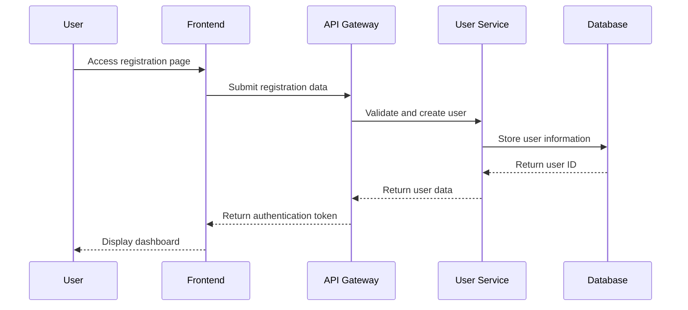
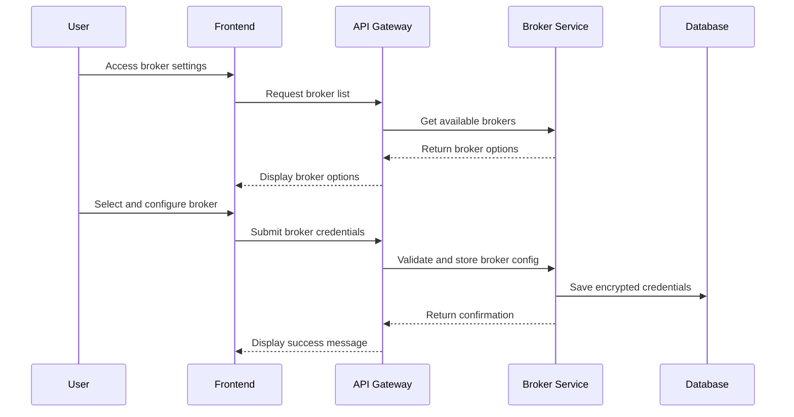
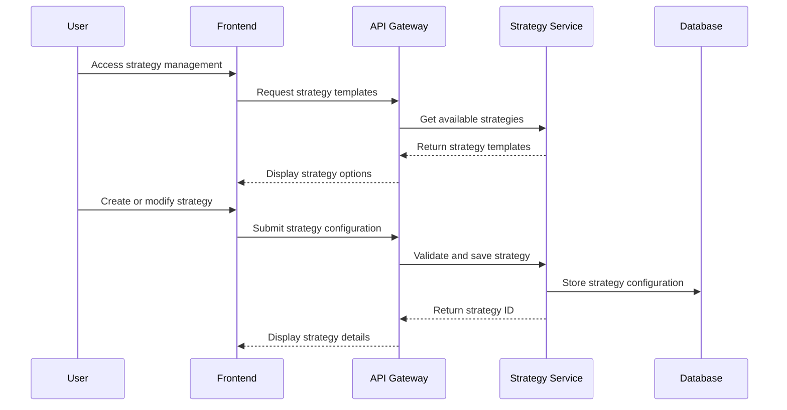
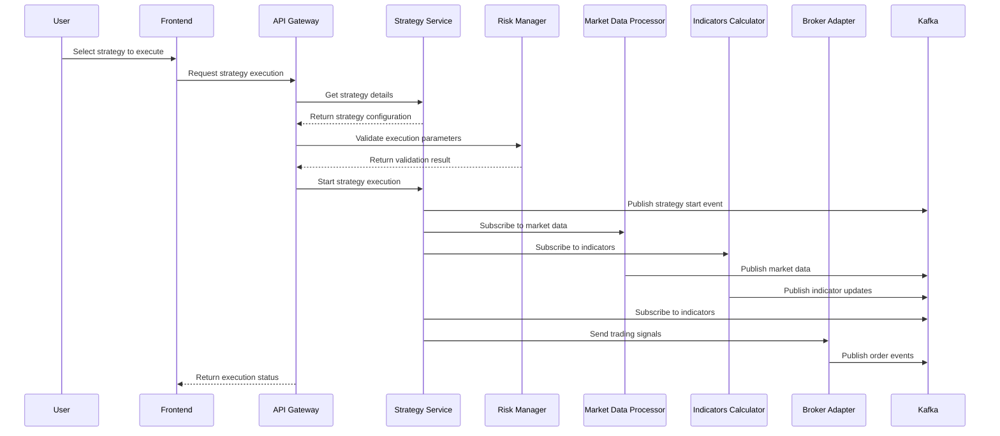
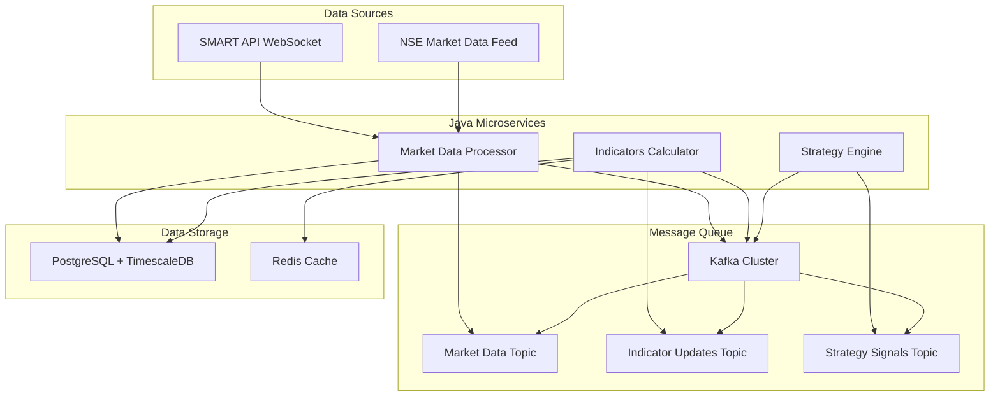
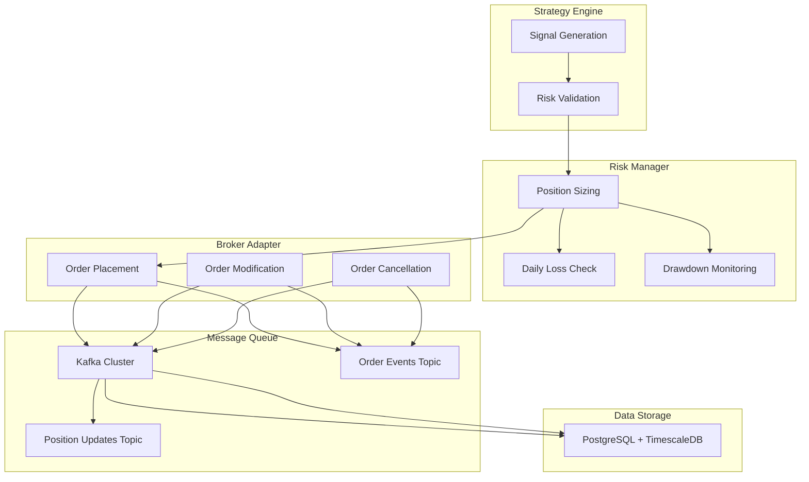
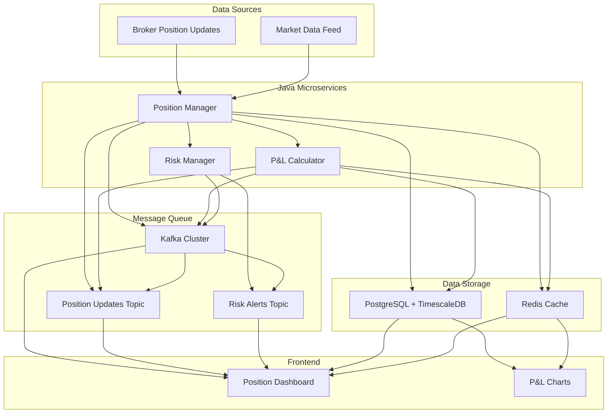
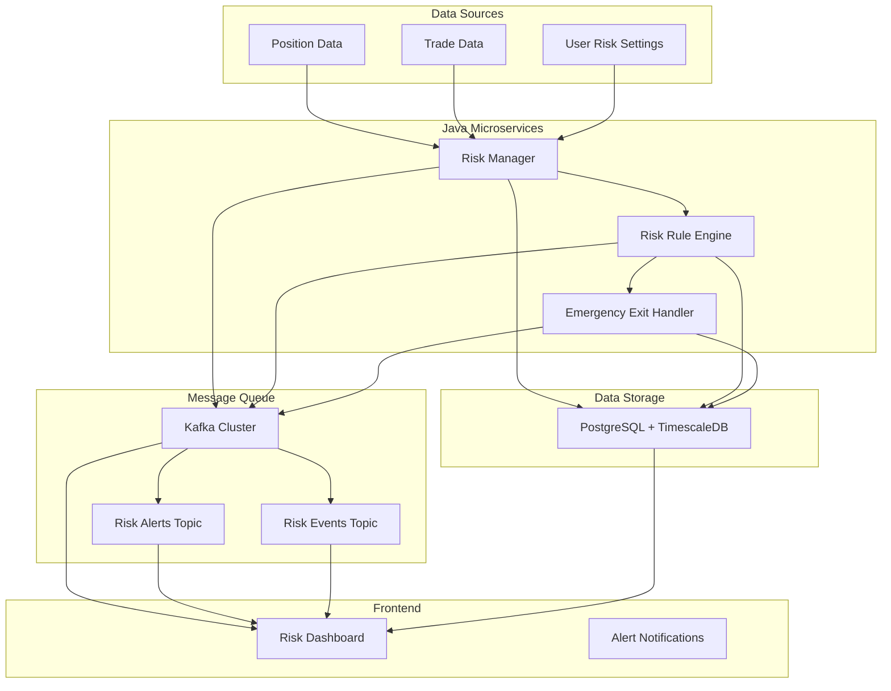

# User Flow and Data Flow

## Overview

This document outlines the complete user flow and data flow for the Velox algotrading system, from user registration to trade execution, with emphasis on Java microservices for high-performance processing.

## User Flow

### 1. User Registration and Authentication

**Steps**:
1. User accesses registration page
2. User submits registration form (username, email, password)
3. Frontend sends registration request to API Gateway
4. API Gateway validates data and forwards to User Service
5. User Service creates user account in database
6. User Service returns user data and authentication token
7. Frontend stores token and redirects to dashboard

### 2. Broker Configuration

**Steps**:
1. User accesses broker configuration page
2. Frontend requests available broker options
3. API Gateway returns list of supported brokers
4. User selects broker and enters credentials
5. Frontend submits encrypted credentials to API Gateway
6. API Gateway validates and stores broker configuration
7. System confirms successful configuration

### 3. Strategy Creation and Configuration

**Steps**:
1. User accesses strategy management page
2. Frontend displays available strategy templates
3. User creates new strategy or modifies existing one
4. Frontend submits strategy configuration to API Gateway
5. API Gateway validates and saves strategy
6. System confirms successful strategy creation

### 4. Strategy Execution

**Steps**:
1. User selects strategy to execute
2. Frontend requests strategy execution
3. API Gateway validates execution parameters
4. Risk Manager checks execution against risk limits
5. Strategy Service starts execution and subscribes to data streams
6. Market Data Processor and Indicators Calculator process real-time data
7. Strategy generates trading signals based on indicators
8. Broker Adapter executes trades and publishes events
9. Frontend displays execution status and results

## Data Flow

### 1. Market Data Flow

**Flow Description**:
1. SMART API WebSocket sends real-time tick data to Market Data Processor
2. Market Data Processor validates, normalizes, and publishes to Kafka
3. Indicators Calculator subscribes to market data and calculates indicators
4. Indicators Calculator publishes indicator updates to Kafka
5. Strategy Engine subscribes to market data and indicators
6. Strategy Engine processes data and generates trading signals
7. All services store relevant data in PostgreSQL
8. Frequently accessed data is cached in Redis

### 2. Order Execution Flow

**Flow Description**:
1. Strategy Engine generates trading signals
2. Risk Manager validates signals against risk parameters
3. Risk Manager calculates position sizing and checks limits
4. Broker Adapter places orders with validated parameters
5. Order events are published to Kafka
6. Position updates are published to Kafka
7. All order and position data is stored in PostgreSQL

### 3. Position Management Flow

**Flow Description**:
1. Position Manager receives position updates from brokers
2. P&L Calculator calculates real-time profit/loss
3. Risk Manager monitors position against risk limits
4. Position updates and P&L data are published to Kafka
5. Frontend subscribes to position updates and displays in dashboard
6. Risk alerts are generated when limits are breached
7. All position data is stored in PostgreSQL
8. Current positions are cached in Redis for fast access

### 4. Risk Management Flow

**Flow Description**:
1. Risk Manager receives position, trade, and risk setting data
2. Risk Rule Engine evaluates all trading activities against risk rules
3. Emergency Exit Handler triggers when critical limits are breached
4. Risk events and alerts are published to Kafka
5. Frontend displays risk dashboard and alert notifications
6. All risk data is stored in PostgreSQL
7. Risk settings are cached for fast access

## Performance Considerations

### 1. Real-Time Processing
- **Market Data Latency**: < 10ms from broker to processor
- **Indicator Calculation**: < 1ms for each update
- **Signal Generation**: < 50ms from data to signal
- **Order Placement**: < 100ms from signal to broker

### 2. Throughput
- **Market Data**: > 10,000 ticks/second
- **Kafka Messages**: > 1M messages/second
- **Concurrent Users**: > 1,000 simultaneous users
- **Concurrent Strategies**: > 100 simultaneous strategies

### 3. Reliability
- **System Uptime**: > 99.9%
- **Data Accuracy**: 99.99% data consistency
- **Order Success Rate**: > 99.5%
- **Alert Delivery**: < 5 seconds from event to notification

## Error Handling and Recovery

### 1. Data Validation
- Input validation at all entry points
- Data quality checks for market data
- Range validation for all parameters
- Format validation for all data structures

### 2. Connection Management
- Automatic reconnection for broker APIs
- Kafka consumer group management
- WebSocket connection monitoring
- Circuit breaker pattern for external services

### 3. Fallback Mechanisms
- Secondary data sources for market data
- Alternative broker connections
- Local caching for critical data
- Manual override capabilities for emergency situations

## Security Considerations

### 1. Data Protection
- End-to-end encryption for sensitive data
- Encrypted storage of broker credentials
- Secure API communication with TLS
- Data masking in logs and monitoring

### 2. Access Control
- Role-based permissions for different user types
- JWT token validation for all API calls
- Rate limiting to prevent abuse
- IP whitelisting for administrative functions

### 3. Audit Trail
- Complete logging of all user actions
- Immutable audit trail for all trades
- Risk event logging for compliance
- Regular security reviews and assessments

This user flow and data flow documentation provides a comprehensive understanding of how the Velox algotrading system operates, with emphasis on Java microservices for high-performance processing and robust data flow management.